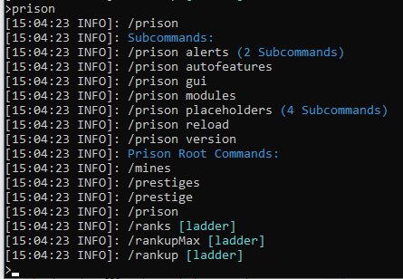

### Prison Documentation
[Prison Documents - Table of Contents](../prison_docs_000_toc.md)

## Description:

`/prison`'s the Main core command, by executing it you'll get a list of all the subcommands.  

The command `/prison` also shows all of the other registered root commands that are used within prison, for example `/ranks` and `/mines`.

## Permission:

- `prison.admin`

## SubCommands:

- [`/prison alerts`](prison_docs_command_02_prison_alerts.md)
- [`/prison autofeatures`](prison_docs_command_03_prison_autofeatures.md)
- [`/prison gui`](prison_docs_command_04_prison_gui.md)
- [`/prison modules`](prison_docs_command_05_prison_modules.md)
- [`/prison placeholders`](prison_docs_command_06_prison_placeholders.md)
- [`/prison reload`](prison_docs_command_07_prison_reload.md)
- [`/prison version`](prison_docs_command_09_prison_version.md)

## How to use the command

Execute:
`/prison`
and all the subcommands will be displayed, plus the other Prison root commands.

### Command Format

`/prison [Arguments]`

**END of the command INFO**

