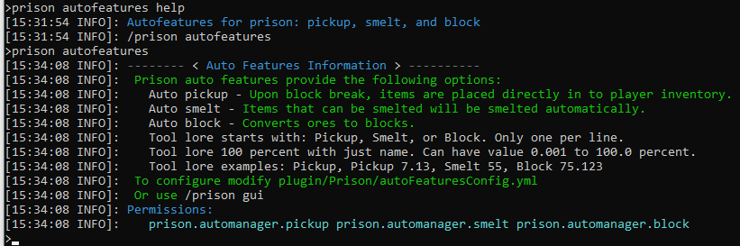

### Prison Documentation
[Prison Documents - Table of Contents](../prison_docs_000_toc.md)

## Description:

Show a description of the AutoFeatures and some info about them.  This command only provides information about how to use autofeatures and does not provide any customizations.

**NOTE:** You need to enable the autofeatures within in the **config.yml** file first, then you can edit them from the `/prison gui` or the `plugins/Prison/autoFeaturesConfig.yml`.

## Permissions:

- `prison.admin`
- `prison.automanager`
- `prison.automanager.pickup` *(configurable)*
- `prison.automanager.smelt` *(configurable)*
- `prison.automanager.block` *(configurable)*

You can customize the permission plugins that are marked as *(configurable)* through modification of the `plugins/Prison/autoFeaturesConfig.yml` file.

## SubCommands:

- `none`

## How to use the command

Just execute the command `/prison autofeatures`

### Command Format

`/prison autofeatures`

**END of the command INFO**