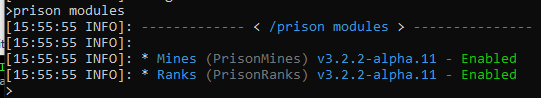
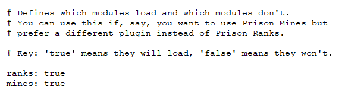

### Prison Documentation 
[Prison Documents - Table of Contents](../prison_docs_000_toc.md)

## Description:

The Prison Modules command will list all modules and their current status.  Modules cannot be enabled or disabled through this command.  You would have to make manual changes to the configuration file `plugins/Prison/modules.yml`.

## Permission:

- `prison.modules`
- `prison.admin`

## SubCommands:

- `none`

## How to use the command

Just execute the command `/prison modules`

### Command Format

`/prison modules`

Example of `/prison modules` ran within the console:

Example of `plugins/Prison/modules.yml`:

**END of the command INFO**