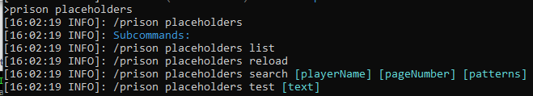

### Prison Documentation 
[Prison Documents - Table of Contents](../prison_docs_000_toc.md)

## Description:

Show a list of Prison Placeholders available.

## Permission:

- `prison.placeholder`

## SubCommands:

- `/prison placeholders list help` Shows a list of placeholders, including aliases.
- `/prison placeholders list` 
- `/prison placeholders reload` Reload placeholders and register them.
- `/prison placeholders search help` Search for placeholders.
- `/prison placeholders search [playerName] [pageNumber] [patterns]`
    - `playerName` is optional and is used for player related placeholders to fill in active details
    - The search results can contain hundreds of results, so paging allows you to control what results are shown.
    - The `patterns` can be multiple words or fragments. If more than one pattern is used, then all patterns must exist within a placeholder to be included in the result set.
- `/prison placeholders test help` Test a placeholder
- `/prison placeholders test [text]` 

## How to use the command

Use the `/prison placeholders`.

### Command Format

`/prison placeholders`

See above subcommands for their use.

**END of the command INFO**