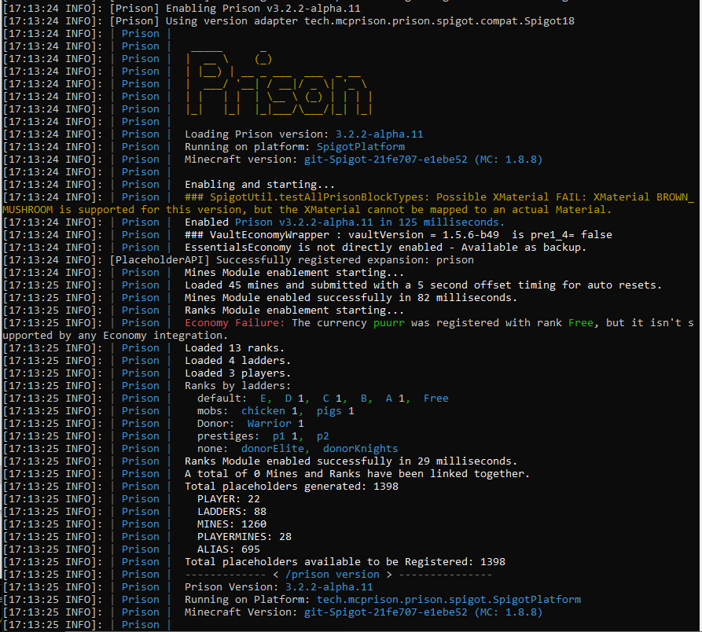

### Prison Documentation
[Prison Documents - Table of Contents](../prison_docs_000_toc.md)

## Description:

Displays detailed information about Prison, especially about the versions of Prison, the platform (ie... Spigot, Paper, etc), and even the other plugins that are active.

This view also includes detailed information on how prison is configured and what components and commands are active.  

This detailed information is very useful for debugging purposes if there are any issues with the environment.  At server startup this information is included along with even more detailed information.  If you are needing to get additional help with your prison environment, it is important to provide the other startup information too.

## Permission:

- `prison.admin`

## SubCommands:

- `none`

## How to use the command

Run the command: `/prison version`

This is an example of the `/prison version` command.

Upon startup of your server, there is additional important information that is displayed that could be very helpful in diagnosing any issues you may have with your server, or Prison itself.  This is an example of what it could look like.  

Notice there are a few errors listed, since my test server  has been setup with errors on purpose so as to ensure these error reporting features are functional. For example one rank has been setup with a currency that no longer exist, there are two ranks that are not associated with any ladders, and there is a block type that was detected that is not supported.

### Command Format

`/prison version`

**END of the command INFO**