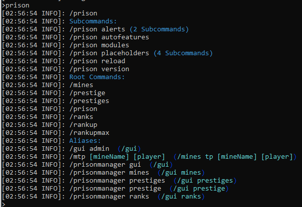

### Prison Documentation 
[Prison Documents - Table of Contents](prison_docs_000_toc.md)

## Setting up Prison - The Basics

This document provides a quick overview on how to install Prison and get it running.

<hr style="height:1px; border:none; color:#aaf; background-color:#aaf;">


# Dependencies 

* **None - No hard dependencies** - There are no hard dependencies for Prison.

There may be no hard dependencies that will prevent Prison from running, but there are some core plugins that will make it easier to use.  This short list is just a suggestion, but alternatives do exist and may be outside of our ability to comment or assist in their usage.


* **Vault** - Optional, but STRONGLY Suggested - This is perhaps the most important plugin.  This plugin provides a common way to access other plugins running on your server, but without having to write any code within Prison to support them.  Vault provides the mapping of a plugin's unique APIs to a common Vault API.  Vault helps support Economy, Permissions, and Placeholders.  Because of Vault, Prison can work flawlessly with dozens of other plugins.  Please refer to Vault's documentation for what it supports.


* **EssentialsX** - Optional, but STRONGLY Suggested - Provides many of the basic commands and behaviors that you would expect from a Spigot server such as chat, warps, and even some moderation commands.  EssentialsX is not Essentials, since Essentials is an older abandoned project, and EssentialsX is a forked project that is still maintained.  Unfortunately, internally it is identified as simply Essentials, but you can tell it's EssentialsX if the version is greater than 2.15.x.


* **EssentialsX Chat** - Optional - Enhanced Chat experience.


* **A permissions plugin of your choice** - Required - Prison works with many different permission plugins through Vault.  I strongly suggest LuckPerms since it is free and is under active development so bugs and performance issues will be addressed.
    * Warning: LuckPerms v5.0.x crashes older versions of prison, such as V3.2.0 and earlier.
    * Notice: Prison v3.2.1, and newer, supports all versions of LuckPerms.
    * Strongly suggest using LuckPerms v5.x with all of the latest versions of Prison.


* **PlaceholderAPI** - Used through Vault, it is free and provides the core interfaces in to the usage of placeholders.  Prison also has a special integration setup for PlaceholderAPI to register all of the Prison placeholders dynamically upon startup.  You do not need to download anything from the cloud for prison to work with this plugin.
 

<hr style="height:1px; border:none; color:#aaf; background-color:#aaf;">


# Download Prison

Download Prison from [spigotmc.org's Prison History Page](https://www.spigotmc.org/resources/prison.1223/history).


Setting up Prison is simple:

* Download Prison - Current Release
    - Go to the SpigotMC.org Prison's resource page:
        - [Prison Downloads](https://www.spigotmc.org/resources/prison.1223/history "Prison download can be found under the Version History tab")
    - Click on the Version History tab if needed
    - Choose the latest version to download
    
* **Download Prison's Pre-Release Version**
    - Useful to access newer features and fixes
    - You can always find the latest alpha build on the Discord Server in the #alpha-versions channel:
        - [Prison Discord Server](https://discord.gg/DCJ3j6r)

* Copy the prison jar file to your server's plugin directory.  

* Remove any older prison jar file

* Restart the server. 

* Prison's startup information contains a lot of information.  If you ever have issues, check that information first since it probably will identify what the issues are.

* Follow Prison's documentation on customization, but at this point it's ready for use. 


<hr style="height:1px; border:none; color:#aaf; background-color:#aaf;">


# Important Prison Information

Upon starting up, Prison will display a lot of information in the server's console.
This information is intended to help you configure and confirm that prison started 
correctly with all of the related resources that it is using.  It also provides you 
with valuable information that is needed to help troubleshoot issues, if you should
happen to encounter any.  

Some of the important details that are listed:
* Versions of Prison, Spigot, and other plugins
* Which modules were successfully loaded
* The root commands that are available
* The integration status of all related plugins that are supported
* The list of active placeholders
* Startup error messages, if any.  Examples would be if a rank is configured to use a 
custom currency and that currency cannot be found in any economy.


<hr style="height:1px; border:none; color:#aaf; background-color:#aaf;">


# Getting Help

If you should run in to any questions or issues, please first review all online documentation first.


If you cannot find what you need within the documentation, please visit our Discord server to get the quickest responses there.  
[Prison Discord Server](https://discord.gg/DCJ3j6r)


In order to provide the best support, the prison startup screen provides most of the information that is needed to help trouble shoot your issues.  Please take a screen print and provide on discord with a detailed explanation of the issue.


If you do encounter an issue, and the startup information is requested, please include
everything from the first line to the last. Please take a screen print and provide on 
discord with a detailed explanation of the issue.  Include everything from:

```
	[16:21:30 INFO]: [Prison] Enabling Prison v3.2.1-alpha.13
```

through:

```
	[16:21:31 INFO]: | Prison | Prison - Finished loading.
```


# Prison Commands

On the startup screen, prison shows all of the base commands that are active. From these commands, they will provide you with sub-listings of all the other commands.

* **/prison**
* **/mines**
* **/ranks**
* **/rankup** 


If you use the command `/prison` it will not only display all of the sub commands available for `/prison`, but it will also include a list of all the other *root* commands and aliases that have been setup.


  


These commands are intended to run in game, but most can be ran from the system console.  Sometimes the system console is easier to displays longer listings, such as **/mines list**.  Also the console is better with wider text, and with easier to read text since it's not trying to display over a mc world.


<hr style="height:1px; border:none; color:#aaf; background-color:#aaf;">


# Getting Started

There is a lot to do get your server up and running.  But here are some ideas on what to get started on first.  It may even be a good idea to create a couple of small mines in an area that you have not spent much time with your final builds.  Plan on creating a couple of test mines and ranks, then deleting them.  You can quickly get a good understanding of how prison can be setup by playing around with a lot of the setting within a few minutes.


Remember that the command **/prison version** will show all the available root level commands by the modules.  Entering those commands will show all of the related sub commands.  


* Create a couple of small mines.  About 10x10x5 blocks in size would work well.  Above ground is easy too.
* Play around with adding blocks, removing them, searching for blocks to add.
* Try to resize the mines, and even deleting them.

* Go ahead and create a couple of ranks.
* Setup the permissions (see the WorldGuard and LuckPerms document for examples)
* Add some simple permissions to the rank commands
* Test the ranks and the /rankup commands.

* To clean up, you can remove the test ranks (or keep them) 
* Remove the mines.


<hr style="height:1px; border:none; color:#aaf; background-color:#aaf;">

