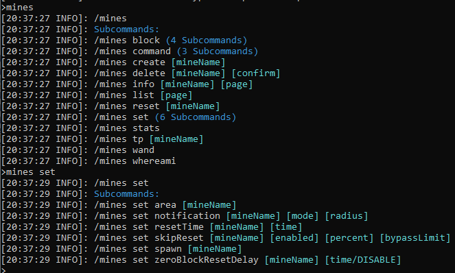
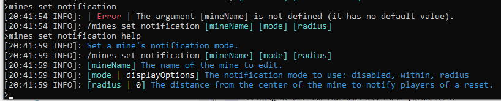
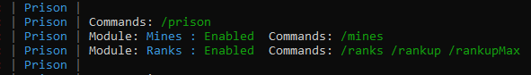

### Prison Documentation 
[Prison Documents - Table of Contents](prison_docs_000_toc.md)

## Prison - Getting Help

This document provides some important information on how to find help in setting up your prison server, and ultimately, how and where to ask for help.


*Documented updated: 2024-08-30*

<hr style="height:1px; border:none; color:#aaf; background-color:#aaf;">

# Overview

We take support seriously.  We realize that being a Prison plugin, we are working with a lot of different aspects of minecraft, and that there are many other plugins that may cross paths with Prison.  We cannot support every single plugin out there, but we will try to resolve and identify all problems that are brought to our attention..

Because we are so very concerned with your server's functionality, we have put a lot of effort in trying to create support tools to better understand what is happening. We cannot control other plugins, but prison is capable of tracking and reporting many fine-grained details about how it works and what is happening step-by-step.  This can allow us to figure out difficult problems.

We have gone out of our way, many times, to try to provide the best support that we can.  We've made custom changes to prison to support specific needs, and to help solve specific problems.  Many of these new features have become a standard part of prison too.  So the bottom line here is, we take support seriously, and we're willing to find a solution to your challenges even if we have to some times go out of our way.


If you are having problem, please take a quick look at the following documents as found in the Table of Contents:


* Setting up prison and various plugins - If special conditions for their configurations become apparent in order for prison to work, notes will be added there.  If you notice there is a special configuration consideration that we did not document, please share with us so we can update the documents.
* Review topics that may address your issue
* At the end of the table of contents are some FAQs.  Special situations may be added to them.
* Known Issues & A TO DO List - This is also a TO DO list, but at the bottom are some known issues with prison.  

<hr style="height:1px; border:none; color:#aaf; background-color:#aaf;">


# Asking for Help

Before you actually ask for help, take a look at some of the documents presented here.  You may find your answer, or at least become a little more familiar with Prison.  There is a good chance that if your question is a common one, then you will just be referred to this documentation anyway.

When you do ask for help, please realize if you can provide a clear description of the problems you are experiencing, plus the versions of Prison, Spigot, etc, then we can help you faster and more accurately.  To help provide you with answers to these questions, see the next section of this document for information on what you can copy and paste to provide all those much needed details.


<hr style="height:1px; border:none; color:#aaf; background-color:#aaf;">


# Prison Command 'help' keyword


Prison has a very advanced command handler that provides a lot of advance features.  But one simple feature to know about and to use is the use of the 'help' keyword.  


If you add '**help**' to any command within prison, prison's command handler will show you information on what the command is, how to use it, parameters, how to get more help and details, and also what permissions are needed to use the command.


Prison automatically inserts the **help** keyword if you enter the base commands.  So the command **/mines** is really the command handler recognizing there are many commands tied to the path '/mines' that it automatically injects the **help** keyword for you so it will generate the list.  It's exactly the same as if you've entered **/mines help**.


# General Information on Prison Commands


All of the commands for Prison can be ran in-game, and most can be ran from the console. When running commands from the console, you do not have to prefix the commands with a **/**.  But within these documents, all commands will be referenced with a prefixed **/** so it is clear that it's a command.  Just don't include it when running within the console.


My (Blue) personal preference is to run the commands from the console since there are less restrictions on width or number of lines shown, and they are easier to see without the busy background of the game.


Within most of these documents, the console will be used for screen prints for those reasons.


The only commands that cannot be ran from the console are the commands that expect you to be an in-game player.  Examples are **/mines whereami** and **/mines tp <mineName>**.  But note, you can now run the TP command from the console if you supply the name of an online player:  **/mines tp <mineName> <playerName>**.


If you need to do some maintenance, or configurating of your Prison, the console could be an easier environment to use.


But in-game, some commands have clickable actions such as **page next** or **page prior**.  Or even command completion, such as with **/mines block search** and clicking on a search result provides you with a filled in copy of **/mines block add** where all you need to do is just fill in the percentage since it uses the last mine name that has been used.


<hr style="height:1px; border:none; color:#aaf; background-color:#aaf;">


# Prison Commands and Using "help"

It may be helpful to know what commands are available, and what options exist for those commands.


Prison's command handler not only understands what commands have been registered within Prison, but it has awareness of what parameters are needed, and what permissions some commands are required.  The command handler is able to provide a lot of information if you know a few basic things.


Prison's commands are based upon a hierarchy of commands, which groups them by context.  If you enter a lower command in the hierarchy that includes sub commands, then Prison will list them.  This is a great way to explore what commands are available within Prison.


The best starting point is with the root command `/prison`.  Not only is that the root command for everything that starts with `/prison`, but it has special behavior in that it also includes all other command roots.  So if a command exists in prison, you can find it through starting with `/prison` and exploring their children.


Some of the root commands that are important to know: `/prison`, `/mines`, `/ranks`, `/rankup`, `/gui`, `/sellall`.


Many commands within prison are compound commands, such that they start with a base command, followed by one or more other commands.  When Prison lists the available commands, if there are sub commands, that information is included in the command listing, including the sub command count.  For example:

* **/mines**
* **/mines set**
* **/mines set spawn**

If for a given set of commands, such as **/mines set**, has sub commands, then Prison will present a listing of all sub commands and their parameters.  



In this screen print, you can see the hierarchy of **/mines** and **/mines set**.  The parameter listing is helpful, but it does not provide all the information that is available.

Let's take a closer look at **/mines set notification** and how the **help** keyword can provide a lot more meaningful details.  If you just enter that command, without any parameters, Prison reports an error message, depending upon which parameter failed. See the next screen print and the related *Error* message.  It's not helpful in the least, especially if you are not certain what each parameter is supposed to be.




But notice within the above screen print, the same command has been entered, but this time with the keyword **help** added as if it were the first parameter.  For example, **/mines set notification help**.  Prison recognizes that you are requesting help for that command, and then it displays all of the information it has for each parameter.


<hr style="height:1px; border:none; color:#aaf; background-color:#aaf;">


# Where to ask for help: The Prison Discord Server

The best place to ask for help, and to get answers quickly (within a few hours) would be without a doubt the Prison Discord Server.

[Prison Discord Server](https://discord.gg/DCJ3j6r)


You can also submit a help ticket on the Prison github Issues tab, but the response may be slower and less detailed


<hr style="height:1px; border:none; color:#aaf; background-color:#aaf;">


# Prison Support Submit Information

Prison has a built in way to share your configurations and settings with support personnel.

The way this works, is that when you generate a report, prison gathers all of the various data, and creates a single page (a very long page) document which it uploads to a 3rd party server.  This information is very detailed and can help us better support everyone since we can see exactly how prison is configured. The service prison uses, is called PrivateBin.  The reports are encrypted on the client (not at the server) and is held for only 7 days.  Only people with the password can read the these documents.  Prison defaults to a standard password for the encryption so we're able to read the reports when they are posted for us.  That password, and time to live can be changed in the prison's config.yml file, but you probably do not need to change it.


We went with this service since the other paste bin that we were using in the past would never delete any of the documents. Generally they are only needed for a few hours, and worst case a few days.  Any older than that, then they probably are not current and new docs need to be generated. So having a service that would auto-delete these was critical to find.  Plus with it being encrypted on the client, no one can stumble across them and read them. So they are extra secure.  Of course, with the URLs being posted within prison, anyone there can access them, and they probably can lookup the default password.  Generally we're not too concerned about the Prison community seeing these documents, since they would not contain anything sensitive (except for logs maybe?) but it's your choice.  You can DM them to us, change the password and DM us the password, or request that we delete the link as soon as we open it.  If it's a concern to you, please let us know and ask questions and we'll figure out a procedure that will work for you.


When requested by the Prison support team, you would first enter the following command to set your name that will be included on all reports to help identify who the are related to.  It doesn't have to be your full discord name, but enough characters to allow us to identify who you are.


These commands will collect all of the related information from your Prison setup, and send it to the website `https://privatebin.net`.  The older website that would not purge them or encrypt them is  `https://paste.helpch.at`, and that is still available as a standby service.  

These commands will provide you with an URL.  All you need to do is to copy and paste that URL in to the discord chat so the Prison support team can help with your issue.


`/prison support setSupportName <yourName>`

Once entered, it will enable the following submit tools:

`/prison support submit`  - Show the available tools.

```
/prison support submit version
/prison support submit ranks
/prison support submit mines
/prison support submit latestLogs
```

**Version** This is generally the most requested information needed for support.  Provides general overall information on Prison and it's environment on the server.  This is similar to the command `/prison version all` plus a few other features such as configs, listeners, and the command cache. This support page has expanded to include more details so there are fewer items to submit, if needed.
Listeners are dumps of the event listeners for BlockBreak, chat, and playerinteract. The blockbreak listeners include any that you have enabled.  These can be used to identify problems with priorities and other possible conflicts.


**Ranks** This is everything related to ranks.  Includes ladders, ranks lists, and rank details.  It also includes all of the raw save file for these items too.

**Mines** This is everything related to mines.  Includes the mine list, mine info, and the related files for each mine.

**LatestLogs** This will send the latest log file, up to a max allowed amount.


Here are two examples that I generated from one of my test servers on 2021-12-03 and 2023-07-24.  I have no idea how long the content remains available, but for support purposes, we only need this information for a few hours.  It appears like this information is never deleted?  As such, here are two different versions which shows you how much more information has been added. 
  [https://paste.helpch.at/silihuxaja](https://paste.helpch.at/silihuxaja) From Prison v3.3.0-alpha.15a
  [https://paste.helpch.at/itejovejeh](https://paste.helpch.at/itejovejeh) From Prison v3.2.11-alpha.9


# Prison Support HTML Output Files

**As a brand new feature, Prison now is able to generate HTML files** that are stored within the `plugins/Prison/backups/` directory.  It includes information from version, ranks, mines, listeners, and configs.  See above.  The nice thing about this support format is that it reproduces all of the colors as found in the console version of these commands.

The reason why this format is not used with the privatebin.net service is because style sheets cannot be embedded in to a markdown document.  HTML can be placed in a markdown document, which is what this version of support files are based upon, but without the style sheets and the simple javascript, these do not work and will not be formatted correctly.

This file format is also good for server owners who do not want to post their server information on another website.

To generate the file, use the command:
`/prison support saveToFile help`

To generate with the defaults settings:
`/prison support saveToFile basic`

If an existing file exists, it will generate the next one in the series.  When ran, it will identify what the current file is.  Please send this file to support.


If you want to use this format instead of the above file that are sent to paste.helpch.at, then generate the file and you can DM it to either Blue or Madog.  It's best to ask before sending to confirm we are available to respond to your needs.


NOTE: Hyperlinks and table of contents will be added to this HTML support document in the near-ish future.


<hr style="height:1px; border:none; color:#aaf; background-color:#aaf;">


# Prison Debugger


Prison has been evolving to provide many new features, but as a result, it's also becoming very complex in some areas.  To help address these greater complexities, Prison has some debugging details that can be dynamically enabled.  These can help identify what's happening and provide hints as to what may be the trouble.


New targets will be added to Prison overtime.  So check with the command for the latest updates for the version that you are using.


To enable the debugger, you can toggle them all on with `/prison debug` once to turn it on, and again to turn them all off.


To review the options available, use the command `/prison debug help`.  There are also debug targets that only enable specific debug statements and the list of the available targets can be displayed with `/prison debug targets`.


Please note, on busy servers, hundreds of messages can be logged in a very short amount of time.  Therefore, one feature of the debug command is that it can target a specific user and only log a specified number of statements.  That way, if you need to collect logs for sellall or block break events, you can enable it for yourself, or another player, do a few transactions, and it will auto shutoff.  Please see the help text below for more information on how to use that feature.


```
>prison debug help
[23:02:19 INFO]: ---------- < Cmd: /prison debug > ------------- (3.3.0-alpha.18d)
[23:02:19 INFO]: Enables debugging and trouble shooting information. For internal use only. Do not use unless instructed. This will add a lot of data to the console.
[23:02:19 INFO]: /prison debug [targets]
[23:02:19 INFO]: [targets] Optional. Enable or disable a debugging target, or set a count down timer. [on, off, targets, (count-down-timer), selective, jarScan, testPlayerUtil, testLocale, rankup, blockConstraints, player=<playerName> ] Use 'targets' to list all available targets.  Use 'on' or 'off' to toggle on and off individual targets, or 'all' targets if no target is specified. If any targets are enabled, then debug in general will be enabled. Selective will only activate debug with the specified targets. A positive integer value will enable the count down timer mode to enable debug mode for a number of loggings, then debug mode will be turned off. jarScan will identify what Java version compiled the class files within the listed jars. If a player name is given, all debug messages that are tracked by player name will only be logged for that player.  Example: `/debug playerName=RoyalBlueRanger 5` will log only 5 debug messages for that player, then debug mode will be disabled.
[23:02:19 INFO]: Permissions:
[23:02:19 INFO]:    prison.debug
[23:02:19 INFO]: Aliases:
[23:02:19 INFO]:    [prison support debug]


>prison debug targets
[23:03:19 INFO]: Global Debug Logging is disabled
[23:03:19 INFO]: . Valid Targets: all, on, off, blockBreak, blockBreakFortune, targetBlockMismatch, rankup, blockConstraints

>prison debug
[12:18:18 INFO]: Global Debug Logging is enabled
[12:18:18 INFO]: . Valid Targets: all, on, off, blockBreak, blockBreakFortune, targetBlockMismatch, rankup, blockConstraints

>prison debug
[12:18:20 INFO]: Global Debug Logging is disabled
[12:18:20 INFO]: . Valid Targets: all, on, off, blockBreak, blockBreakFortune, targetBlockMismatch, rankup, blockConstraints
```

It should be noted that every time you use the command, other than with the help keyword, it will always show the current status of the debugging information.  It will show if the global logging is enabled or not, and if any targets are enabled, it will list all of the active ones.  Plus it will show all of the available targets too.


The following shows toggling the global settings:

```
>prison debug
[21:12:10 INFO]: Global Debug Logging is enabled
[21:12:10 INFO]: . Valid Targets: all, on, off, blockBreak, blockBreakFortune, targetBlockMismatch, rankup, blockConstraints
>prison debug
[21:12:15 INFO]: Global Debug Logging is disabled
[21:12:15 INFO]: . Valid Targets: all, on, off, blockBreak, blockBreakFortune, targetBlockMismatch, rankup, blockConstraints
```

The following will show how you can toggle on a few features.  Without using the actions 'on' or 'off' it will toggle the specified targets.  The use of 'on' and 'off' can occur anywhere in the list of targets, and if both 'on' and 'off' are specified, then 'on' will take precedence over 'off'.


First notice two targets are activated with two different uses of the `/prison debug` command.

```
>prison debug blockBreak
[21:17:23 INFO]: Global Debug Logging is disabled
[21:17:23 INFO]: . Active Debug Targets:
[21:17:23 INFO]: . . Target: blockBreak
[21:17:23 INFO]: . Valid Targets: all, on, off, blockBreak, blockBreakFortune, targetBlockMismatch, rankup, blockConstraints
>prison debug blockBreakFortune
[21:17:30 INFO]: Global Debug Logging is disabled
[21:17:30 INFO]: . Active Debug Targets:
[21:17:30 INFO]: . . Target: blockBreak
[21:17:30 INFO]: . . Target: blockBreakFortune
[21:17:30 INFO]: . Valid Targets: all, on, off, blockBreak, blockBreakFortune, targetBlockMismatch, rankup, blockConstraints
```

Then using both of the same targets, they are toggled off.

```
>prison debug blockBreakFortune blockBreak
[21:17:42 INFO]: Global Debug Logging is disabled
[21:17:42 INFO]: . Valid Targets: all, on, off, blockBreak, blockBreakFortune, targetBlockMismatch, rankup, blockConstraints
```

Next, this is showing multiple targets being used, with the 'on' keyword mixed in.  Notice it lists all of these active targets.  Then `/prison debug` is used to globally turn on all features, which removes any individual targets. Then the global is used again to turn them all off.

```
>prison debug blockBreakFortune blockBreak on durability
[21:18:31 INFO]: Global Debug Logging is disabled
[21:18:31 INFO]: . Active Debug Targets:
[21:18:31 INFO]: . . Target: durability
[21:18:31 INFO]: . . Target: blockBreak
[21:18:31 INFO]: . . Target: blockBreakFortune
[21:18:31 INFO]: . Valid Targets: all, on, off, blockBreak, blockBreakFortune, targetBlockMismatch, rankup, blockConstraints
>prison debug
[21:18:38 INFO]: Global Debug Logging is enabled
[21:18:38 INFO]: . Valid Targets: all, on, off, blockBreak, blockBreakFortune, targetBlockMismatch, rankup, blockConstraints
>prison debug
[21:18:43 INFO]: Global Debug Logging is disabled
[21:18:43 INFO]: . Valid Targets: all, on, off, blockBreak, blockBreakFortune, targetBlockMismatch, rankup, blockConstraints
```


<hr style="height:1px; border:none; color:#aaf; background-color:#aaf;">


# Prison v3.2.1 and it's Pre-Release Versions


NOTE: A lot has been added and changed since v3.2.1. This should be updated in the near future, but for now, view the current version in the console.


The Prison startup screen contains a lot of information that can be used help identify issues that are detected by Prison on start up, and can provide useful information about the general environment.  See the screen prints below.


As prison evolves, the information provided within these commands will better reflect the current state of the plugin, and provide the information that is most helpful when contacting support.  For example, prison now includes information on the version of prison and spigot, but also memory information for your server since a lot of performance issues have been tied to the lack of having enough memory; now it's easy to access that information.


When the server starts, Prison's startup information will contain a lot of information, including any errors that may prevent prison from running correctly.  Also you can get information on demand with `/prison version`, or even more in greater detail with `/prison version all`.


If you are having problems and need to ask for help, please provide all of this information when requested. Screen prints are preferred.  When asked what versions of prison and platform that you are running, copying the following three lines is what is needed to answer that question:

```
>prison version all
[21:29:55 INFO]: ------------- < /prison version > ---------------
[21:29:55 INFO]: Prison Version: 3.3.0-alpha.4h
[21:29:55 INFO]: Running on Platform: tech.mcprison.prison.spigot.SpigotPlatform
[21:29:55 INFO]: Minecraft Version: git-Spigot-21fe707-e1ebe52 (MC: 1.8.8)
[21:29:55 INFO]:
[21:29:55 INFO]: Server runtime: 4h 26m 21s
[21:29:55 INFO]: Java Version: 1.8.0_291  Processor cores: 8
[21:29:55 INFO]: Memory Max: 3.556 GB  Total: 1.922 GB  Free: 1.459 GB  Used: 473.920 MB
[21:29:55 INFO]: Total Server Disk Space: 943.719 GB  Usable: 750.948 GB  Free: 750.948 GB  Used: 192.770 GB
[21:29:55 INFO]: Prison's File Count: 116  Folder Count: 24  Disk Space: 158.258 KB  Other Objects: 0
[21:29:55 INFO]:
[21:29:55 INFO]: Prison's root Command: /prison
[21:29:55 INFO]: Module: Mines : Enabled
[21:29:55 INFO]: Module: Ranks : Enabled
[21:29:55 INFO]: Module: Utils : Enabled
[21:29:55 INFO]:
[21:29:55 INFO]: AutoManager Enabled: true
[21:29:55 INFO]: .   Block Break Event Priority: LOW
[21:29:55 INFO]: .   Token Enchant BlockExplodeEvent Priority: LOW
[21:29:55 INFO]: .   Crazy Enchant BlastUseEvent Priority: LOW
[21:29:55 INFO]: .   Zenchantments BlockShredEvent Priority: LOW
[21:29:55 INFO]:
[21:29:55 INFO]: .   Auto Pickup: true
[21:29:55 INFO]: .   Auto Smelt: true
[21:29:55 INFO]: .   Auto Block: true
[21:29:55 INFO]: .   Handle Normal Drops: disabled by AutoPickup
[21:29:55 INFO]: .   Normal Drop Smelt: disabled
[21:29:55 INFO]: .   Normal Drop Block: disabled
[21:29:55 INFO]:
[21:29:55 INFO]: .   Calculate Durability: true
[21:29:55 INFO]: .   Calculate Fortune: true
[21:29:55 INFO]: .  .  Max Fortune Multiplier: 0
[21:29:55 INFO]: .  .  Extended Bukkit Fortune Enabled: true
[21:29:55 INFO]: .  .  Extended Bukkit Fortune Factor Percent Range Low: 40
[21:29:55 INFO]: .  .  Extended Bukkit Fortune Factor Percent Range High: 110
[21:29:55 INFO]: .  .  Calculate Alt Fortune Enabled: disabled
[21:29:55 INFO]: .  .  Calculate Alt Fortune on all Blocks: false
[21:29:55 INFO]:
[21:29:55 INFO]: .   Calculate XP: true
[21:29:55 INFO]: .   Drop XP as Orbs: true
[21:29:55 INFO]: .   Process TokensEnchant Explosive Events: true
[21:29:55 INFO]: .   Process Crazy Enchants Block Explode Events: true
[21:29:55 INFO]: .   Process McMMO BlockBreakEvents: true
[21:29:55 INFO]: Prestiges Enabled: true
[21:29:55 INFO]: .   Reset Money: true
[21:29:55 INFO]: .   Reset Default Ladder: true
[21:29:55 INFO]: GUI Enabled: true
[21:29:55 INFO]: Sellall Enabled: true
[21:29:55 INFO]: Backpacks Enabled: true
[21:29:55 INFO]:
[21:29:55 INFO]: Integrations:
[21:29:55 INFO]: . . Permissions:  LuckPerms (Vault)
[21:29:55 INFO]: . . Economy:  Essentials Economy (Vault)
[21:29:55 INFO]: Integration Type: ECONOMY
[21:29:55 INFO]: . . Essentials Economy (Vault) <Active> [URL]
[21:29:55 INFO]: . . Essentials (EssentialsX) (disabled) <Inactive> [URL]
[21:29:55 INFO]: . . SaneEconomy (API v0.15.0) <Inactive> [URL]
[21:29:55 INFO]: . . GemsEconomy <Inactive> [URL]
[21:29:55 INFO]: Integration Type: PERMISSION
[21:29:55 INFO]: . . LuckPerms (Vault) <Active>
[21:29:55 INFO]: . . LuckPerms (LuckPermsV5) <Active> [URL]
[21:29:55 INFO]: . . LuckPerms (LuckPerms-Legacy) <Inactive> [URL]
[21:29:55 INFO]: Integration Type: PLACEHOLDER
[21:29:55 INFO]: . . To list all or search for placeholders see: /prison placeholders
[21:29:55 INFO]: . . MVdWPlaceholderAPI <Inactive> [URL]
[21:29:55 INFO]: . . PlaceholderAPI <Active> [URL]
[21:29:55 INFO]:
[21:29:55 INFO]: Registered Plugins:
[21:29:55 INFO]: .  LuckPerms (5.1.26),   WorldEdit (6.1;no_git_id)
[21:29:55 INFO]: .  Vault (1.5.6-b49),   PlaceholderAPI (2.10.9)
[21:29:55 INFO]: .  ProtocolLib (4.5.0),   WorldGuard (6.1)
[21:29:55 INFO]: .  Essentials (2.18.1.0),   Scoreboard-revision (R3 1.4.2 RELEASE)
[21:29:55 INFO]: .  EssentialsChat (2.18.1.0),   Prison (3.3.0-alpha.4h)
```

The following are screen prints of an older version of what is shown at the server startup.


These screen prints may not contain the most recent enhancements to prison, since they are based upon an alpha release. Please see your server's console for details pertaining to your environment.


<hr style="height:1px; border:none; color:#aaf; background-color:#aaf;">


# Prison - Older versions

We're happy to help support prison, but we cannot support older versions of prison.  If a problem was found, we have tried to fix it, or to replace the faulty command.  We also no long have the source code to go back, make a change, and produce a custom build for you.  We encourage upgrading to the latest release of prison since we can better support you with those newer features, and we can make changes to the source code if needed.

Generally, when you upgrade prison, you could always revert to an older version of prison.  New features will be lost, but the data saved in the save files should be backwards compatible.  This is no longer possible with Prison v3.3.0-alpha.18.  That is because we are starting to change the save file formats so we can usher in newer features and also start to support database storage.  

Whenever prison upgrades, there was a new feature added a couple of years ago, to auto backup all of prison's config settings and store them in a zip file within the directory: `plugins/Prison/backups/`  So although the newest versions of prison cannot be down-graded automatically, you can restore the older save files that have been backedup.
	

# Prison v3.1.0 and Earlier - General Information

There is zero support available for these earlier versions of Prison.  It is therefore highly recommended that you upgrade to the latest release of Prison.  Once a version of prison is released, we cannot go back and apply any fixes; fixes will be applied to the next release.


My suggestions are based upon what I have seen within the code for Prison, and best guesses on how the older versions **may** have worked.  These are guesses.  Proceed carefully and make backups at each upgrade to ensure you can retry a step if something should go wrong.  - Blue


To upgrade prison, the process should be rather simple.  But there are general steps that you must follow to help ensure a smoother transition to the latest release.  


It is highly suggested that you should first backup your whole server, especially the data within your plugins folder.  Please be aware that upgrading Prison may require you to upgrade other pugins that you have, and those plugins may require other plugins to be upgraded.  


DO NOT just install the latest plugin(s) you find on the internet!  Most plugins have specific versions of Spigot/Bukkit/Minecraft that they will work with!  Get them only from trusted servers such as spigotmc.org, polymart.org, bukkit.org, or etc...  Those sites should have multiple versions and should identify what server engines they are compatible with.  


If you want to also upgrade to a newer version of the server software that you are running, such as spigot, bukkit, paper, etc..., first upgrade the plugins for your current version of the server.  So if you are running Spigot 1.8.8 and a plugin has a newer version available that works with 1.8.8, install that first and then start the server and make sure everything is working well.  Usually if there is a major change in a plugin from one version to the next, the "last" version may have code to "convert" your data to prepare for the next higher version. If there is an important intermediate step that will convert your data, or require you to make major changes, there should be some notes in documents somewhere.  Spending a few minutes reading the release notes on these websites could save you hours of work trying to recover from a messed up upgrade.  Remember to make backups!
   

<h3>Upgrading from Prison v3.2.0 to Prison v3.2.1</h3>

If you are running Prison v3.2.0, then upgrading to v3.2.1, or it's pre-release editions, you don't have to take any special precautions other than backing up your server and the plugin's data folders.  

The internal files remain the same between these two versions.  Version 3.2.1 has a lot of new additions to the internal file formats, but nothing will break if using v3.2.0 data with v3.2.1.  Matter of fact, if for some reason, you want to down grade from v3.2.1 to v3.2.0 you can.  Any new data elements from v3.2.1 will be lost if any of the data items are rewriting to the file system.  If a mine is not modified, as an example, then it will not write the mine data back to the file system.  


<h3>Upgrading from Prison v3.1.1 to Prison v3.2.1 or Prison v3.2.0</h3>

Upgrading from Prison v3.1.1 to either Prison v3.2.0 or Prison v3.2.1 requires no special procedures or processes.  The internal file formats are pretty close to being the same that it should work with no problems.  Just make sure you perform a backup of the server and the plugins data folders to provide that extra level of insurance and protection.


It is inadvisable to try to down grade to Prison v3.1.1 if running Prison v3.2.0 or later.  It may work, but there could possibly be potential internal failures due to the addition of the new fields.  If you try to do this, you assume all risks and no help will be provided.


<h3>Upgrading from v3.0.0 to Newer Versions of Prison</h3>

Honestly I cannot advise you on actual steps to take, since I do not know what file formats were used with v3.0.0.  I suspect they are compatible 100% with v3.1.1.  If this is true, you can just jump to Prison v3.2.1 with no problems.  

If there is an incompatibility, then its strongly suggested that you upgrade to v3.1.1 first and let it perform its own conversions, then shut down the server carefully.  If it is not shutdown cleanly, then the data files will not be saved to the file system. Once you update to v3.1.1 then you can update to v3.2.1 without any issues.


<h3>Upgrading from Earlier Versions Prior to v3.0.0</p> 
   
For prison releases prior to Prison v3.0.0, the data structures they uses to store all the data on the file system was different.  I do not know how it was different, I just know it was.  I saw there were remains of a conversion utility in Prison v3.0.0 that I **think** was able to convert Prison v2.x data to Prison v3.x formats.  If you are upgrading from Prison v2.x it is VERY IMPORTANT that you first upgrade to Prison v3.0.0!!  Once up start up that server, use the command **/prison** and confirm there is a command **/prison convert**, and if there is, run that command to convert your old data to the new Prison v3.0.0 format.  Make sure you take backups BEFORE and AFTER upgrading your data!  Also do a "clean" shutdown on prison v3.0.0 to finalize the changes.


**Please NOTE:** It needs to be understood that changes made to mines, ranks, ladders, or player data, in versions of Prison prior to v3.2.0 did NOT save those changes until the server shutdown.  So if the server should happen to crash, the changes could have been lost.  So this is important to understand, because if you are upgrading from an older version of prison to Prison v3.0.0, a version prior to Prison v3.2.0, then you MUST ensure the server shuts down cleanly or the conversions and/or changes to the prison data may not have been written to the server file system.  After you shut down the server, if performing an upgrade to v3.0.0, please review all the files under the plugins/Prison directory and make sure the last modify date reflects when you shut down the server.  If the files have not been updated, try restarting the server, and maybe make a change to mine or rank to force a save when the server shuts down.  I cannot help with this process other than these suggestions.  Sorry.


Once you are running Prison v3.x.x then you can safely upgrade to Prison v3.2.0, or better yet, to Prison v3.2.1 (or the pre-release edition).


<hr style="height:1px; border:none; color:#aaf; background-color:#aaf;">

**Obsolete Screen Prints:**




<hr style="height:1px; border:none; color:#aaf; background-color:#aaf;">
