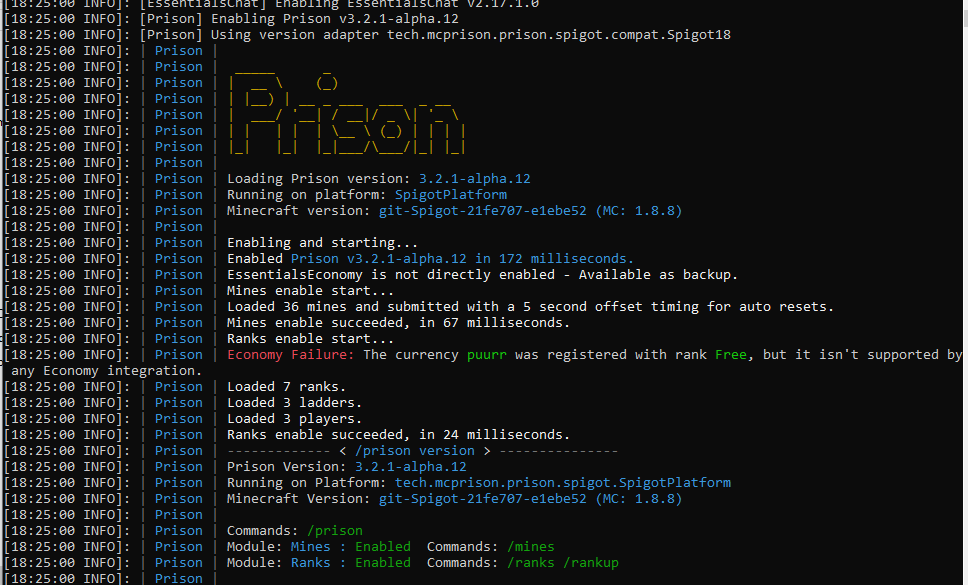
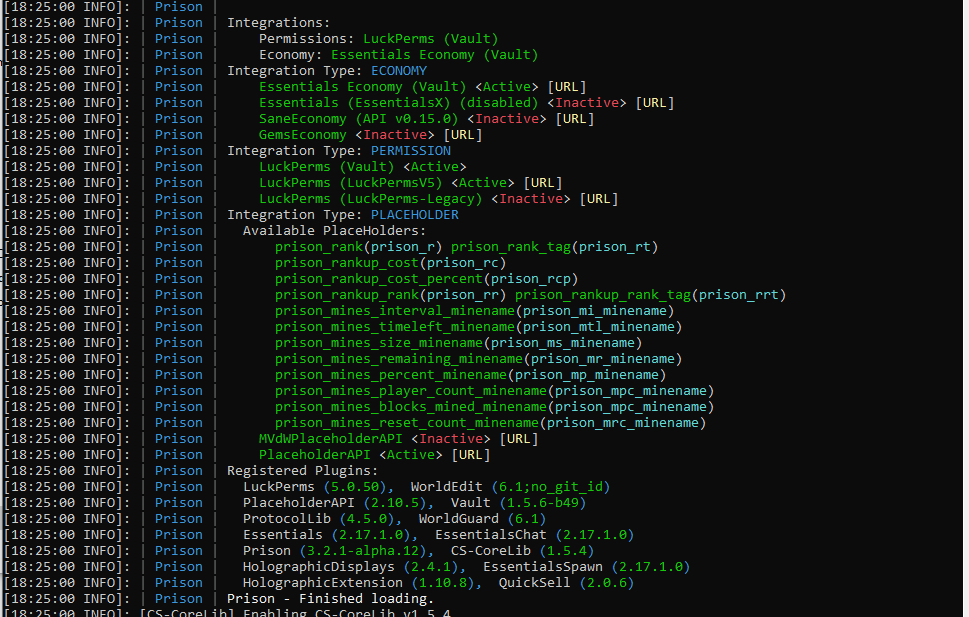

### Prison Documentation 
[Prison Documents - Table of Contents](prison_docs_000_toc.md)

## Prison - Getting Help

This document provides some important information on how to find help in setting up your prison server, and ultimately, how and where to ask for help.

<hr style="height:1px; border:none; color:#aaf; background-color:#aaf;">

# Overview

If you are having problem, please take a quick look at the following documents as found in the Table of Contents:

* Setting up prison and various plugins - If special conditions for their configurations become apparent in order for prison to work, notes will be added there.
* Review topics that may address your issue
* At the end of the table of contents are some FAQs.  Special situations may be added to them.
* Known Issues & A TO DO List - This is also a TO DO list, but at the bottom are some known issues with prison.  

<hr style="height:1px; border:none; color:#aaf; background-color:#aaf;">


# Where to ask for help: The Prison Discord Server

The best place to ask for help, and to get answers quickly (within a few hours) would be without a doubt the Prison Discord Server.

[Prison Discord Server](https://discord.gg/396ed5F)


You can also submit a help ticket on the Prison github Issues tab, but the response may be slower and less detailed


<hr style="height:1px; border:none; color:#aaf; background-color:#aaf;">


# Asking for Help

Before you actually ask for help, take a look at some of the documents presented here.  You may find your answer, or at least become a little more familiar with Prison.  There is a good chance that if your question is a common one, then you will just be referred to this documentation anyway.

When you do ask for help, please realize if you can provide a clear description of the problems you are experiencing, plus the versions of Prison, Spigot, etc, then we can help you faster and more accurately.  To help provide you with answers to these questions, see the next section of this document for information on what you can copy and paste to provide all those much needed details.


<hr style="height:1px; border:none; color:#aaf; background-color:#aaf;">


# Prison v3.2.1 and it's Pre-Release Versions


The Prison startup screen contains a lot of information that can be used help identify issues that are detected by Prison on start up, and can provide useful information about the general environment.  See the screen prints below.

If you are having problems and need to ask for help, please provide all of this information when requested. Screen prints are preferred.  When asked what versions of prison and platform that you are running, copying the following three lines is what is needed to answer that question:

```
[18:40:20 INFO]: | Prison | Loading Prison version: 3.2.1-alpha.12
[18:40:20 INFO]: | Prison | Running on platform: SpigotPlatform
[18:40:20 INFO]: | Prison | Minecraft version: git-Spigot-21fe707-e1ebe52 (MC: 1.8.8)
```





<hr style="height:1px; border:none; color:#aaf; background-color:#aaf;">


** incomplete - Work in progress **


<hr style="height:1px; border:none; color:#aaf; background-color:#aaf;">


# Prison v3.1.0 and Earlier - General Information

There is zero support available for these earlier versions of Prison.  It is therefore highly recommended that you upgrade to the latest release of Prison.  Once a version of prison is released, we cannot go back and apply any fixes; fixes will be applied to the next release.


My suggestions are based upon what I have seen within the code for Prison, and best guesses on how the older versions **may** have worked.  These are guesses.  Proceed carefully and make backups at each upgrade to ensure you can retry a step if something should go wrong.  - Blue


To upgrade prison, the process should be rather simple.  But there are general steps that you must follow to help ensure a smoother transition to the latest release.  


It is highly suggested that you should first backup your whole server, especially the data within your plugins folder.  Please be aware that upgrading Prison may require you to upgrade other pugins that you have, and those plugins may require other plugins to be upgraded.  


DO NOT just install the latest plugin(s) you find on the internet!  Most plugins have specific versions of Spigot/Bukkit/Minecraft that they will work with!  Get them only from trusted servers such as spigotmc.org, bukkit.org, or etc...  Those sites should have multiple versions and should identify what server engines they are compatible with.  


If you want to also upgrade to a newer version of the server software that you are running, such as spigot, bukkit, paper, etc..., first upgrade the plugins for your current version of the server.  So if you are running Spigot 1.8.8 and a plugin has a newer version available that works with 1.8.8, install that first and then start the server and make sure everything is working well.  Usually if there is a major change in a plugin from one version to the next, the "last" version may have code to "convert" your data to prepare for the next higher version. If there is an important intermediate step that will convert your data, or require you to make major changes, there should be some notes in documents somewhere.  Spending a few minutes reading the release notes on these websites could save you hours of work trying to recover from a messed up upgrade.  Remember to make backups!
   

<h3>Upgrading from Prison v3.2.0 to Prison v3.2.1</h3>

If you are running Prison v3.2.0, then upgrading to v3.2.1, or it's pre-release editions, you don't have to take any special precautions other than backing up your server and the plugin's data folders.  

The internal files remain the same between these two versions.  Version 3.2.1 has a lot of new additions to the internal file formats, but nothing will break if using v3.2.0 data with v3.2.1.  Matter of fact, if for some reason, you want to down grade from v3.2.1 to v3.2.0 you can.  Any new data elements from v3.2.1 will be lost if any of the data items are rewriting to the file system.  If a mine is not modified, as an example, then it will not write the mine data back to the file system.  


<h3>Upgrading from Prison v3.1.1 to Prison v3.2.1 or Prison v3.2.0</h3>

Upgrading from Prison v3.1.1 to either Prison v3.2.0 or Prison v3.2.1 requires no special procedures or processes.  The internal file formats are pretty close to being the same that it should work with no problems.  Just make sure you perform a backup of the server and the plugins data folders to provide that extra level of insurance and protection.


It is inadvisable to try to down grade to Prison v3.1.1 if running Prison v3.2.0 or later.  It may work, but there could possibly be potential internal failures due to the addition of the new fields.  If you try to do this, you assume all risks and no help will be provided.


<h3>Upgrading from v3.0.0 to Newer Versions of Prison</h3>

Honestly I cannot advise you on actual steps to take, since I do not know what file formats were used with v3.0.0.  I suspect they are compatible 100% with v3.1.1.  If this is true, you can just jump to Prison v3.2.1 with no problems.  

If there is an incompatibility, then its strongly suggested that you upgrade to v3.1.1 first and let it perform its own conversions, then shut down the server carefully.  If it is not shutdown cleanly, then the data files will not be saved to the file system. Once you update to v3.1.1 then you can update to v3.2.1 without any issues.


<h3>Upgrading from Earlier Versions Prior to v3.0.0</p> 
   
For prison releases prior to Prison v3.0.0, the data structures they uses to store all the data on the file system was different.  I do not know how it was different, I just know it was.  I saw there were remains of a conversion utility in Prison v3.0.0 that I **think** was able to convert Prison v2.x data to Prison v3.x formats.  If you are upgrading from Prison v2.x it is VERY IMPORTANT that you first upgrade to Prison v3.0.0!!  Once up start up that server, use the command **/prison** and confirm there is a command **/prison convert**, and if there is, run that command to convert your old data to the new Prison v3.0.0 format.  Make sure you take backups BEFORE and AFTER upgrading your data!  Also do a "clean" shutdown on prison v3.0.0 to finalize the changes.


**Please NOTE:** It needs to be understood that changes made to mines, ranks, ladders, or player data, in versions of Prison prior to v3.2.0 did NOT save those changes until the server shutdown.  So if the server should happen to crash, the changes could have been lost.  So this is important to understand, because if you are upgrading from an older version of prison to Prison v3.0.0, a version prior to Prison v3.2.0, then you MUST ensure the server shuts down cleanly or the conversions and/or changes to the prison data may not have been written to the server file system.  After you shut down the server, if performing an upgrade to v3.0.0, please review all the files under the plugins/Prison directory and make sure the last modify date reflects when you shut down the server.  If the files have not been updated, try restarting the server, and maybe make a change to mine or rank to force a save when the server shuts down.  I cannot help with this process other than these suggestions.  Sorry.


Once you are running Prison v3.x.x then you can safely upgrade to Prison v3.2.0, or better yet, to Prison v3.2.1 (or the pre-release edition).


<hr style="height:1px; border:none; color:#aaf; background-color:#aaf;">


