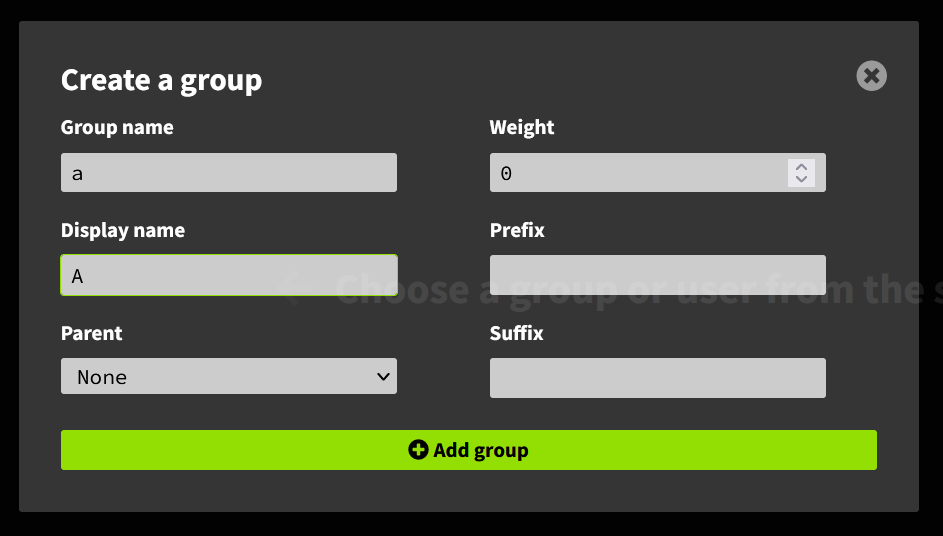
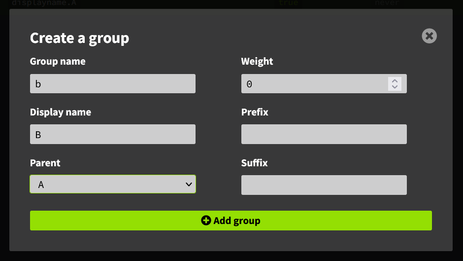
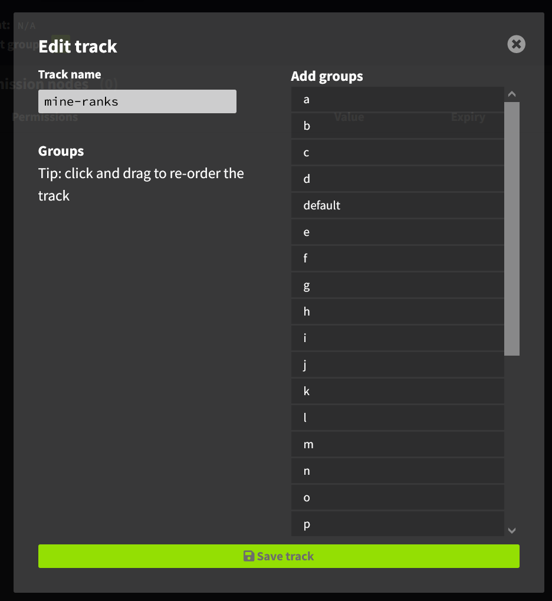
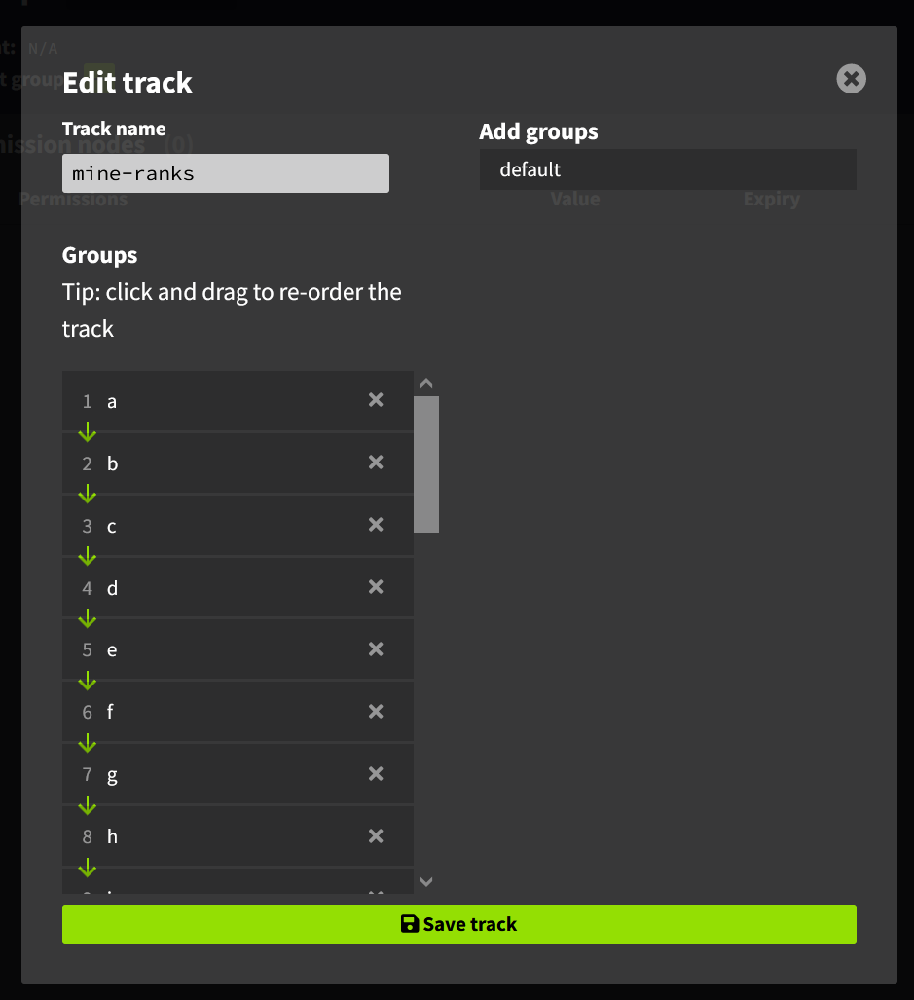

### Prison Documentation 
[Prison Documents - Table of Contents](prison_docs_000_toc.md)

## Setting up LuckPerms' Groups and Tracks

This document provides an overview to help setup LuckPerms groups and tracks.


*Documented updated: 2022-06-19*

<hr style="height:1px; border:none; color:#aaf; background-color:#aaf;">


# Setting Up LuckPerms


Setup LuckPerms as needed.  Information on where to download it can be found here:

[Setting Up LuckPerms](prison_docs_020_setting_up_luckperms.md)


To use the LuckPerms Chat Prefix, you will also need the **PlaceholderAPI** and **LPC** plugins.  Information on the LPC plugin is presented near the end of this document.


Below are detailed steps on how to configure both Prison and LuckPerms.


The commands and configurations presented below are for a normal (A-Z) setup, if your ranks and/or mines have different names, use those instead of the A-Z names as shown in this guide


<hr style="height:3px; border:none; color:#aaf; background-color:#aaf;">


# LuckPerms Groups

To help simplify the management of permissions for players, LuckPerms uses permission Groups to form a collection of permissions.  This helps to simplify assigning permission to players since one group can contain many permissions.  For example, if there are 20 permissions in a group, then you would only have to issue one group command instead of 20 permission commands.

<hr style="height:3px; border:none; color:#aaf; background-color:#aaf;">


# LuckPerms Tracks

A brief overview of Tracks: Tracks are to LuckPerms, as ranks and ladders are to Prison.  They provide an easy way to manage player's perms by associating them with these ranks.  Tracks are also linked together, just like Prison ladders. A player is then moved along these Tracks to provide a way to change their permissions to match the evolving access and roles. 


To advance a player within LuckPerms Tracks, you just promote the player to the next higher Track.  This is very similar to how Prison ranks and ladders are used.


Since Prison needs to use their own ranks, and is not directly tied to LuckPerms Tracks, Prison Ranks can help manage a player's LuckPerms Track.

<hr style="height:3px; border:none; color:#aaf; background-color:#aaf;">


# Using Prison Rank Commands with Groups and Tracks - An Overview

Since LuckPerm Groups and Tracks must be synchronized with Prison Ranks, the Prison Rank Commands are used to provide this linkage through Prison Rank Commands.  This allows the player to control when they rankup within Prison, which then synchronizes the LuckPerms' Track.


If you are not using LuckPerms Tracks, the following is the command you would use to setup the prison rank command.


```
/ranks command add B lp user {player} parent set [group]
```


As a quick review, to get more help about the prison rank commands.  The `help` key word displays detailed help about the selected Prison command.  And the `placeholders` keyword is important for prison commands since it lists all of the available placeholders that can be used to provide prison related data and values to be used within the commands.

```
/ranks command add help
/ranks command add placeholders
/ranks ladder command add help
/ranks ladder command add placeholders
```


Prison has various commands, such as Rank Commands, Ladder Commands, Mine Reset Commands, Block Even Commands, and etc.. Each type of command set has it own unique combination of command placeholders.  It's very important to review the list of placeholders since they can be used to inject those values in to the commands before prison runs them.

Here is an example of the placeholders for Rank and Ladder Commands:

```
{player} {player_uid} {msg} {broadcast} {title} {actionBar} 
{inline} {inlinePlayer} {sync} {syncPlayer} {firstJoin} 
{promote} {demote} {balanceInitial} {balanceFinal} {currency} 
{originalRankCost} {rankupCost} {ladder} {rank} {rankTag} 
{targetRank} {targetRankTag}
```


The following is how you would setup a Prison rank command to use tracks.

```
/ranks command add B lp user {player} parent settrack [track] [group]
```

Setting up these rank commands, will cause Prison to run these commands when the player ranks up.


So in review, these are two examples of rankup commands for a player who joins the server for the first time, are demoted back to A, or the prestiged and are reset to rank A. The Prison rank is named `A` and so is the LuckPerms group.  The first command is for setups with no tracks, and the second is for tracks; insert the track's name for `[track]`.  If you name your track `PrisonRanks`, with the Track's Groups named the same as the Prison Ranks.


```
/ranks command add B lp user {player} parent set A

/ranks command add B lp user {player} parent settrack PrisonRanks A
```


<hr style="height:1px; border:none; color:#aaf; background-color:#aaf;">


# More Examples of Usage


If you change a player's rank from E to A, the Prison rank commands for A will run, and set the player to group A, or default.

When you prestige, your rank goes from Z to A, so rank's A commands will be ran.
Plus the rank on your first Prestige rank (typically P1) will **ALSO** be ran.  This is highly useful since if you want certain prestige levels to have their own certain benefits/perms, you can setup a separate track and groups for Prestige ranks.

For example, where `P1` is the Prestige 1 rank:

```
/ranks command add P1 lp user {player} parent settrack [track] P1
```


<hr style="height:1px; border:none; color:#aaf; background-color:#aaf;">


# Setting Up LuckPerms Groups and Tracks - An Overview

Although there are many ways to configure any plugin, these suggestions tries to keep things simple by using the same names as the counter parts between Prison and LuckPerms.  It may be slightly confusion which is which, as far as Prison or LuckPerms, but it makes it easier by being consistent with the same names for the similar parts.


The best way to setup LuckPerms Groups is to make 1 group for every Prison Rank.  Then use the Rank Commands to assign users to that group automatically when they rankup.  Then to tie things together within LuckPerms, place these created LuckPerms Groups on a LuckPerms Track.  Then when a player ranks up, a Prison Ladder Command will be ran to change the LP track to keep Prison's Ranks in synch with the LuckPerms tracks.


To give you the choice on how to setup the LP groups and tracks, **Step 1** through **Step 3** shows you how to use *either* the LP Web Permissions Editor or how to use the commands through the server's console.  Choose one or the other; you should not try to do both.


**Step 1 : Configure Prison's Ranks and Mines**

If you have not done so already, the best option to get started with Prison, is to run `/ranks autoConfigure`.  That provides so much of the basic configurations and can save you hours just trying to get the basics setup.  You can always change the default settings later to fine tune your setup.


The command `/ranks autoConfigure` will create Ranks and Mines with names from A through Z.  It will also create the first 10 Prestige ranks with the names P01 through P10.


Prison will name the ranks with one letter, and it they will be upper case.  Therefore, when defining the groups within LuckPerms, name the groups exactly the same way as the ranks.  LuckPerms does not allow the group name to use any upper case characters, so they will be lower case, which is perfectly fine.


Prison will also link each Mine to the Rank of the same name.  Prison will also enable **Mine Access by Rank**, and **TP Access by Rank** too. This is very important. 

If you did not run `/ranks autoconfigure`, you can auto link the mines and ranks, assuming they both have the same name, with the following commands:

```
/mines set rank help
/mines set mineaccessbyrank help
/mines set tpaccessbyrank help

/mines set rank a a
/mines set rank b b
(repeat for all mines and ranks)

/mines set mineaccessbyrank *all* enable
/mines set tpaccessbyrank *all* enable

```


**Step 2 : Create the LuckPerms Groups using the LP Editor**


Create a new group in LuckPerms for each Rank within Prison. 


Please note that the name of the LuckPerms group must match the names you use with the Prison Rank names.  This is very important because in **Step 4** below you will need to create a Ladder Command that will run every time a player ranks up, and it will use the next rank's name in the command, which must match the LuckPerms' group name or it won't work.


We suggest that you should use the LP editor, which makes it easier to perform admin tasks.  To open a new editor session, use the command `/lp editor` then click on the hyperlink, or copy and paste it to your browser.


Within the LP Web Permissions Editor, to the left of the page is a left-navigation section with expandable topics of: Tracks, Groups, and Users.  To the right of the Groups section is a plus sign "+", click on that to add a new group.


  


To create your first group, give it a name of "a" and a display name of "A". The display name is not intended for using color codes, or anything fancy.  Click on "Add Group" to create the group.


  


Then create group b.  But this time, have it list Group A as the parent.


  


Repeat creating all the groups, where group z will be the last one.
.

Save it.  Click the save icon in the upper right hand corner.  It will give you a code to apply the changes.  Click the code to copy it to your clipboard, then paste it in game, or in the server's console.  


**Step 2 : Create the LuckPerms Group using Commands**

NOTE: Ignore these steps if you are using the LP Editor.

You can use the `/lp creategroup <group>` command. Create a group for A, then when you create a group for B, you will have to set group A as the parent for Group B.  Setting a display name is optional and not needed, but is shown here to "mirror" what is being generated within the LP Web Permission Editor.


Here are the commands:

```
/lp creategroup a
/lp group a setdisplayname A

/lp creategroup b
/lp group b setdisplayname B
/lp group b parent add a

/lp creategroup c
/lp group c setdisplayname C
/lp group c parent add b

... etc ...

/lp creategroup z
/lp group z setdisplayname Z
/lp group z parent add y
```


**Step 3: Create LP Tracks using LP Editor**


Open a new LP Web Permission editor: `/lp editor`.


Click the plus (+) button to the right of the heading **Tracks** to create a new LP track.

Name the new track "mine-ranks".


  


You "must" click on each rank in alphabetical order to add it to the track's list.  You can also drag-n-drop.  Review the list of ranks and ensure they are in alphabetical order.  Notice it shows the groups in order, with arrows identifying the flow of the track.


  


When finished, click on "Add Track" to keep it.


Click the save icon in the upper right hand corner, then copy and paste the code in game or in to the console to apply it.


**Step 3: Create LP Tracks using Commands**

NOTE: Ignore these steps if you are using the LP Editor.


Create the track, then add the groups in the correct order:


```
/lp createtrack mine-ranks
/lp track mine-ranks append a
/lp track mine-ranks append b
/lp track mine-ranks append c

... etc ...

/lp track mine-ranks append z

```

**Step 4 - Setting up Ladder Commands to link LuckPerms to prison**


If you're familiar with Prison's rank commands, you'll know you can do a lot of powerful things when a player ranks up, including running commands from other plugins.  But the downside, is that each rank will need to be configured with the same commands, which can be a pain and a risk for bugs.  What if you skipped a rank or had a typo in a command?  What if there was something even better than Rank commands?


Prison actually has Ladder Commands.  They are similar to Rank Commands, but a ladder command is applied to all ranks on that ladder.  That means you only create one ladder command, instead of 26 rank commands.  A huge savings.


Ladder commands make use of ladder placeholders so you can inject rank names, or other values, in to the command when it is ran.  This prevents the need to copy rank commands just to provide the correct rank name.  Please review the list of placeholders to better understand how ladder commands can adjust for various ranks.  See the commands below.


So the final step in setting up LuckPerms Tracks is to create just one Ladder Command.  That ladder command will run this LP command: `lp user [playerName] parent settrack [track] [LP-group]`.  See the command below with prison's Ladder placeholders and LP track name inserted.

```
/ranks ladder command add help
/ranks ladder command add placeholders

/ranks ladder command add default lp user {player} parent settrack mine-ranks {targetRank}
```

Let's review the parts of that command: 

* `/ranks ladder command add` - The command prison's command-handler runs.  4 words to identify 1 command.
* `default` - Identifies which ladder to add the command to.  This is the "default" ladder.
* `lp user` - Identifies a LP User command is being used.
* `{player}` - This is a Ladder command placeholder which will inject the player's name before running the command.
* `parent settrack` - Sets the player's parent to use a track.
* `mine-ranks` - The LP Track name that we defined that contains all of the LP Groups.
* `{targetRank}`- This is a Ladder Command placeholder that will inject the new rank for the player.


<hr style="height:10px; border:none; color:#aaf; background-color:#aaf;">


# Setting up LuckPerms Chat Prefixes


To setup a LuckPerms chat prefix, using prison's rank tag, use the following command.  This assumes you've followed the directions above with setting up a LP track.


The following commands are examples of setting up a default prefix for your groups.  You only need to use one command when setting up a default.


The first examples are pretty much identical. The second one is exactly the same as the first, except for it's using the placeholder's aliases.  The third one is using the non-ladder variant which includes all rank tags for all ladders on which a player has a rank, which could be more than two.  The drawback to the third one is that you don't have control over which one is displayed first.

```
/lp group default meta setprefix "%prison_rank_tag_prestiges%%prison_rank_tag_default% &r"
/lp group default meta setprefix "%prison_rt_prestiges% %prison_rt_default% &r"
/lp group default meta setprefix "%prison_rt% &r"

```

This one is rather interesting since it provides the player's current Earnings per Minute.  When auto pickup is enabled, and autosell is enable for each block break, then this will show the dynamic earnings as players chat. Providing such information may encourage players to see who can get the highest value.  The full placeholder is shown for understandability, but the alias is probably ideal to use due to the shorter length: `%prison_pb_epmf%`.

```
/lp group default meta setprefix "%prison_rank_tag_prestiges%%prison_rank_tag_default% &4[&7%prison_player_balance_earnings_per_minute_formatted%&4] &r"
```


Some other variations may include the player's health levels, the total number of blocks mined, or even which mine they are currently in.  There are a lot of possibilities.


You could use just `%prison_rank_tag%`, or it's alias `%prison_rt%`, but that will include the rank tags for all ranks the player has on the server.  Normally they will always have a rank on the `default` rank, and optionally on the `prestiges` ladder too.  If other ladders are setup, then they will also be included.  Generally this is fine, but the drawback is that you cannot control the order in which they are generated.  So as listed in the example above, we are controlling the order of the rank tags for both the prestiges and default ladder.  The aliases for those two placeholders are `%prison_rt_prestiges%` and `%prison_rt_default%`.


Next, you need to install a plugin to enable the LuckPerms Chat Prefixes, which allows LuckPerms to resolve the placeholder through PlaceholderAPI.


Download the **LPC** plugin and place it in the server's `/plugins` directory.  This plugin also requires the **PlaceholderAPI** plugin.  Then restart the server.


[https://www.spigotmc.org/resources/lpc-chat-formatter-1-7-10-1-18-2.68965/](https://www.spigotmc.org/resources/lpc-chat-formatter-1-7-10-1-18-2.68965/)


There should be no configuration changes needed for the plugin, and it should just work.


<hr style="height:10px; border:none; color:#aaf; background-color:#aaf;">


# Special Variation: Accessing Only One Mine at a Time by using MineAccessByRank

_Warning: This is a non-standard way of configuring access to your mines. These settings will only allow a player to access only the current mine and will exclude them from accessing prior mines._

This setting will only allow players to access mines that are linked to their current rank.  For example, if a player is at Rank C, then they cannot access the prior mines A nor B.  This is a very restrictive configuration and is not generally typical of a prison server.  


Enable MineAccesByRank on all mines:

`/mines set mineAccessByRank *all* enable`

Then in the Prison `config.yml` file, enable this setting, using a value of *false*:

```yaml
prison-mines:
  access-to-prior-mines: false
```


<hr style="height:10px; border:none; color:#aaf; background-color:#aaf;">


# Special Variation: Accessing Only One Mine at a Time by using Permissions

_Warning: This is a non-standard way of configuring access to your mines. These settings will only allow a player to access only the current mine and will exclude them from accessing prior mines._

_Warning: It is not recommended to use Mine Access by Permissions; instead use MineAccessByRank._

One special variation in configuring your server, would be if players can "only" access mines that are tied to their current rank.  For example, if a player is at Rank C, then they cannot access the prior mines A nor B.  This is a very restrictive configuration, which requires managing the permissions.


If you are using permissions for access, then the two you need to know about are: `mines.<mineName>` and `mine.tp.<mineName>`.  Such that mine A would require: `mines.a` and `mines.tp.a`.


Add these two perms to all LuckPerm groups.  You can use the LP editor, or manually with the following commands.  Repeat for all groups.

```
/lp group a permission set mines.a true
/lp group a permission set mines.tp.a true
```


You would also need to turn off Mine Access by Rank and TP Access by Rank, then enable access by permissions with the following commands:

```
/mines set mineAccessByRank *all* disable
/mines set tpAccessByRank *all* disable

/mines set accessPermission help
/mines set accessPermission a mines.a
/mines set accessPermission b mines.b
/mines set accessPermission c mines.c

... etc ...

/mines set accessPermission z mines.z
```


<hr style="height:6px; border:none; color:#aaf; background-color:#aaf;">


# Testing LuckPerms along with Prison Ranks


Here are a few topics to consider when you're testing your setup.  Some of these are some general tips that may help with testing and managing your player.


Make sure the player you're testing with is not OP'd.  If you're permissions to manage access to mines, mine TP spawn locations, or other commands, then OP will bypass all perms and give that player full access.


You can use `/rankup` to change ranks, but it will cost you the stand rankup fees.


Or you can use `/ranks promote help` and `/ranks demote help` to rankup and to rank-down.  Check out these commands, since you can force a player to pay for the promote, or even give a refund on a demote.


If you're using EssentialsX's economy, also applies to many other economy plugins, the following commands can be helpful to know.  `/eco` will show available commands.  To give yourself money: `/eco give <player> <amount>`.  Remove some with `/eco take <player> <amount>`.  Or to set it to a specific value `/eco set <player> <amount>`.


You can also use `/ranks set rank help` to jump over a number of ranks in either direction.  But this could be dangerous if there is a rank command that needs to be set, or removed, at any specific rank that you may skip over.


To test the teleportation to the mines, especially if you use perms, you can use `/mines tp`, or the alias `/mtp`.  If you did not setup each mine's spawn points yet, then it will teleport you to the top-center of the mine.  See `/mines set spawn help`.


Generally your players will be using the GUI for ranks and mines.  For mines, the commands for players are just `/mines` but if you're OP'd then you can use `/gui mines` to get to their GUI.  Same with player ranks, their command is just `/ranks`, but to access that guil while OP'd use `/gui ranks.  Within the Mines GUI, the players can TP to the mines (why its important to test TP'ing).  Also they can rankup through the ranks GUI.


To review a player's rank within LP use `/lp user <player> info` and `/lp user <player> permission info`.


To review a player's rank within prison use `/ranks player <playerName>`.


<hr style="height:6px; border:none; color:#aaf; background-color:#aaf;">


