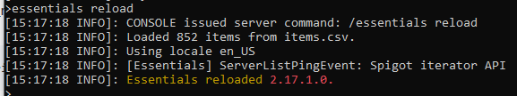

### Prison Documentation 
[Prison Documents - Table of Contents](prison_docs_000_toc.md)

## Setting up EssentialsX

This document provides a quick overview on how to install EssentialsX and add the Prison Rank Tag to your chat.

# Optional Dependencies

It is highly recommended to install [Vault](https://www.spigotmc.org/resources/vault.34315/). Vault will allow many different economies, permissions, and placeholders to works with Prison.  If no other economy is detected, then Prison will default to using EssentialsX as a backup.

# Setting up EssentialsX

Setting up Essentials is easy, but you've to choose which plugins to add.

* Download the EssentialsX's Zip, which contains various jars plugins.
* Download from the SpigotMC.org EssentialsX **Version History** tab for the EssentialsX Resource:
    - [EssentialsX Download page](https://www.spigotmc.org/resources/essentialsx.9089/)
* Unzip the download.
* Copy the jar files of your choice to your server's `plugin/` directory.
* The zip file contains multiple jars of the same version. Always use the same versions with each other, and never mix one EssentialsX jar version with another version. 

* Available Modules and what is recommended and what isn't:
    * EssentialsX - Main jar - **Required**
    * EssentialsXAntiBuild - *Optional* - Don't use if using WorldGuard?
    * EssentialsXChat - **Recommended** - Provides chat based placeholders (see below)
    * EssentialsXGeoIP - *Optional* - Provide geo locations for players IP addresses
    * EssentialsXProtect - *Optional* - Not sure, but shouldn't be used with WorldGuard?
    * EssentialsXSpawn - *Optional* - Not sure, but provides special behaviors for spawn? Not sure.
    * EssentialsXXMPP - *Don't Use* - Google _XXMPP for spigot_ to confirm if you really have a need to use this.  You probably never will. 

* Prison does not require you to change any settings in EssentialsX, but you may if you want to customize a few things.

* List of possible items to modify:      
    * Chat prefixes (see below)
    * Item prices if you will be using the shop functions through EssentialsX. If you do, I suggest you remove the entries for armor, weapons, tools, food, etc.  Otherwise players may accidentally sell things they need. Also you can add new items to be sold.
    * Customize kits
    * etc...
    
    
* Restart your server

## Add the Prison placeholder *Rank Tag* to Player's Chat Prefix

* Go to the EssentialsX's plugin folder on the server:

* Path: `plugins\Essentials\`

* Edit the `config.yml` file: 
    - Search for the section pertaining to chat by using one of the following keywords: 
      - **EssentialsChat** for older versions of EssentialsX for spigot v1.8 through v1.15
      - **EssentialsX Chat** for newer versions of EssentialsX.
    - Add the placeholders {prison_rank_tag} or {prison_rank} to the "format:" line.
        * The placeholders should be **all lower case**
        * The curly braces is used by EssentialsX chat engine, not Prison. Other chat plugins may use percent symbols instead.
        * {prison_rank} is the rank name without special formatting
        * {prison_rank_tag} is the defined tag (with formatting) for that rank
    - Example:
    format: `<{prison_rank_tag}:{DISPLAYNAME}>{MESSAGE}`

Reload EssentialsX settings, or restart the server.

    
# Applying Settings and Reloading Essentials

* Restart the server. Or use **/essentials reload**.

  

* If you reload essentials and the placeholders are not working, then you may have to either restart the server, or reload the prison's placeholders with the following commands, both of which are exactly the same:
    - `/prison placeholders reload`
    - `/prison reload placeholders`

* Notice: **Don't use /reload to reload the whole server!**  Using /reload or another tool such as plugman could corrupt plugins. Prison was not designed to do soft reloads and as such mines, ranks, ladders, and even some player settings and histories could be corrupted.

# Essentials Currency Commands

Eventually you may have to deal with currency, so here are the essentials commands.

* `/eco` - Show the EssentialsX economy commands
* `/eco give <player> <amount>` - Give a player money
* `/eco take <player> <amount>` - Take away money from a player
* `/eco set <player> <amount>` - Set a player's balance to an amount. Resets the balance to a given amount.
* `/bal <player>` - Shows the balance for a given player.

  

**End of the guide**

