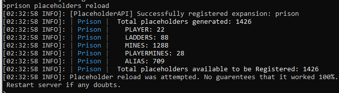
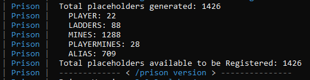

### Prison Documentation 
[Prison Documents - Table of Contents](prison_docs_000_toc.md)

## Setting up PlaceholderAPI

This document provides a quick overview on how to install PlaceholderAPI.

Additional documentation on placeholders:

* [Guide: Prison Placeholders](prison_docs_310_guide_placeholders.md) 
	How to use placeholders. Includes HolographicDisplays.

* [Setting up Mines](prison_docs_101_setting_up_mines.md)
	This has a placeholder example using a One-block mine example with HolographicDisplays.


<hr style="height:1px; border:none; color:#aaf; background-color:#aaf;">


# Optional Dependencies

* If you want to use placeholders with plugins without placeholderAPI support you should also install the right version of [Protocollib](https://www.spigotmc.org/resources/protocollib.1997/) for you server and the [PlaceholderAPI ChatInjector](https://www.spigotmc.org/resources/chatinjector.38327/)


<hr style="height:1px; border:none; color:#aaf; background-color:#aaf;">


# Setting up PlaceholderAPI

Setting up PlaceholderAPI just need couple of steps:

* Download PlaceholderAPI
    - Go to the SpigotMC.org PlaceholderAPI download page
        - [PlaceholderAPI Download page](https://www.spigotmc.org/resources/placeholderapi.6245/)

* Copy to your server's plugin directory

* Restart your server. Do not use **/reload** or you'll break Prison Placeholders. Prison registers all of the placeholders upon server startup so the registrations will be lost.

* NOTE: Prison now has placeholders reload feature, but the first time you install PlaceholderAPI you will have to restart the server for everything to be properly registered.

<hr style="height:1px; border:none; color:#aaf; background-color:#aaf;">


# Placeholders Commands

Use the command **/prison placeholders** for a listing the placeholder commands.  These include:

* **/prison placeholders list**
* **/prison placeholders search <playerName> <pageNumber> <searchPatterns>**
* **/prison placeholders test <text>**


* **/prison placeholders reload** or **/prison reload placeholders**
    - This will reload all placeholders and will re-register them with the proper placeholder plugins.  Both of these commands are exactly the same.


Example of reloading prison's placeholders with stats on what was registered.

  


* **/prison version**
    - The prison version command is useful for reviewing that placeholder plugins are correctly registered.
    

* **Prison startup logs**
    - The Prison startup messages provides a detailed list of stats pertaining to placeholders, such as the break down of how many were registered and available.
    

  


<hr style="height:1px; border:none; color:#aaf; background-color:#aaf;">


# Troubleshooting Possible Compatibility Issues

There are no known issues with Prison and PlaceholderAPI, but out of the interest to help get your servers up and running, here are a couple of tips that could help with your environment.


<h3>Issue with PlaceholderAPI not working with Economy and Scoreboard</h3>

There was an issue with an economy placeholder not working with the QuickBoard placeholder.  

The solution was to download from PlaceholderAPI, their modified version of Vault and Essentials.  Followed by a server restart, or use `/papi reload`. 

```
/papi ecloud download Vault
/papi ecloud download Essentials
/papi reload
```

If you use `/papi reload`/ then you will have to reload the placeholders in prison so they are registered with papi.  When papi reloads, it forgets everything that was registered before.


You can use either one of the following commands to reload and re-register all of prison's placeholders.  Both commands are exactly the same.

```
/prison placeholders reload
/prison reload placeholders
```

If you create new ranks or mines you will also have to reload the prison placeholders.  You don't have to reload papi in these situations, just prison.


<hr style="height:1px; border:none; color:#aaf; background-color:#aaf;">
