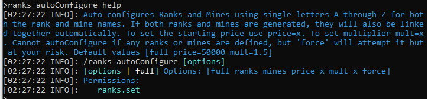
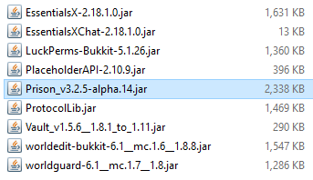
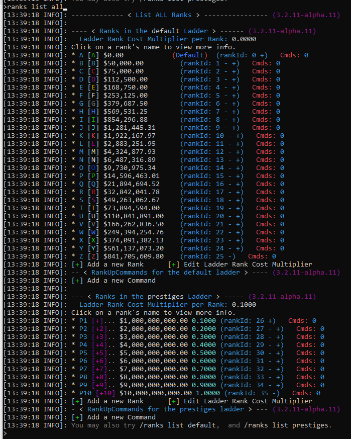
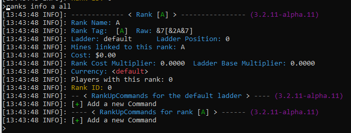
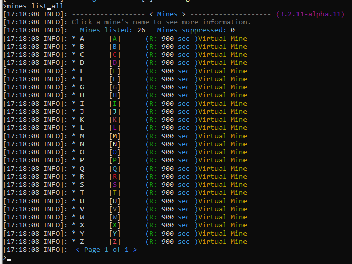
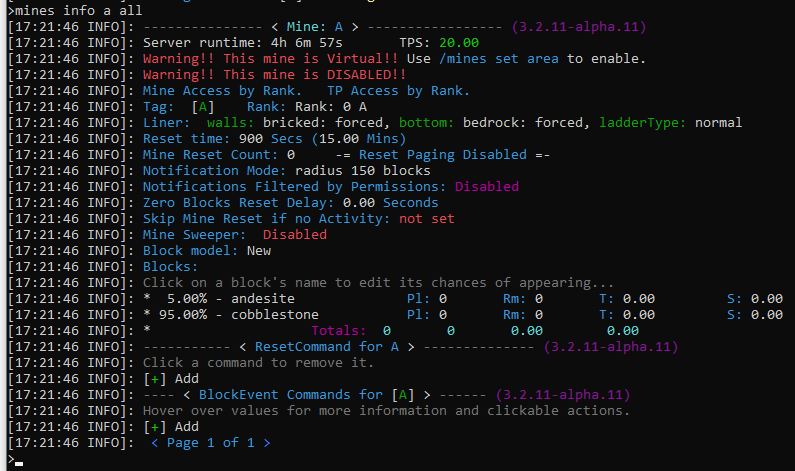

### Prison Documentation 
[Prison Documents - Table of Contents](prison_docs_000_toc.md)

## Prison - Setting Prison with Auto Configure

This document provides information on how to get started quickly using Prison's `/ranks autoConfigure`.


<hr style="height:3px; border:none; color:#aaf; background-color:#aaf;">

# Overview

This document covers how to run `/ranks autoConfigure`, it's options, and what to do after the command runs.


Prison's Auto Configure will perform most of the basic configurations to get you up and running quickly.  This feature will perform the following tasks for you:


* Create a series of Ranks and Mines that will be named A through Z, for both the mines and the linked ranks.  The mines are generated as Virtual Mines.


* Link each Mine to it's associated Rank.


* Assign blocks to each mine, starting with the least valuable blocks for Mine A, and then including more valuable blocks until it gets to Mine Z. 


* Auto Configure now uses a new feature called Access by Rank.  This is automatically enabled for Mine Access and Access to TP for the players.  Access by Rank eliminates the need to use perms for these access.  As a player ranks up, they will gain access to ranks and mines, but all prior ranks and mines will automatically be included. 


* Auto assign random Mine Liners to each mine. 


* Auto generate 10 Prestige Ranks and have them enabled by default.


* Enable Ladder Base Rank Cost Multiplier for the Prestiges ladder.  Once a player prestiges, this will enable a rank cost multiplier that will increase all rank cost.  As the player ranks upon the prestiges ladder, the rank costs will increase.


* Enable Prison's Sellall feature and preload the default shop prices with about 98 items and blocks.  These defaults settings will allow your players to sell what they mine.


* Enable Prison's Auto Features.  This includes, by default, auto pickup, auto smelt, and auto block.  It also enables other features such as providing XP for certain blocks, fortune, etc.  


<hr style="height:3px; border:none; color:#aaf; background-color:#aaf;">


# Steps Covered in this Document

Some of the steps involved and which are covered by this document:

* **Server Requirements and expectations** - Quick overview on what you need before you get started.


* **Starting Up Prison the First Time** - Perform a quick sanity check that everything is working.


* **What the Auto Configure Command Does** - A short list of what the command will do.  See the **Overview** above.


* **Running the command `/ranks autoConfigure`** - Running the command and what to expect.


* **Alternative setting to use with the Auto Configure command** 


* **Turning Virtual Mines in to Actual Mines** - How to set the mine's locations so they become real.


* **Setting a Mine's Spawn Location**


* **Resizing A Mine**


* **Moving A Mine**


* **Changing A Mine's Liner**


* **Submitting a New Liner Request**


* **Working with Mines within a Void World** - Special considerations for resizing, moving, and liners when in a Void World.


* **Working with Mine's Permissions**


* **Using Mine Reset Commands**


* **Working with Rank Commands**


<hr style="height:3px; border:none; color:#aaf; background-color:#aaf;">


## Server Requirements and expectations


These listings are to help guide you in planning on what you need.  A minecraft server is a deep expression of the owner's vision and the possibilities are unlimited.  Prison provides many more options.  As such, what works for one server, may not work for yours.  These items provides a starting point of the endless of possibilities.  Try them and see what happens.


* **Spigot Platform** 
    - You need to use a server platform that is based upon Spigot.  
    - Prison only supports Spigot directly, but many other platforms that are based upon Spigot have worked flawlessly too.  If you use another platform based upon Spigot we will work with you if you are having issues and we will try to resolve any platform-specific issue you may encounter within reason.  But we will not perform daily testing on non-spigot platforms since there are way too many variations out there.


* **Minecraft Server Version**
    - Prison support a native minecraft server version of v1.8 through v1.16.5.
    - Prison is developed and compiled with the Spigot v1.13.2 build.  This ensures that Prison is able to natively support all functional behaviors from v1.8 through v1.16.5 since v.1.13 is the only version of Spigot that has both the old internal functions and new internal functions coexisting at the same time.  
    - Prison will try to support v1.17 when it is released, but not sure what special requirements it will place upon the development environment.
    

* **Memory Requirements**
    - Prison can run with a minimum of 1 GB of ram, but more is suggested. 
    - A test server running Spigot 1.8.8 with 9 plugins and 48 mines can run for hours with using less than 400 MB of ram. This is with no real activity, so I would consider this the base amount of memory.
    - Normally about 2 GB to 4 GB could be required.
    - It really depends upon how many plugins you have and their memory requirements.  Also the number of players is a major contributing factor too.  Prison does have some heavy memory requirements since many features must remain in memory while the server is running.  So the more mines and ranks you have, the more memory will be required. 


* **Server Cores**
    - Most hosting services offer only 1 core, and a lot of times that single core is shared. 
    - Naturally prison will do well with just one core, but if your server is growing with a lot of players and you're starting to see heavy loads, then you may want to consider increasing the number of dedicated cores your server can use.  Most hosting services do not provide this as an option, but some do.  So this should be something to consider if your server is growing large.
    
    
* **Other Plugins - Required**
    - Prison has a philosophy that no other plugins are required, but the honest truth is that there are a few you really must have to get thinks to "work".  Prison has no "hard dependencies" to other plugins so that may give a false illusion that your server may not need any other plugins, which is not correct.  Spigot/Bukkit will not keep prison from running if you lack critical plugins.
    - Prison must have some basic support with an economy and permission plugin.
    - **Vault** - Is a critical plugin that provides connections to numerous plugins on the market for both Economies and Permissions.  Vault allows you to choose one of these other plugins and helps ensure prison will work with it.  Vault allows the freedom of choice.  Vault is still optional.
    -  **Economy Plugin** - **Required!** Prison will not work without an economy plugin.  You can use almost any economy that Vault supports. Or if you don't want to use Vault then you can use EssentialsX economy directly, or Sane Economy, or Gems Economy without Vault.  Prison has direct integrations with these three economy plugins.  Note that Gems Economy is a plugin that supports custom economies and can be used with other economy plugins.
    - **Permission Plugins** - **Required!** Prison will not work without a permission plugin, but Spigot will default to an simple internal permission engine.  But a plugin will provide more features and better support.  Prison provide native support for LuckPerms v5.x and even v4.x (legacy). It is strongly suggested to use the latest version of LuckPerms. Other permission plugins are supported through Vault.
    - **EssentialsX** - EssentialsX is a great free set of plugins that provides a good free **economy** plugin and also they have a great chat plugin that will provide a simple and reliable way to set chat prefixes.
    - **Placeholders** - Placeholders support is optional, but it provides for a richer server environment by integrating prison details within other plugins such as holographic displays, scoreboards, and chat prefixes.  Prison supports **PlaceholderAPI (papi)** and strongly recommends its use.  Prison also supports **MVdWPlaceholderAPI** but it may not be as flexible as papi, also it may fail to work with prison's placeholder attributes. 
    - **WorldEdit and WorldGuard** - WorldGuard is strongly suggested to protect your whole world.  With prison's newest release, the use of Mine Access Permissions reduces the need to create WG regions other than the default region.  WG is also useful for keeping players out of areas such as mines they don't have access to.
    
    
* **Other Plugins - Optional**
    - **ProtocolLib** - Used by other plugins.  You probably will need it.
    - **Holographic Displays** - Creates holographs.  You will also need **HolographicExtensions** plugin to get the holographic displays to work with PlaceholderAPI (papi).
    - An Enchantment plugin - Provides OP options for your OP mines - **TokenEnchant** is recommended for the fullest support within prison, but it is a premium plugin.  Other options are **Crazy Enchantments** and **Zenchantments**.  There are others, but they may not be fully supported due to conflicts with the bukkit BlockBreakEvents and they don't have explosion events that prison can monitor and enable.
    - **McMMO** - Prison supports it within the mines.  Appears to be fully supported.
    - **MinePacks** - Prison has it's own built in backpacks, but this is another backpack plugin that's supported.
    - **Custom Items** - This is simply an amazing plugin.  You can create custom items, but also custom blocks with custom textures (optional) and custom events.  Prison supports about 90% of the features; if you need more feature enabled for it, please contact us.
    - **Multiverse-core** - Supports multiverse-core and the delayed loading of worlds.  Also supports Void world generators.
    - **ViaVersion and ViaBackwards** - Allows for the support of versions other than your server version.  Not all features may work when using this plugin, but no issues have been reported.


* **Access to the Server's Console**
    - Some hosting services may not offer access to the server's console, but the console can make it easier to enter complex commands and to view larger sets of data from various command outputs.
    

<hr style="height:3px; border:none; color:#aaf; background-color:#aaf;">


# Starting Up Prison the First Time


Prison prints out a lot of detailed information when it starts up.  Please review the console to confirm there are no obvious error messages.  If there was an issue with prison, and prison is able to detect any issues upon startup, then they will be listed there.


If at any time it appears like there may be something wrong with prison, then please check these startup messages for it may give you a clue as to what is going on.


If at any time you need help with prison, then the first few lines and the list of plugins, with their versions, usually are able to provide a lot of details as to what may be going on.


<hr style="height:3px; border:none; color:#aaf; background-color:#aaf;">


# What the Auto Configure Command Does


Please see the short section at the top of this document titled: **Overview**.


<hr style="height:3px; border:none; color:#aaf; background-color:#aaf;">


# Running the command `/ranks autoConfigure`


It is strongly suggested to run this command from the console so it will be easier to see the messages and any notifications it may provide.


The current version of Prison's `/ranks autoConfigure` uses Access by Ranks to allow players to use various parts of prison automatically.  Two of the major components that are using Access by Rank are `/mines tp` and player access to the mines.  These accesses are based upon the default rank.  A player, through Access by Ranks, has access to all prior ranks too.  This new feature of using Rank Associations will only work for mines that are linked to ranks.


The use of Access by Ranks prevents the need for `/ranks autoConfigure` to generate any rank commands dealing with permissions.  You may need to add them for your own needs.


**Critical:** It should be noted that the ideal conditions to running this command is without having any mines or ranks previously defined.  If any are detected, this command will terminate and will not attempt to perform any actions.  You can use the Option **force** to force the auto configure to run if there are ranks and mines already defined.  If you do force it, keep in mind that it will skip over any rank or mine that it would otherwise try to generate.  It will not add rank commands to existing ranks.  It will not add blocks to existing mines.  It will not hook up ranks to mines.  Nor will it configure such features as Mine Access Permissions.  If you decide to use **force** you do so at your own risks.  That said, it's easy to delete the `plugins/Prison/` directory and start over (or just rename it).


Almost every command within prison has detailed help, and it can be activated by adding the `help` keyword to the end of the command.  For example:


`/ranks autoConfigure help`


  


Under most circumstances you will not have to choose any options.  


Then run the command.  It should only take about 5 seconds run and will generate a lot of output.


`/ranks autoConfigure`


<hr style="height:3px; border:none; color:#aaf; background-color:#aaf;">


# Sample Output from the running the Auto Configure


The server that was created to run this example was using 9 core plugins:


 


<h1>Note: The following is from an older release of prison that generated rank commands that controlled the way prison worked.</h1>


Sample of prison starting up for the first time and it's console messages:


```
[03:02:59 INFO]: [Prison] Enabling Prison v3.2.5-alpha.14
[03:02:59 INFO]: [Prison] Using version adapter tech.mcprison.prison.spigot.compat.Spigot18
[03:02:59 INFO]: | Prison |
[03:02:59 INFO]: | Prison |   _____      _
[03:02:59 INFO]: | Prison |  |  __ \    (_)
[03:02:59 INFO]: | Prison |  | |__) | __ _ ___  ___  _ __
[03:02:59 INFO]: | Prison |  |  ___/ '__| / __|/ _ \| '_ \
[03:02:59 INFO]: | Prison |  | |   | |  | \__ \ (_) | | | |
[03:02:59 INFO]: | Prison |  |_|   |_|  |_|___/\___/|_| |_|
[03:02:59 INFO]: | Prison |
[03:02:59 INFO]: | Prison |  Loading Prison version: 3.2.5-alpha.14
[03:02:59 INFO]: | Prison |  Running on platform: SpigotPlatform
[03:02:59 INFO]: | Prison |  Minecraft version: git-Spigot-21fe707-e1ebe52 (MC: 1.8.8)
[03:02:59 INFO]: | Prison |
[03:02:59 INFO]: | Prison |  Enabling and starting...
[03:02:59 INFO]: | Prison |  Enabled Prison v3.2.5-alpha.14 in 223 milliseconds.
[03:02:59 INFO]: | Prison |  There were 19 new values added to the GuiConfig.yml file located at C:\mc_servers\spigot-1.8.8-autoConfig_server\plugins\Prison\GuiConfig.yml
[03:02:59 INFO]: | Prison |  There were 37 new values added for the language files used by the SellAllConfig.yml file located at C:\mc_servers\spigot-1.8.8-autoConfig_server\plugins\Prison\SellAllConfig.yml
[03:02:59 INFO]: | Prison |  There were 37 new values added for the language files used by the SellAllConfig.yml file located at C:\mc_servers\spigot-1.8.8-autoConfig_server\plugins\Prison\SellAllConfig.yml
[03:02:59 INFO]: | Prison |  There were 272 new values added for the language files used by the GuiConfig.yml file located at C:\mc_servers\spigot-1.8.8-autoConfig_server\plugins\Prison\module_conf\lang\en_US.yml
[03:02:59 INFO]: | Prison |  Notice: AutoManager config file was just updated with 89 new entries. May need to be configured. File: autoFeaturesConfig.yml
[03:02:59 INFO]: | Prison |  Notice: AutoManager config file was just created. You must configure it to use it. File: autoFeaturesConfig.yml
[03:02:59 INFO]: | Prison |  ###--### AutoFeaturesFileConfig: test autoPickupBlockNameList: length = 2  value = [coal_block, iron_ore]
[03:02:59 INFO]: | Prison |  ### VaultEconomyWrapper : vaultVersion = 1.5.6-b49  is pre1_4= false
[03:02:59 INFO]: | Prison |  EssentialsEconomy is not directly enabled - Available as backup.
[03:02:59 INFO]: [PlaceholderAPI] Successfully registered expansion: prison
[03:02:59 INFO]: | Prison |  Mines Module enablement starting...
[03:02:59 INFO]: | Prison |  Mines Module enabled successfully in 152 milliseconds.
[03:02:59 INFO]: | Prison |  Ranks Module enablement starting...
[03:03:00 INFO]: | Prison |  Loaded 0 ranks.
[03:03:00 INFO]: | Prison |  Loaded 2 ladders.
[03:03:00 INFO]: | Prison |  Loaded 0 players.
[03:03:00 INFO]: | Prison |  Ranks by ladders:
[03:03:00 INFO]: | Prison |    default:
[03:03:00 INFO]: | Prison |    prestiges:
[03:03:00 INFO]: | Prison |    none:
[03:03:00 INFO]: | Prison |  Ranks Module enabled successfully in 580 milliseconds.
[03:03:00 INFO]: | Prison |  Utils Module enablement starting...
[03:03:00 INFO]: | Prison |  Utils Module enabled successfully in 7 milliseconds.
[03:03:00 INFO]: | Prison |  Loaded 0 mines and submitted with a 5000 millisecond offset timing for auto resets.
[03:03:00 INFO]: [PlaceholderAPI] Successfully registered expansion: prison
[03:03:00 INFO]: | Prison |  Total placeholders generated: 122
[03:03:00 INFO]: | Prison |    PLAYER: 26
[03:03:00 INFO]: | Prison |    LADDERS: 48
[03:03:00 INFO]: | Prison |    PLAYERMINES: 48
[03:03:00 INFO]: | Prison |    ALIAS: 61
[03:03:00 INFO]: | Prison |  Total placeholders available to be Registered: 122
[03:03:00 INFO]: | Prison |  A total of 0 Mines and Ranks have been linked together.
[03:03:00 INFO]: | Prison |  ------------- < /prison version > ---------------
[03:03:00 INFO]: | Prison |  Prison Version: 3.2.5-alpha.14
[03:03:00 INFO]: | Prison |  Running on Platform: tech.mcprison.prison.spigot.SpigotPlatform
[03:03:00 INFO]: | Prison |  Minecraft Version: git-Spigot-21fe707-e1ebe52 (MC: 1.8.8)
[03:03:00 INFO]: | Prison |
[03:03:00 INFO]: | Prison |  Commands: /prison
[03:03:00 INFO]: | Prison |  Module: Mines : Enabled
[03:03:00 INFO]: | Prison |  .   Base Commands: /mines
[03:03:00 INFO]: | Prison |  Module: Ranks : Enabled
[03:03:00 INFO]: | Prison |  .   Base Commands: /ranks /rankup /rankupMax /prestige /prestiges
[03:03:00 INFO]: | Prison |  Module: Utils : Enabled
[03:03:00 INFO]: | Prison |  .   Base Commands: /prison utils
[03:03:00 INFO]: | Prison |
[03:03:00 INFO]: | Prison |  Integrations:
[03:03:00 INFO]: | Prison |      Permissions:  LuckPerms (Vault)
[03:03:00 INFO]: | Prison |      Economy:  Essentials Economy (Vault)
[03:03:00 INFO]: | Prison |  Integration Type: ECONOMY
[03:03:00 INFO]: | Prison |      Essentials Economy (Vault) <Active> [URL]
[03:03:00 INFO]: | Prison |      Essentials (EssentialsX) (disabled) <Inactive> [URL]
[03:03:00 INFO]: | Prison |      SaneEconomy (API v0.15.0) <Inactive> [URL]
[03:03:00 INFO]: | Prison |      GemsEconomy <Inactive> [URL]
[03:03:00 INFO]: | Prison |  Integration Type: PERMISSION
[03:03:00 INFO]: | Prison |      LuckPerms (Vault) <Active>
[03:03:00 INFO]: | Prison |      LuckPerms (LuckPermsV5) <Active> [URL]
[03:03:00 INFO]: | Prison |      LuckPerms (LuckPerms-Legacy) <Inactive> [URL]
[03:03:00 INFO]: | Prison |  Integration Type: PLACEHOLDER
[03:03:00 INFO]: | Prison |      To list all or search for placeholders see: /prison placeholders
[03:03:00 INFO]: | Prison |      MVdWPlaceholderAPI <Inactive> [URL]
[03:03:00 INFO]: | Prison |      PlaceholderAPI <Active> [URL]
[03:03:00 INFO]: | Prison |      MVdWPlaceholderAPI <Inactive> [URL]
[03:03:00 INFO]: | Prison |      PlaceholderAPI <Active> [URL]
[03:03:00 INFO]: | Prison |  Registered Plugins:
[03:03:00 INFO]: | Prison |     LuckPerms (5.1.26),   WorldEdit (6.1;no_git_id)
[03:03:00 INFO]: | Prison |     Vault (1.5.6-b49),   PlaceholderAPI (2.10.9)
[03:03:00 INFO]: | Prison |     ProtocolLib (4.5.0),   WorldGuard (6.1)
[03:03:00 INFO]: | Prison |     Essentials (2.18.1.0),   EssentialsChat (2.18.1.0)
[03:03:00 INFO]: | Prison |     Prison (3.2.5-alpha.14)
[03:03:00 INFO]: | Prison |  Prison - Finished loading.
```

Running the command:

```
>ranks autoConfigure help
[04:19:55 INFO]: Auto configures Ranks and Mines using single letters A through Z for both the rank and mine names. If both ranks and mines are generated, they will also be linked together automatically. To set the starting price use price=x. To set multiplier mult=x. Cannot autoConfigure if any ranks or mines are defined, but 'force' will attempt it but at your risk. Default values [full price=50000 mult=1.5]
[04:19:55 INFO]: /ranks autoConfigure [options]
[04:19:55 INFO]: [options | full] Options: [full ranks mines price=x mult=x force]
[04:19:55 INFO]: Permissions:
[04:19:55 INFO]:    ranks.set
>ranks autoConfigure
[04:20:03 INFO]: | Info | Your new rank, 'A', was created in the ladder 'default', using the tag value of '[A]'
[04:20:03 INFO]: Virtual mine created: use command /mines set area  to enable as a normal mine.
[04:20:04 INFO]: | Info | Your new rank, 'B', was created in the ladder 'default', using the tag value of '[B]'
[04:20:04 INFO]: Virtual mine created: use command /mines set area  to enable as a normal mine.
[04:20:04 INFO]: | Info | Your new rank, 'C', was created in the ladder 'default', using the tag value of '[C]'
[04:20:04 INFO]: Virtual mine created: use command /mines set area  to enable as a normal mine.
[04:20:04 INFO]: | Info | Your new rank, 'D', was created in the ladder 'default', using the tag value of '[D]'
[04:20:04 INFO]: Virtual mine created: use command /mines set area  to enable as a normal mine.
[04:20:04 INFO]: | Info | Your new rank, 'E', was created in the ladder 'default', using the tag value of '[E]'
[04:20:04 INFO]: Virtual mine created: use command /mines set area  to enable as a normal mine.
[04:20:04 INFO]: | Info | Your new rank, 'F', was created in the ladder 'default', using the tag value of '[F]'
[04:20:04 INFO]: Virtual mine created: use command /mines set area  to enable as a normal mine.
[04:20:04 INFO]: | Info | Your new rank, 'G', was created in the ladder 'default', using the tag value of '[G]'
[04:20:04 INFO]: Virtual mine created: use command /mines set area  to enable as a normal mine.
[04:20:04 INFO]: | Info | Your new rank, 'H', was created in the ladder 'default', using the tag value of '[H]'
[04:20:04 INFO]: Virtual mine created: use command /mines set area  to enable as a normal mine.
[04:20:04 INFO]: | Info | Your new rank, 'I', was created in the ladder 'default', using the tag value of '[I]'
[04:20:04 INFO]: Virtual mine created: use command /mines set area  to enable as a normal mine.
[04:20:04 INFO]: | Info | Your new rank, 'J', was created in the ladder 'default', using the tag value of '[J]'
[04:20:05 INFO]: Virtual mine created: use command /mines set area  to enable as a normal mine.
[04:20:05 INFO]: | Info | Your new rank, 'K', was created in the ladder 'default', using the tag value of '[K]'
[04:20:05 INFO]: Virtual mine created: use command /mines set area  to enable as a normal mine.
[04:20:05 INFO]: | Info | Your new rank, 'L', was created in the ladder 'default', using the tag value of '[L]'
[04:20:05 INFO]: Virtual mine created: use command /mines set area  to enable as a normal mine.
[04:20:05 INFO]: | Info | Your new rank, 'M', was created in the ladder 'default', using the tag value of '[M]'
[04:20:05 INFO]: Virtual mine created: use command /mines set area  to enable as a normal mine.
[04:20:05 INFO]: | Info | Your new rank, 'N', was created in the ladder 'default', using the tag value of '[N]'
[04:20:05 INFO]: Virtual mine created: use command /mines set area  to enable as a normal mine.
[04:20:05 INFO]: | Info | Your new rank, 'O', was created in the ladder 'default', using the tag value of '[O]'
[04:20:05 INFO]: Virtual mine created: use command /mines set area  to enable as a normal mine.
[04:20:05 INFO]: | Info | Your new rank, 'P', was created in the ladder 'default', using the tag value of '[P]'
[04:20:05 INFO]: Virtual mine created: use command /mines set area  to enable as a normal mine.
[04:20:05 INFO]: | Info | Your new rank, 'Q', was created in the ladder 'default', using the tag value of '[Q]'
[04:20:05 INFO]: Virtual mine created: use command /mines set area  to enable as a normal mine.
[04:20:05 INFO]: | Info | Your new rank, 'R', was created in the ladder 'default', using the tag value of '[R]'
[04:20:05 INFO]: Virtual mine created: use command /mines set area  to enable as a normal mine.
[04:20:05 INFO]: | Info | Your new rank, 'S', was created in the ladder 'default', using the tag value of '[S]'
[04:20:05 INFO]: Virtual mine created: use command /mines set area  to enable as a normal mine.
[04:20:05 INFO]: | Info | Your new rank, 'T', was created in the ladder 'default', using the tag value of '[T]'
[04:20:05 INFO]: Virtual mine created: use command /mines set area  to enable as a normal mine.
[04:20:05 INFO]: | Info | Your new rank, 'U', was created in the ladder 'default', using the tag value of '[U]'
[04:20:05 INFO]: Virtual mine created: use command /mines set area  to enable as a normal mine.
[04:20:05 INFO]: | Info | Your new rank, 'V', was created in the ladder 'default', using the tag value of '[V]'
[04:20:05 INFO]: Virtual mine created: use command /mines set area  to enable as a normal mine.
[04:20:05 INFO]: | Info | Your new rank, 'W', was created in the ladder 'default', using the tag value of '[W]'
[04:20:05 INFO]: Virtual mine created: use command /mines set area  to enable as a normal mine.
[04:20:05 INFO]: | Info | Your new rank, 'X', was created in the ladder 'default', using the tag value of '[X]'
[04:20:05 INFO]: Virtual mine created: use command /mines set area  to enable as a normal mine.
[04:20:05 INFO]: | Info | Your new rank, 'Y', was created in the ladder 'default', using the tag value of '[Y]'
[04:20:05 INFO]: Virtual mine created: use command /mines set area  to enable as a normal mine.
[04:20:05 INFO]: | Info | Your new rank, 'Z', was created in the ladder 'default', using the tag value of '[Z]'
[04:20:05 INFO]: Virtual mine created: use command /mines set area  to enable as a normal mine.
```


Note: The following are the messages generated while building the **sellall** shop with the default items:


```
[04:20:05 INFO]: Virtual mine created: use command /mines set area  to enable as a normal mine.
[04:20:05 INFO]: | Prison |   ITEM [COBBLESTONE, 4.0] added with success!
[04:20:05 INFO]: | Prison |   ITEM [ANDESITE, 5.0] added with success!
[04:20:05 INFO]: | Prison |   ITEM [DIORITE, 6.0] added with success!
[04:20:05 INFO]: | Prison |   ITEM [COAL_ORE, 13.0] added with success!
[04:20:05 INFO]: | Prison |   ITEM [GRANITE, 8.0] added with success!
[04:20:05 INFO]: | Prison |   ITEM [STONE, 9.0] added with success!
[04:20:05 INFO]: | Prison |   ITEM [IRON_ORE, 18.0] added with success!
[04:20:06 INFO]: | Prison |   ITEM [POLISHED_ANDESITE, 7.0] added with success!
[04:20:06 INFO]: | Prison |   ITEM [GOLD_ORE, 45.0] added with success!
[04:20:06 INFO]: | Prison |   ITEM [MOSSY_COBBLESTONE, 29.0] added with success!
[04:20:06 INFO]: | Prison |   ITEM [COAL_BLOCK, 135.0] added with success!
[04:20:06 INFO]: | Prison |   ITEM [IRON_BLOCK, 190.0] added with success!
[04:20:06 INFO]: | Prison |   ITEM [LAPIS_ORE, 100.0] added with success!
[04:20:06 INFO]: | Prison |   ITEM [REDSTONE_ORE, 45.0] added with success!
[04:20:06 INFO]: | Prison |   ITEM [DIAMOND_ORE, 200.0] added with success!
[04:20:06 INFO]: | Prison |   ITEM [EMERALD_ORE, 250.0] added with success!
[04:20:06 INFO]: | Prison |   ITEM [GOLD_BLOCK, 450.0] added with success!
[04:20:06 INFO]: | Prison |   ITEM [LAPIS_BLOCK, 950.0] added with success!
[04:20:06 INFO]: | Prison |   ITEM [REDSTONE_BLOCK, 405.0] added with success!
[04:20:06 INFO]: | Prison |   ITEM [DIAMOND_BLOCK, 2000.0] added with success!
[04:20:06 INFO]: | Prison |   ITEM [EMERALD_BLOCK, 2250.0] added with success!
[04:20:06 INFO]: | Prison |   ITEM [OBSIDIAN, 450.0] added with success!
[04:20:06 INFO]: | Prison |   ITEM [CLAY, 12.0] added with success!
[04:20:06 INFO]: | Prison |   ITEM [GRAVEL, 3.0] added with success!
[04:20:06 INFO]: | Prison |   ITEM [SAND, 6.0] added with success!
[04:20:06 INFO]: | Prison |   ITEM [DIRT, 4.0] added with success!
[04:20:06 INFO]: | Prison |   ITEM [COARSE_DIRT, 7.0] added with success!
[04:20:06 INFO]: | Prison |   ITEM [PODZOL, 6.0] added with success!
[04:20:06 INFO]: | Prison |   ITEM [RED_SAND, 9.0] added with success!
[04:20:06 INFO]: | Prison |   ITEM [BEDROCK, 500.0] added with success!
[04:20:06 INFO]: | Prison |   ITEM [SANDSTONE, 3.0] added with success!
[04:20:06 INFO]: | Prison |   ITEM [POLISHED_DIORITE, 8.0] added with success!
[04:20:06 INFO]: | Prison |   ITEM [POLISHED_GRANITE, 9.0] added with success!
[04:20:06 INFO]: | Prison |   ITEM [CHISELED_NETHER_BRICKS, 39.0] added with success!
[04:20:06 INFO]: | Prison |   ITEM [CHISELED_RED_SANDSTONE, 11.0] added with success!
[04:20:06 INFO]: | Prison |   ITEM [CHISELED_STONE_BRICKS, 11.0] added with success!
[04:20:06 INFO]: | Prison |   ITEM [CUT_RED_SANDSTONE, 13.0] added with success!
[04:20:06 INFO]: | Prison |   ITEM [CUT_SANDSTONE, 10.0] added with success!
[04:20:06 INFO]: | Prison |   ITEM [NETHER_QUARTZ_ORE, 34.0] added with success!
[04:20:06 INFO]: | Prison |   ITEM [QUARTZ, 34.0] added with success!
[04:20:06 INFO]: | Prison |   ITEM [QUARTZ_BLOCK, 136.0] added with success!
[04:20:06 INFO]: | Prison |   ITEM [QUARTZ_SLAB, 68.0] added with success!
[04:20:06 INFO]: | Prison |   ITEM [CHISELED_QUARTZ_BLOCK, 136.0] added with success!
[04:20:06 INFO]: | Prison |   ITEM [QUARTZ_BRICKS, 136.0] added with success!
[04:20:06 INFO]: | Prison |   ITEM [QUARTZ_PILLAR, 136.0] added with success!
[04:20:06 INFO]: | Prison |   ITEM [SMOOTH_QUARTZ, 136.0] added with success!
[04:20:06 INFO]: | Prison |   ITEM [SMOOTH_RED_SANDSTONE, 14.0] added with success!
[04:20:06 INFO]: | Prison |   ITEM [SMOOTH_SANDSTONE, 14.0] added with success!
[04:20:06 INFO]: | Prison |   ITEM [SMOOTH_STONE, 14.0] added with success!
[04:20:06 INFO]: | Prison |   ITEM [CHARCOAL, 16.0] added with success!
[04:20:06 INFO]: | Prison |   ITEM [CRACKED_NETHER_BRICKS, 16.0] added with success!
[04:20:06 INFO]: | Prison |   ITEM [CRACKED_STONE_BRICKS, 14.0] added with success!
[04:20:06 INFO]: | Prison |   ITEM [EMERALD, 14.0] added with success!
[04:20:06 INFO]: | Prison |   ITEM [END_STONE, 14.0] added with success!
[04:20:06 INFO]: | Prison |   ITEM [END_STONE_BRICKS, 14.0] added with success!
[04:20:06 INFO]: | Prison |   ITEM [FLINT, 9.0] added with success!
[04:20:06 INFO]: | Prison |   ITEM [LAPIS_LAZULI, 14.0] added with success!
[04:20:06 INFO]: | Prison |   ITEM [MOSSY_STONE_BRICKS, 14.0] added with success!
[04:20:06 INFO]: | Prison |   ITEM [PRISMARINE_SHARD, 13.0] added with success!
[04:20:06 INFO]: | Prison |   ITEM [PRISMARINE, 52.0] added with success!
[04:20:06 INFO]: | Prison |   ITEM [PRISMARINE_BRICKS, 52.0] added with success!
[04:20:06 INFO]: | Prison |   ITEM [PRISMARINE_BRICK_SLAB, 52.0] added with success!
[04:20:06 INFO]: | Prison |   ITEM [PRISMARINE_CRYSTALS, 37.0] added with success!
[04:20:06 INFO]: | Prison |   ITEM [DARK_PRISMARINE, 52.0] added with success!
[04:20:06 INFO]: | Prison |   ITEM [DARK_PRISMARINE_SLAB, 52.0] added with success!
[04:20:06 INFO]: | Prison |   ITEM [PURPUR_BLOCK, 14.0] added with success!
[04:20:06 INFO]: | Prison |   ITEM [PURPUR_PILLAR, 14.0] added with success!
[04:20:06 INFO]: | Prison |   ITEM [TERRACOTTA, 10.0] added with success!
[04:20:06 INFO]: | Prison |   ITEM [ACACIA_LOG, 7.0] added with success!
[04:20:06 INFO]: | Prison |   ITEM [BIRCH_LOG, 7.0] added with success!
[04:20:06 INFO]: | Prison |   ITEM [DARK_OAK_LOG, 7.0] added with success!
[04:20:06 INFO]: | Prison |   ITEM [JUNGLE_LOG, 7.0] added with success!
[04:20:06 INFO]: | Prison |   ITEM [OAK_LOG, 7.0] added with success!
[04:20:06 INFO]: | Prison |   ITEM [SPRUCE_LOG, 7.0] added with success!
[04:20:06 INFO]: | Prison |   ITEM [ACACIA_PLANKS, 28.0] added with success!
[04:20:06 INFO]: | Prison |   ITEM [BIRCH_PLANKS, 28.0] added with success!
[04:20:06 INFO]: | Prison |   ITEM [DARK_OAK_PLANKS, 28.0] added with success!
[04:20:06 INFO]: | Prison |   ITEM [JUNGLE_PLANKS, 28.0] added with success!
[04:20:06 INFO]: | Prison |   ITEM [OAK_PLANKS, 28.0] added with success!
[04:20:06 INFO]: | Prison |   ITEM [SPRUCE_PLANKS, 28.0] added with success!
[04:20:06 INFO]: | Prison |   ITEM [ACACIA_WOOD, 7.0] added with success!
[04:20:06 INFO]: | Prison |   ITEM [BIRCH_WOOD, 7.0] added with success!
[04:20:06 INFO]: | Prison |   ITEM [DARK_OAK_WOOD, 7.0] added with success!
[04:20:06 INFO]: | Prison |   ITEM [JUNGLE_WOOD, 7.0] added with success!
[04:20:06 INFO]: | Prison |   ITEM [OAK_WOOD, 7.0] added with success!
[04:20:06 INFO]: | Prison |   ITEM [SPRUCE_WOOD, 7.0] added with success!
[04:20:06 INFO]: | Prison |   ITEM [IRON_NUGGET, 3.0] added with success!
[04:20:06 INFO]: | Prison |   ITEM [IRON_INGOT, 27.0] added with success!
[04:20:06 INFO]: | Prison |   ITEM [GOLD_NUGGET, 12.0] added with success!
[04:20:06 INFO]: | Prison |   ITEM [GOLD_INGOT, 108.0] added with success!
[04:20:06 INFO]: | Prison |   ITEM [REDSTONE, 45.0] added with success!
[04:20:06 INFO]: | Prison |   ITEM [GLOWSTONE, 52.0] added with success!
[04:20:06 INFO]: | Prison |   ITEM [GLOWSTONE_DUST, 14.0] added with success!
[04:20:06 INFO]: | Prison |   ITEM [COAL, 15.0] added with success!
[04:20:06 INFO]: | Prison |   ITEM [DIAMOND, 200.0] added with success!
[04:20:06 INFO]: | Prison |   ITEM [SUGAR_CANE, 13.0] added with success!
[04:20:06 INFO]: | Prison |   ITEM [SUGAR, 13.0] added with success!
[04:20:06 INFO]: | Prison |   ITEM [PAPER, 13.0] added with success!
```

The following are log entries from the generation and assignment of the blocks to all of the generated mines.

```
[04:20:06 INFO]: | Prison |  Mine A: [ANDESITE 5.0, COBBLESTONE 95.0]
[04:20:06 INFO]: | Prison |  Mine B: [DIORITE 5.0, ANDESITE 10.0, COBBLESTONE 85.0]
[04:20:06 INFO]: | Prison |  Mine C: [COAL_ORE 5.0, DIORITE 10.0, ANDESITE 20.0, COBBLESTONE 65.0]
[04:20:06 INFO]: | Prison |  Mine D: [GRANITE 5.0, COAL_ORE 10.0, DIORITE 20.0, ANDESITE 20.0, COBBLESTONE 45.0]
[04:20:06 INFO]: | Prison |  Mine E: [STONE 5.0, GRANITE 10.0, COAL_ORE 20.0, DIORITE 20.0, ANDESITE 20.0, COBBLESTONE 25.0]
[04:20:06 INFO]: | Prison |  Mine F: [IRON_ORE 5.0, STONE 10.0, GRANITE 20.0, COAL_ORE 20.0, DIORITE 20.0, ANDESITE 25.0]
[04:20:06 INFO]: | Prison |  Mine G: [POLISHED_ANDESITE 5.0, IRON_ORE 10.0, STONE 20.0, GRANITE 20.0, COAL_ORE 20.0, DIORITE 25.0]
[04:20:06 INFO]: | Prison |  Mine H: [GOLD_ORE 5.0, POLISHED_ANDESITE 10.0, IRON_ORE 20.0, STONE 20.0, GRANITE 20.0, COAL_ORE 25.0]
[04:20:06 INFO]: | Prison |  Mine I: [MOSSY_COBBLESTONE 5.0, GOLD_ORE 10.0, POLISHED_ANDESITE 20.0, IRON_ORE 20.0, STONE 20.0, GRANITE 25.0]
[04:20:06 INFO]: | Prison |  Mine J: [COAL_BLOCK 5.0, MOSSY_COBBLESTONE 10.0, GOLD_ORE 20.0, POLISHED_ANDESITE 20.0, IRON_ORE 20.0, STONE 25.0]
[04:20:06 INFO]: | Prison |  Mine K: [NETHER_QUARTZ_ORE 5.0, COAL_BLOCK 10.0, MOSSY_COBBLESTONE 20.0, GOLD_ORE 20.0, POLISHED_ANDESITE 20.0, IRON_ORE 25.0]
[04:20:06 INFO]: | Prison |  Mine L: [IRON_BLOCK 5.0, NETHER_QUARTZ_ORE 10.0, COAL_BLOCK 20.0, MOSSY_COBBLESTONE 20.0, GOLD_ORE 20.0, POLISHED_ANDESITE 25.0]
[04:20:06 INFO]: | Prison |  Mine M: [LAPIS_ORE 5.0, IRON_BLOCK 10.0, NETHER_QUARTZ_ORE 20.0, COAL_BLOCK 20.0, MOSSY_COBBLESTONE 20.0, GOLD_ORE 25.0]
[04:20:06 INFO]: | Prison |  Mine N: [REDSTONE_ORE 5.0, LAPIS_ORE 10.0, IRON_BLOCK 20.0, NETHER_QUARTZ_ORE 20.0, COAL_BLOCK 20.0, MOSSY_COBBLESTONE 25.0]
[04:20:06 INFO]: | Prison |  Mine O: [DIAMOND_ORE 5.0, REDSTONE_ORE 10.0, LAPIS_ORE 20.0, IRON_BLOCK 20.0, NETHER_QUARTZ_ORE 20.0, COAL_BLOCK 25.0]
[04:20:06 INFO]: | Prison |  Mine P: [QUARTZ_BLOCK 5.0, DIAMOND_ORE 10.0, REDSTONE_ORE 20.0, LAPIS_ORE 20.0, IRON_BLOCK 20.0, NETHER_QUARTZ_ORE 25.0]
[04:20:06 INFO]: | Prison |  Mine Q: [EMERALD_ORE 5.0, QUARTZ_BLOCK 10.0, DIAMOND_ORE 20.0, REDSTONE_ORE 20.0, LAPIS_ORE 20.0, IRON_BLOCK 25.0]
[04:20:06 INFO]: | Prison |  Mine R: [GOLD_BLOCK 5.0, EMERALD_ORE 10.0, QUARTZ_BLOCK 20.0, DIAMOND_ORE 20.0, REDSTONE_ORE 20.0, LAPIS_ORE 25.0]
[04:20:06 INFO]: | Prison |  Mine S: [LAPIS_BLOCK 5.0, GOLD_BLOCK 10.0, EMERALD_ORE 20.0, QUARTZ_BLOCK 20.0, DIAMOND_ORE 20.0, REDSTONE_ORE 25.0]
[04:20:06 INFO]: | Prison |  Mine T: [REDSTONE_BLOCK 5.0, LAPIS_BLOCK 10.0, GOLD_BLOCK 20.0, EMERALD_ORE 20.0, QUARTZ_BLOCK 20.0, DIAMOND_ORE 25.0]
[04:20:06 INFO]: | Prison |  Mine U: [DIAMOND_BLOCK 5.0, REDSTONE_BLOCK 10.0, LAPIS_BLOCK 20.0, GOLD_BLOCK 20.0, EMERALD_ORE 20.0, QUARTZ_BLOCK 25.0]
[04:20:06 INFO]: | Prison |  Mine V: [EMERALD_BLOCK 5.0, DIAMOND_BLOCK 10.0, REDSTONE_BLOCK 20.0, LAPIS_BLOCK 20.0, GOLD_BLOCK 20.0, EMERALD_ORE 25.0]
[04:20:07 INFO]: | Prison |  Mine W: [EMERALD_BLOCK 10.0, DIAMOND_BLOCK 20.0, REDSTONE_BLOCK 20.0, LAPIS_BLOCK 20.0, GOLD_BLOCK 30.0]
[04:20:07 INFO]: | Prison |  Mine X: [EMERALD_BLOCK 20.0, DIAMOND_BLOCK 20.0, REDSTONE_BLOCK 20.0, LAPIS_BLOCK 40.0]
[04:20:07 INFO]: | Prison |  Mine Y: [EMERALD_BLOCK 20.0, DIAMOND_BLOCK 20.0, REDSTONE_BLOCK 60.0]
[04:20:07 INFO]: | Prison |  Mine Z: [EMERALD_BLOCK 20.0, DIAMOND_BLOCK 80.0]
[04:20:07 INFO]: | Prison |  Ranks autoConfigure: 26 ranks were created.
[04:20:07 INFO]: | Prison |  Ranks autoConfigure: 26 rank commands were created.
[04:20:07 INFO]: | Prison |  Ranks autoConfigure: The permission mines.<rankName> and mines.tp.<rankName> was created for each rank. Make sure you add every permission to your permission plugin or they may not work.
[04:20:07 INFO]: | Prison |  Ranks autoConfigure: 26 mines were created.
[04:20:07 INFO]: | Prison |  Ranks autoConfigure: 26 ranks and mines were linked.
[04:20:07 INFO]: | Prison |
```


Listing the generated ranks:

`/ranks list`

  


Listing the information on Rank A:

`/ranks info a`

`/ranks command list a`


  


Note: This list of commands for Rank A is how all the other ranks will look, but Rank A actually contains all the removals of all ranks now.  This will allow Prestige to use the command `/ranks set rank` on a player, and then let these commands remove the permissions they should not have while at rank A.

```
>ranks command list a
[04:21:51 INFO]: ------- < RankUpCommand for [A] > ---------
[04:21:51 INFO]: Click a command to remove it.
[04:21:51 INFO]: * /lp user {player} permission set mines.a
[04:21:51 INFO]: * /lp user {player} permission set mines.tp.a
[04:21:51 INFO]: [+] Add
>
```


Listing the generated mines:

`/mines list all`

  


Review the details of Mine A, including the block listing:

`/mines info A all`

  


<hr style="height:3px; border:none; color:#aaf; background-color:#aaf;">


# Alternative setting to use with the Auto Configure command


Generally you would never need to use any of the options.  But they do provide for some control during auto configure process.

* **Default values** - [`full price=50000 mult=1.5`]


* **Full** - The default for options.  This will perform a full auto configure.  See the section at the top of the document titled **Overview** for a list of features and actions performed.  Future releases of prison will probably expand upon these.


* **price=x** - The default value for price is 50,000.  This set's the price for the first rank.

 
* **mult=x** - The default value for the multiplier is 1.5.  This is the multiplier that is used calculate the next rank.  So if the first rank has an initial cost of 50,000 then the second rank cost is 1.5 times that value.  Therefore the second rank will have a cost of 75,000 (50,000 * 1.5).


* **Force** - If any mines or ranks exist, normally it will prevent auto configure from running.  **Force** forces it to run, but with consequences.  It will skip over any rank or mine that it would otherwise try to generate.  It will not add rank commands to existing ranks.  It will not add blocks to existing mines.  It will not hook up ranks to mines.  Nor will it configure such features as Mine Access Permissions.  If you decide to use **force** you do so at your own risks.


* **ranks** - If specified, it will only generate ranks and not the mines.


* **mines** - If specified, it will only generate mines and not the ranks.


<hr style="height:3px; border:none; color:#aaf; background-color:#aaf;">


# Turning Virtual Mines in to Actual Mines

One of the first things that you probably should do first, is to protect your new world.  The following are a few commands that will prevent players from breaking blocks outside of the mines, and then the next two will prevent mobs from spawning (optional).


```
/rg flag -w <world> __global__ passthrough deny
    
/region flag -w <world> __global__ mob-spawning deny
/gamerule doMobSpawning false
```


To convert the virtual mines you need to define mine's area.  There are two primary ways of doing this:


Use your feet - seriously ;)
- Stand where you want the mine.  Or if it is a void world, fly to the position.
- `/mines set area <mineName> feet 20 7`
- This will initially create a 1x1x1 mine located at your feet along with the liner.  
- The keyword `feet` identifies that the coordinates for the location of the mine is based upon your feet location.
- The first number, 20, is used to expand the walls by 20 blocks in all directions.  The result will be a mine with a width of 41 and a depth of 41 blocks.
- The second number, 7, indicates the increase of the bottom of the mine.  The result will be a mine with a depth of 8 blocks (1 block for the initial size, plus 8 more).


This one command actually runs the next two commands automatically:


- `/mines set size <mineName> wall 20`
- `/mines set size <mineName> bottom 7`
- The command `/mines set size help` increases or decreases a mine's size in the specified direction, for the specified side.
- If a void world, you may need to `force` the liner.  Now would also be a good time to change it if you wish.


- `/mines set liner ?` 
- Will show all available edges and patterns.
    - **Available Edges: [top bottom north east south west walls]**
    - **Available Patterns for spigot 1.8.8: [bright white blackAndWhite seaEchos obby bedrock glowstone glowingPlanks darkOakPrismarine beacon bricked darkForest theColors repair remove removeAll]**
- `/mines set liner <mineName> walls bright force`
- `/mines set liner <mineName> bottom seaEchos force`

Note: You can also set the ladder widths.  Please use the 'help' keyword for more information.


The other method is a little more controlled, and that's using prison wand to select the two opposite corners, which means you need to have a block to click on.  If they don't exist, then you will need to add them.
- `/mines wand`
- The right click on a block using the wand, then left click on another block using the wand to define the area of the mine.
- `/mines set area <mineName>`
- You can also resize the mine as in the prior example, and even set or change the liner too.


<hr style="height:3px; border:none; color:#aaf; background-color:#aaf;">


# Setting a Mine's Spawn Location


Stand where you want the mine's spawn to be, looking in the direction you want them to be facing.  Then issue this command:

`/mines set spawn <mineName>`

If you do not set a spawn location, then players will be teleported to the top-center of the mine.  If there is air under their feet, then it will spawn a glass block for them to stand upon to prevent fall damage.  If the mine has been significantly mined and there are no blocks around that area, then may fall to their death if they leave that glass block.


<hr style="height:3px; border:none; color:#aaf; background-color:#aaf;">


# Resizing A Mine


# Moving A Mine


# Changing A Mine's Liner


# Working with Mines within a Void World

Special considerations for resizing, moving, and liners when in a Void World.


# Working with Mine's Permissions


# Using Mine Reset Commands


# Working with Rank Commands


