### Prison Documentation 
[Prison Documents - Table of Contents](prison_docs_000_toc.md)

## Prison - Setting Up Mines

This document provides some highlights to how to setup mines.  It is a work in progress so check back for more information.

<hr style="height:1px; border:none; color:#aaf; background-color:#aaf;">

# Overview

This document should be able to provide the basic information to get your mines configured.  There are many options available within Prison, and also through the use of other plugins, and these advanced topics are beyond the scope of this document.


Items to add to this document:
* Use of **/mines set area** to change the mine size without deleting it.
* Use of **/mines delete** how it works and how to recover a deleted mine.
* Use of **/mines list**
* Use of **/mines reset** provide a little information about how it works in relationship to the other settings and commands.  There are some internal things that happen and this will help clarify how the other settings are impacted.


<hr style="height:1px; border:none; color:#aaf; background-color:#aaf;">


# New! Prison Fast Start

Prison now has a new set of features that can help you get up and running faster than ever!  `/ranks autoConfigure`. It can auto create your ranks and virtual mines, A through Z, it will link the mines to the ranks, setup the basic rank commands to provide basic access permissions for your players, and assign blocks of increasing values to all mines.  This command also enables the Mine Access Permission so it will be easier to control player's access to mining.

The Prison auto configure also now enables prison's **sellall** features and preloads about 98 default items to make it easier to get started with your sellall shop.


Once the the auto configure command is completed, all you need to do is to use the command `/mines set area` on all mines to make them physical mines.  Plus there are a new features to help provide the finishing touches in almost no time, such as setting liners for your mines.


Some of the commands of interest:

 - `/ranks autoConfigure help`
 - `/mines set area help`
 - `/mines set tracer help`
 - `/mines set size help`
 - `/mines set liner help`
 
Documentation pertaining to the use of the auto configuration will be coming soon.


Keep in mind that in order to use the command `/ranks autoConfigure` you cannot have any mines or ranks defined yet.  So before you create a test mine, go ahead and run the auto configure so at least that is complete.  There is an option to force the generation of auto configure, but when forcing the generation, it will skip over any rank and any mine that is already configured, so it could cause a mess.
 
 
One thing you need to keep in mind, if you are using something like LuckPerm groups, you must define the groups within LuckPerms before you can actually use them, such as through a rankup command being ran.


<hr style="height:1px; border:none; color:#aaf; background-color:#aaf;">


# Getting Started


Please review the Prison's [Table of Contents](prison_docs_000_toc.md) for information on how to configure your server, and which plugins are required, or at least suggested.  

It is also strongly suggested that you review the documentation on [Configuring and Using WorldGuard with LuckPerms to Protect Mines](prison_docs_626_configuring_worldguard_regions.md) since that explains a lot on how to setup the basics with your world, which will not be covered here. There will be references to this document, but this will be the only link provided. 

These instructions assume you are OP'd since that is part of the above document pertaining to WorldGuard. If not, go ahead and OP yourself.

To follow along with this documentation, you may want to crate your first mine as a test, with intentions of deleting it later.  It may be easier to remove it, than to convert it over to a final product.  The instructions here are informational, not focused on perfection.  So after you figure out how to create your mines, you may want to provide more attention to the details to ensure they are perfect.  But for now, the focus is on the commands.

Please note that all command provide in this document will be written as if they were entered within the game.  If you use some of them from the console, then do not include the slash prefix.  I always include the slash prefix in the documentation so the commands stand out as being commands.

It should also be strongly noted that you should never modify the save files for the mines, ranks, or ladders, since that could easily lead to corruption and undefined failures and problems.  We cannot support misuse of the files.

<hr style="height:1px; border:none; color:#aaf; background-color:#aaf;">


# Create Your First Mine

Being OP'd, find a good location for your mines.

Also the following commands may help setup the environment.  Optional of course.  Having some block in your inventory can be useful for use as scaffolding or selecting.  I personally like to use sealanterns because they are not a common block and they stand out well in low light conditions and are easier to see in screen prints. Giving yourself `/fly` and `/god` may not be necessary, but it could help if you need to find a good location, or if there are mobs in the area when you drop out of creative mode and back in to survival.

```
/op <yourIGN>
/fly
/god
/gamemode creative
/time day
/give <yourIGN> sealantern 64

```

<h3>The wand</h3>

Now give yourself a Prison wand.

```
/mines wand
```


<h3>Laying Out the New Mine</h3>

For the sake of this document, and to keep things simple, the mines we are creating will be very small and will not be deep within the ground.


First mark out the dimensions of your mine. As you can see here, I've marked my first mine out with sealanterns to show you how big it will be.  You really only need to mark opposing corners since that defines a cuboidal region. I've cleared away some of the dirt so you can see the lower blocks.  This mine will be 5 x 5 x 5 in size.

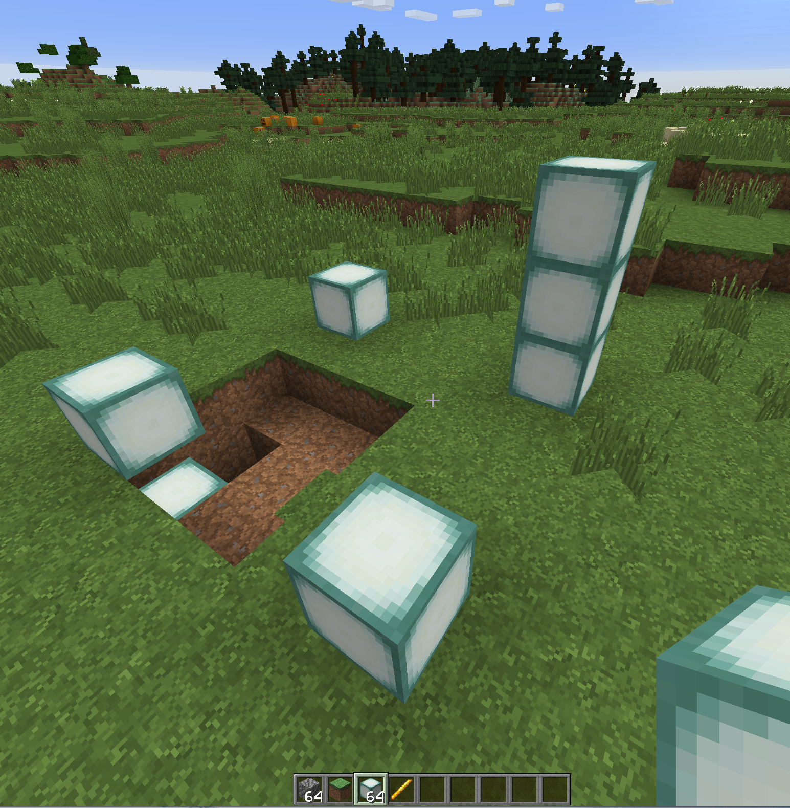  


<h3>Define the New Mine</h3>

Then holding the Prison's wand (blaze rod), left-click in one corner, and then right-click in the opposite corner.  In this example, I've left-clicked the lowest sealantern block, then right-clicked the highest sealantern block.  You should see a message indicating that you have successfully selected a region.

  


Then create the mine with:

```
/mines create test1
```

It will default to 100% air.  So then follow up creating the new mine with a reset to confirm everything is replaced with air.


<h3>Reset the New Mine to Test it Exists</h3>

Go ahead and reset the mine.  All of the sealanterns that were used to mark the mine are now gone, and so are the two layers of dirt.  That confirms success with our first mine since the only default block that exists in the mines when created is air.

```
/mines reset test1
```

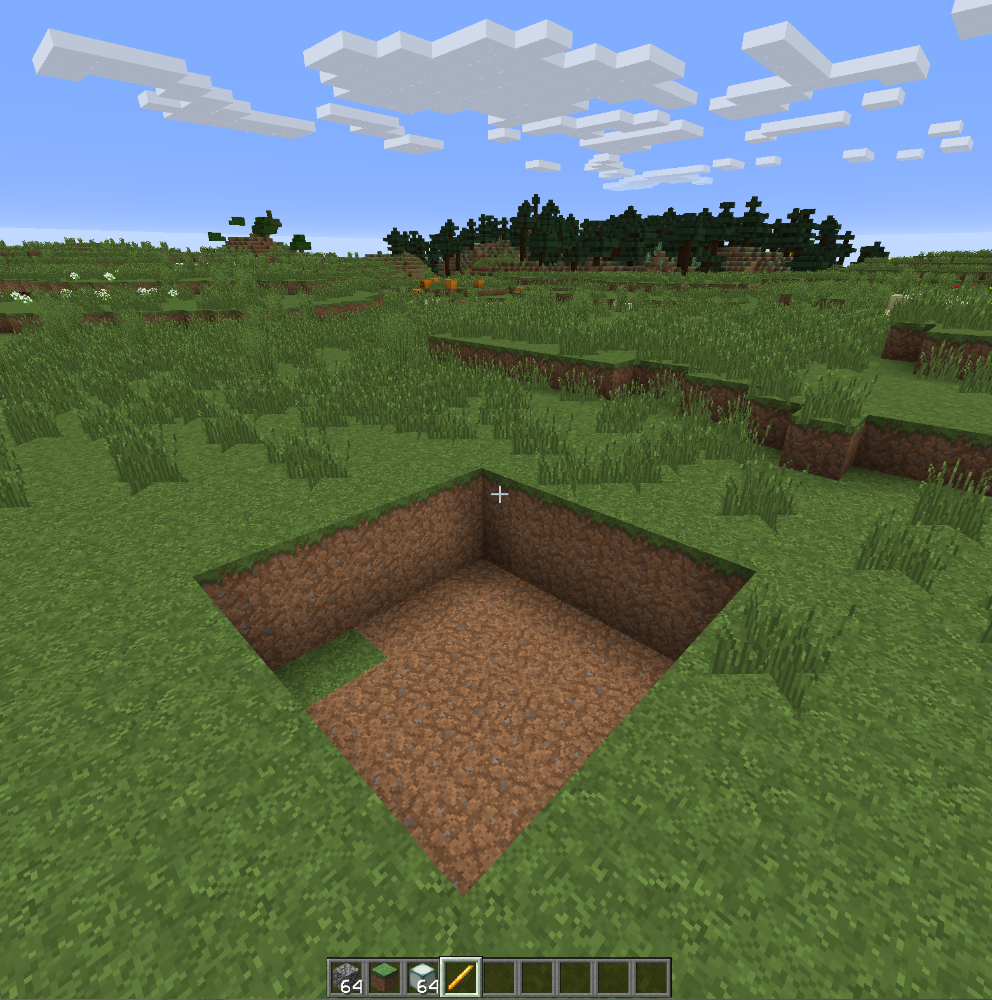  


<hr style="height:1px; border:none; color:#aaf; background-color:#aaf;">


# Mine Commands Overview

Now that we've created a mine, let's take a moment and review some of the available commands.  There are a lot of options available, and many of those options have numerous features, so this will just be an overview so you have a better idea of what you could possibly do with your new mines. This listing is generated within the console so it's easier to see.  This includes the main grouping of commands, which is displayed with `/mines`.  Remember, when using commands within the console drop the leading slash.  Then two sub-groups: `/mines block` and also `/mines set`.


For the following commands, we can use the console, which is also easier to see for this documentation.  But these commands can just as easily be ran within game.


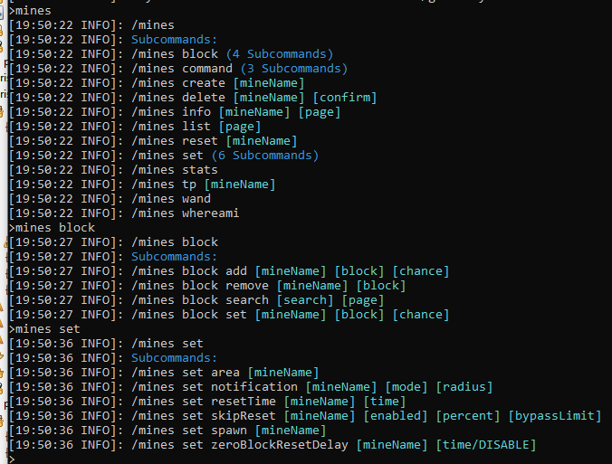  


Some of the highlights of these commands are as follows:
* `/mines create` : Create the mine based upon the wand selection.


* `/mines set accessPermission help` : Use a mine permission to grant players access to the mine. This will override WG regions and resolve issues with strange behaviors resulting from WG.  This must be a plain permission and cannot be a permission group.


* `/mines command` : **Now active!**  **Take your mines to the next level!** See the document on [Mine Commands](prison_docs_111_mine_commands.md) for more information. Every time a mine resets, you can now control what commands run right before a reset, and what runs right after a reset. These commands are similar to the Rank Commands, since they can be any command that you can run from the console.  The idea is that you can have unique mines that have not been possible before, such as randomly spawned forests or specific builds.
* `/mines delete` : Deletes a mine. You can always undelete a mine by going in to the server file system and rename the deleted mine, then restart the server.
* `/mines info` : Very useful in viewing all information related to the mine.
* `/mines list` : Displays all mines on your server.
* `/mines playerInventory` : Shows your current inventory in the console. Intended strictly for admins.
* `/mines rename` : Renames a mine.
* `/mines reset <mineName> <options>` : Resets the mine. Forces a regeneration of all the blocks, even if the mine is in skip reset mode.  `<mineName>` should be the name of the mine, but can also be ** *all* ** to force all the mines to reset one after the other.  If such action is performed, then all mine resets will be done through a submission with a slight delay between each reset, and it will prevent the running of the mine reset commands to prevent possible looping.  `<options>` should not be use directly without understanding what they do. 
* `/mines stats` : Toggles the display of stats that pertain to how long it takes to reset the mines.  View /mines info or /mines list to see the stats.  Use this command again to turn it off.


* `/mines tp <mineName> <playerName> <target>` : tp to a mine's spawn point, or the center of the mine if no spawn has been set.  If players are given the permissions, they too can use this command.  If no parameters are used, then the it will try to teleport the player to the mine associated with their current default ladder's rank. If more than one mine is associated with a Rank, then it will use the mine that has the same name as the Rank, otherwise it will use the first mine listed in the rank. If `<playerName>` is provided and submitted by console or an OP'd player, then it can initiate a tp for the specified player if they are online. Target defaults to `spawn` and will tp to the set spawn location for the mine, otherwise `target` tp's to the center of the mine.  Use `/mines tp help` for a list of the perms.

* `/mtp` is an alias for `/mines tp` and can be use interchangeably. 


* `/mines wand` : Gives you a Prison selection wand for defining you mine's area. Use prior to using the commands `/mines create` and `/mines set area`.  The wand is no longer the only way to set a physical location, you can now use `/mines set area <mineName> feet` to set a 1 x 1 x 1 region under your feet, which is great for when you're flying.  You can then use `/mines set size` to increase the size.
* `/mines whereami` : Shows you what mine you are in, or how far away you are from other mines in the area.  If you have a lot of mines, it's easy to lose track of where you are, and this may help get your bearings.


* `/mines block add` : Add a new block type to a mine.  It's easier to start off with `/mines block search` and have it fill in the commands for you.
* `/mines block remove` : Remove a block type from a mine.
* `/mines block search` : Search for a block type based up on a search string.
* `/mines block set` : Edit the block's percentage within the mine.  A percent of zero will remove.  If the block does not already exist, it will be added. (Can replace add and remove).


* `/mines blockEvent add` : 
* `/mines blockEvent block add` : 
* `/mines blockEvent block list` : 
* `/mines blockEvent block remove` : 
* `/mines blockEvent eventType` : 
* `/mines blockEvent list` : 
* `/mines blockEvent mode` : 
* `/mines blockEvent percent` : 
* `/mines blockEvent permission` : 
* `/mines blockEvent remove` : 
* `/mines blockEvent triggered` : 


* `/mines set area` : Redefine the area of the mine.  Careful, this can wipe out builds if set incorrectly.  This is a required command to set the area of the mine.  A new feature is to use the current location of your feet to define a 1 x 1 x 1 region with `/mines set area <mineName> feet`.  Then you can use `/mines set size` to make it any size you want.
* `/mines set liner` : A quick way to wrap your mine with a 2D Pattern in 3D space.  This command also will `repair` the area around a mine, and will effectively erase a liner.  There are six directions that can be specified for change: `north`, `south`, `east`, `west`, `top`, and `bottom`. `walls` also is a shortcut for `north`, `south`, `east`, and `west`.  The patterns available are listed by the command.  There is even a `force` setting that will allow the mine to be wrapped when in air, since the wrappings normally needs blocks in contact with the mine so it is able to conform to the terrain.
* `/mines set move` is a new command that is not yet enabled. It is still in development, but will be active soon.  This command will move a whole mine as a single unit, be it a few blocks or many (not recommended).
* **Removed:** `/mines set norank` : Disconnect the mine from a rank. **Note:** This command has been changed to `/mines set rank <mineName> none` to delete the rank from the mine.
* `/mines set notificationPerm` : Enables or Disables notifications pertaining to mine resets to be seen only by players who have permission to that mine.  The permissions used are `mines.notification.[mineName]` in all lower case.
* `/mines set notification` : Can turn off the notifications on a per-mine basis.  Or set the notification radius, or only notify players within the mine.  This command cannot change the message.
* `/mines set rank <rankName>` : Links a mine to a rank, otherwise there is no way within prison to identify which mines should be associated with a given rank. If **rankName** is **none** then it removes the associated rank from the mine (deletes the rank).  This is not yet needed, but it will be used in the near future with new features, or enhancements to existing features.
* `/mines set resetThreshold` : This allows you to set a percent remaining in the mine to use as a threshold for resets. For example if you set it to 20.5% then the mine will reset when it reaches 25.5% blocks remaining.  When the mine resets, it will initiate the `zeroBlockResetDelay` functionality, of which it's not exactly "zero blocks" anymore.
* `/mines set resetTime` : Changes the time between resets, as expressed in seconds. Applies to each mine independently.
* `/mines set resetPaging` : This is an advanced feature that can eliminate lag that might be experienced with the resetting of enormous large mines. A mine could be millions of blocks in size and without this setting it may take a few seconds, or longer to reset, and it could cause the ticks to fall far behind, even to the point of forcing a shutdown.  This command instead will breakdown the mine's reset in to very small chunks that will prevent the TPS from slowing down, and it will allow other critical tasks to continue to run.  The total length of time for the rest may be increased, but it will not hurt the server. Prison does not use async resets due to eventual corruption of the bukkit and spigot components.
* `/mines set size` : Allows you to resize a mine without redefining it with the prison selection wand. Just specify which direction to increase or decrease. It also uses the `/mines set liner <mineName> repair` feature to fill in voids when reducing an edge. 
* `/mines set skipReset` : When enabled, can prevent a mine from resetting if it has no activity.  Can set a threshold before the mine is reset, such as 80% will require 20% of the blocks be mined before being reset.  Can also set a bypassLimit so that if the reset is skipped X number of times, it will force a reset anyway.
* `/mines set sortOrder` : Mines can be sorted for view within `/mines list` or the GUI.  Setting the sortOrder allows you manually set the order in which the mines are listed.  There is even the option to suppress (hide) mines from that list too by setting the sort order to a -1.
* `/mines set spawn` : Sets the mines spawn point. Whatever you are looking at is what the players will be looking at when they tp to that spot.
* `/mines set tag` : Set a mine tag value that can be used with placeholders.
* `/mines set tracer` : Removes all blocks in a mine and replaces them with air, with the exception of the corners, of which are replace with pink_stained_glass.  This function allows for easy viewing of the full mine without the blocks getting in the way.  It also helps when setting the liner of the mine.  Using `/mines reset` returns the mine to normal functionality, or it will reset on its own.
* `/mines set zeroBlockResetDelay` : If the mine runs out of blocks, when enabled, it will force a manual reset after the specified delay. The delay can be zero for instant reset.

Adding the term `help` to the end of any of the above listed commands will display additional information that is available for each command, including the parameters and also all permissions that are associated with the commands.

<hr style="height:1px; border:none; color:#aaf; background-color:#aaf;">


# Customizing Your Mines

Now that we have a mine created, let's go ahead and customize it.

<h3>Inspect our New Mine</h3>

Let's first take a quick look at the new mine with this command.  Let's view it now, before we start making changes.

```
/mines info test1
```


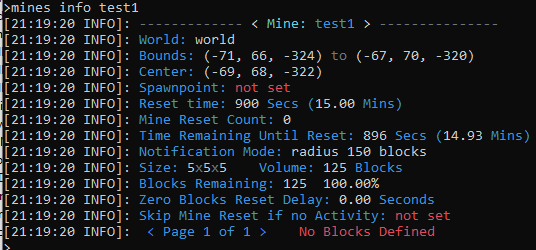  


<h3>Select a Few Blocks</h3>

The easiest way to select blocks is to search for them.  Let's add a few such as cobble, glowstone, gold ore, and coal ore.  Use the block search with cobble:

```
/mines block search cobble
```

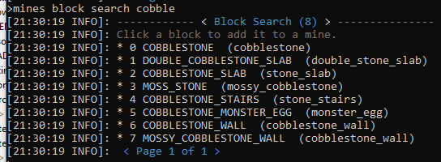  

When using the console with block search limits what you can do with the block search.  If you are in game, you can click on a block type that is displayed, and it will auto fill out the block add command for you, such that all you need to do is add the percentage at then end of the command.  Also in game, you can page through the results.  

This is an example of in game use of this command.  Notice by clicking on cobble it pre-fills all the parameters for the `/mines block add`, including the most recently used mine name and the selected block.  This screen print shows that I added the value of `20` right after the percent sign.

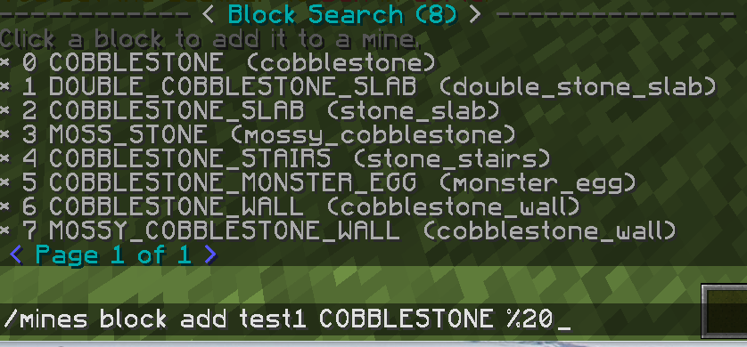  

Then let's take a look at the `/mines info test1 all` command, where all indicates all pages should be displayed in-line without paging.  Notice how Prison automatically provides the balance of air so the total percent is equal to 100.0%.


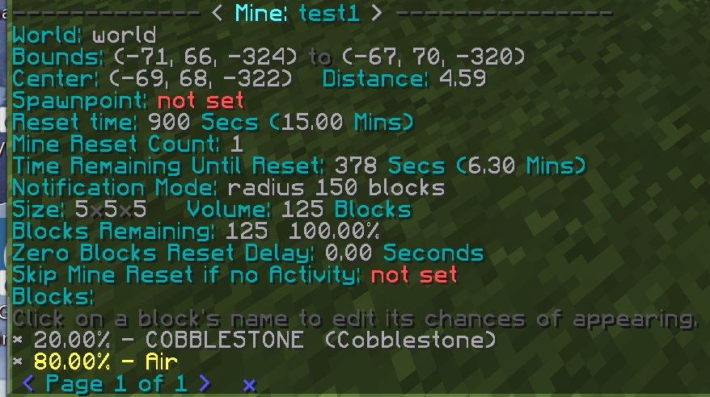  

Now if we perform a `/mines reset test1` then we can see how the cobble is randomly placed at a rate of 20%, and the remainder is air.

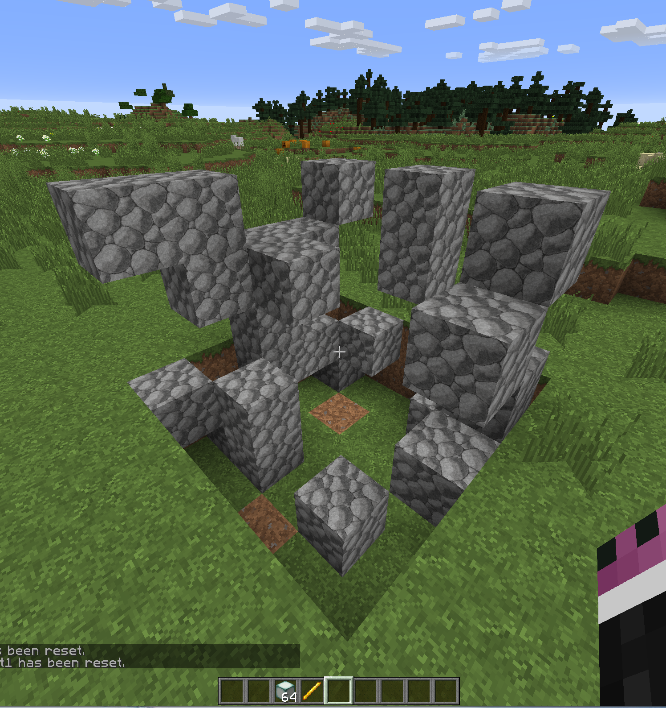  


Let's add the other blocks, each at 20% then take a look at the mine info and how it generates.  Please notice that you can add a single block with as little as 0.01%.  You can also add as many different blocks as you please too.  There are no meaningful restrictions. 


With the additions of the other ores, including 1/2 a percent of sealanterns:

  


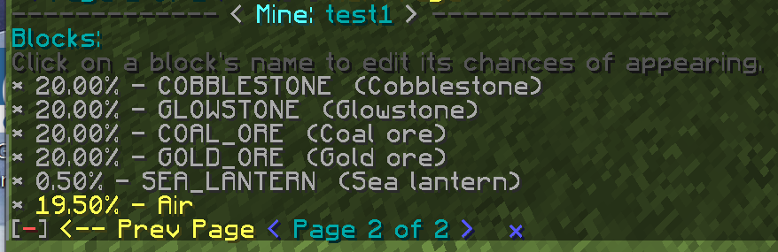  


Example of a mine reset including a sealantern.  Notice that there is still 19.5% air.

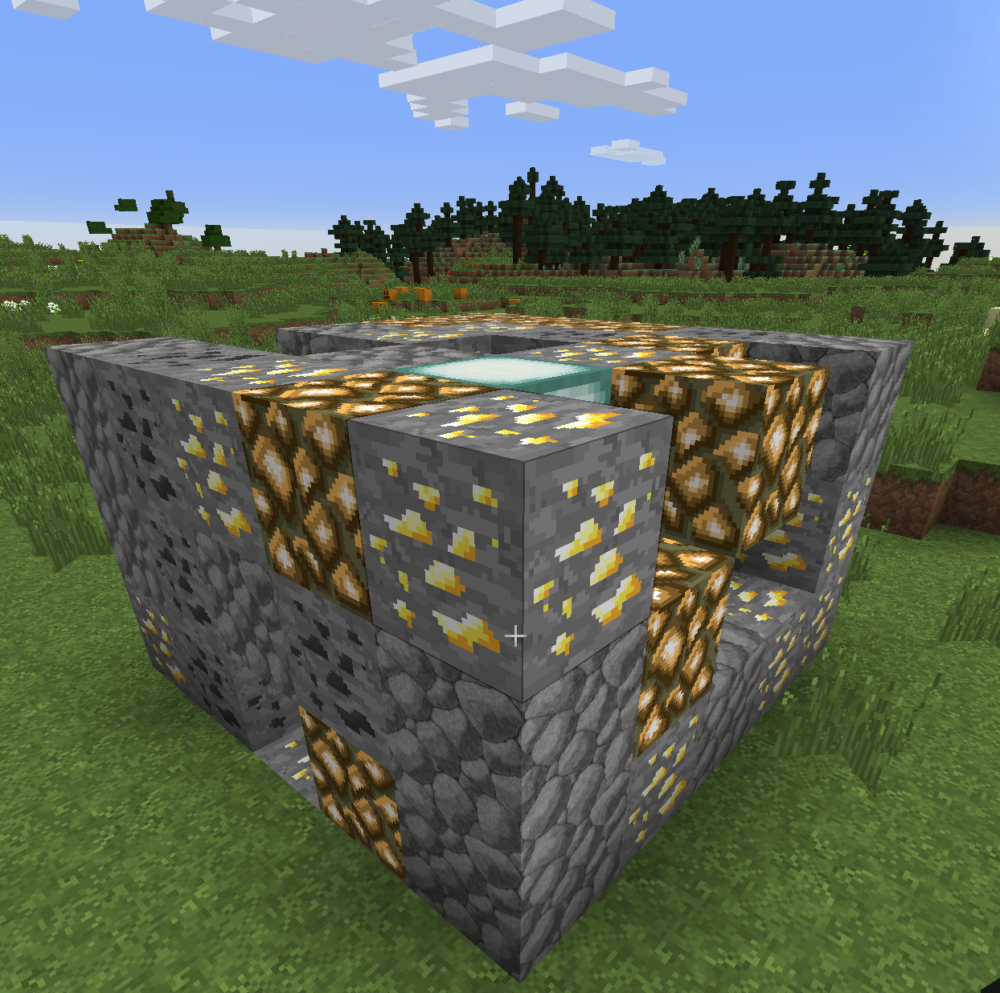  


<hr style="height:1px; border:none; color:#aaf; background-color:#aaf;">


# Adjusting the Mine's Size and Setting the Liner


A few new features have been added to Prison to help make some adjustments to your mine.  They are the following:

```
/mines set tracer help
/mines set size help
/mines set liner help
/mines set move help

```

These three new commands are used together in various ways.  The command `/mines set tracer` is used within the `/mines set size` and the `/mines set liner` commands.  The `/mines set liner <mineName> repair` is used within the `/mines set size` command to repair the areas that left as voids when resizing the mine.

Note: The new command `/mines set move` is not yet enabled. It is still in development, but will be active soon.  This command will move a whole mine as a single unit, be it a few blocks or many (not recommended).


<hr style="height:1px; border:none; color:#aaf; background-color:#aaf;">


# Large Mines - Preventing Lag

Large mines present their special own special challenges, one of which is that they can take a long time to reset.  Since bukkit cannot handle async resets of blocks because of world corruption, the updates must happen synchronously in the main server thread.  For large mines, that can mean causing a significant amount of lag. 

To prevent lagging the server, Prison has a feature that can prevent any lag from happening while performing the reset.  This feature is called **Reset Paging**.  This feature doesn't have to be used with just large mines, but the reset process is a little more complex. When testing, it was actually found to be slightly faster than the normal reset method.

To enable reset paging use the following commands to enable and disable it.

```
/mines set resetPaging <mineName> enable
/mines set resetPaging <mineName> disable
```

The way it works, is that it performs small pages of block updates and keeps an eye on how long it's taking.  If the update goes beyond a set amount of time, such as 50 milliseconds, it stops the updates, and then schedules the remaining updates to run later, with no delay.  That means if nothing else is trying to run within the main server thread, then it will continue to perform block updates.  But if something else was waiting to run, then the mine update will pause and allow the other process to finish.  This will prevent vital tasks from backing up because the mine reset yields to other tasks that need to run.


<hr style="height:1px; border:none; color:#aaf; background-color:#aaf;">


# Next Steps - Skipping Resets, Notifications, and Zero Blocks


The mine is now usable as-is, but there are still a lot of options that we can add to enhance the mine's behavior to better suit our needs.  For example, we can set a spawn point so we can control where players are teleported to when the mine resets, or if they tp to the mine.  

For our example, let's use the console to set the notification, resetTime, skipRest, and the zeroBlockResetDelay.  We must be in game to set the spawn point since it uses where your player is standing and where you are looking.


<h3>Customizing the Mine</h3>

Issuing all these commands through the console, such as the following.  Note that the spawn point has been set in game, and the reset time has not be changed.

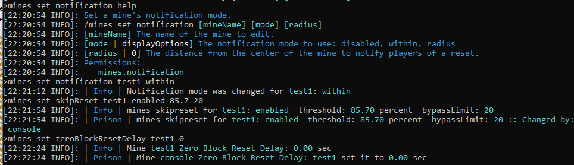  

Mine info showing all changes.  Observe the spawn location now shows an actual location, but yet it does not show the pitch or yaw. The information also shows that the mine has reset 30 times since there server started, and that you must be standing within the mine to receive reset notifications.

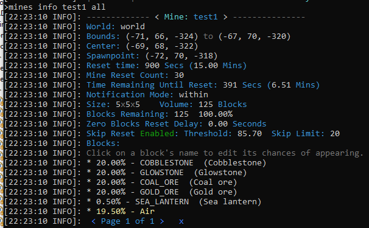  


<h3>Notifications Explained</h3>

In the example above, the notifications for that mine was set to only provide them to the players that are within the mine.  The other options are disabled and radius from the center of the mine.

```
/mines set notification test1 within
```


<h3>Notification Permissions Explained</h3>

The command `/mines set notificationPerm` is able to control who is able to see the notification messages that are generated from a mine based upon permissions.  This setting worked in conjunction with the other notification settings to fine tune the behavior even more so. 

This works by enabling the permission `mines.notification.[mineName]` to be checked when generating mine notification messages.  To use this feature, enable the setting and then give the players that permission as they rankup.   


<h3>Skip Reset Explained</h3>

To better explain what the skipReset does, is it uses the threshold percent as the trigger to allow the mine to auto reset.  Once the **blocks remaining** value hits that value, or is less than that value, it will alloow the mine to rest at it's normal reset time.  If the blocks remaining is higher than the threshold, then it skips the reset and increments the skip counter (not shown in this screen print since it is zero).  Once the number of skips reaches, or exceeds, the Skip Limits value, then it will allow the mine to reset.  

This behavior allows unused, or barely used, mines to avoid from always being reset.  This can reduce the server load and prevent lag on larger servers, or if there are many mines.

This feature never will force a mine to reset early, nor will it ever make it reset.  The only active behavior it can alter, is to skip the automatic reset behavior. 

If a mine is manually reset, then this feature will never prevent a manual reset from happening.  A manual reset will also reset the counter for how many times the mine skipped the automatic resets.


<h3>Zero Blocks Reset Delay Explained</h3>

The feature zero blocks reset delay identifies what should happen when Prison detects that there are no more blocks within the mine.  The only action actually is to force an early reset if this feature is enabled, but more specifically, it identifies how many seconds it should delay before forcing the reset.  

If this feature is enabled, and the delay value is set to Zero, then the mine is forced to reset with no delay.  If there is a light load of jobs running on the server, then it will be instantly reset, otherwise there will be a delay for the job to wait its turn to run.

If the reset delay is non-zero, the value is measured in seconds, with a valid value of 0.01 seconds.  But keep in mind that in reality the seconds are converted to ticks and is scheduled within the Bukkit job queue.  Therefore, since there are 1000 milliseonds within one second, and 20 ticks within one second, one tick is the smaller possible value, which equates to 50 milliseconds.  This is equivalent to 0.05 seconds. When the seconds are converted to ticks, the values will be rounded down to a whole integer value.  So if a value is provide such as 0.049 it will be submitted as 0 ticks, which will result in zero delay (if possible) before running.

The bottom line is that this feature can force an earlier reset of the mine when it becomes totally empty of blocks.  A delay may be needed, or desired, to reach your perfection for the mine.  


<h3>Reset Threshold Percentage Explained</h3>

By using the command `/mines set resetThreshold` it is effectively able to shift when the mine resets. It does not delay when the mine resets, but instead it provides way to trigger a reset based upon a percentage of the mine that remains.  It works in conjunction with Zero Block Reset Delay too, where instead of waiting until zero blocks remain, it then applies a percentage to change the reset level.


<hr style="height:1px; border:none; color:#aaf; background-color:#aaf;">


# Notifications - Config File & Settings


The global `resetMessages`, `resetTime` and `resetWarningTimes`, as found in the configuration file `plugins/Prison/module_conf/mines/config.json` needs a little explanation in what they do.

The `resetMessages` is used only upon the server startup, and if it is disabled, then it will not use the `resetWarningTimes` and will skip all notifications pertaining to mine resets.  The `resetWarningTimes` are global and cannot be customized per mine.  If an individual mine's reset time is less than a warning time, then the reset warning will be skipped for that mine.

The `resetTime` in this configuration file is only used during the creation of a mine and is used to set the initial value for the mine's reset time.  If the configuration file's value is changed, it will never effect any preexisting mines, but only ones created after it has been changed.  

All mines use their internal reset time and can be customized on a per mine basis using the following command.  The command's time value is expressed in seconds.

```
/mines set resetTime <mineName> <timeInSeconds>
```

There are a number of options available for mine notifications, and they are on a per mine basis to allow better control over how to configure everything.  The command is as follows. The value for **mode** can be **disabled**, **within**, or **radius**.  When radius mode is specified then the radius value must be supplied, and it is expressed as whole blocks (integer).

```
/prison set notification <mineName> <mode> <radius>
```

The **disabled** option is pretty much self explanatory; messaging for that mine is disabled.

The **within** the mine notification only provides notifications to the players that are within the boundaries of the mine, including players standing upon the top of the mine.  One of the behaviors to this mode, is that all players within the mine will be notified that the mine will be reset, but once they are teleported out of the mine to the spawn point they cannot be notified that the mine has been reset (because they are no longer within the mine).  But then again, the fact they were teleported to the spawn point should be a big clue the mine reset.

The **radius** setting notifies players that are within the specified distance from the center of the mine, ignoring the Y axis.  So if the distance is set to 30 blocks, and they are within that radius, but 200 blocks above the mine, they will be notified.  Since the center point of the mine is calculated to be the, um, center, it is possible to make the radius smaller than some points of the mine and still be outside of the mine in other places.  So this can provide some nice controls at far distances away from the mine, but could produce some odd behaviors (if you don't understand how it works) if the radius is much smaller in size.


Perhaps the last point pertaining to resets has to do with the actual timers. Once a mine is reset, either by automatic resets, zero block resets, or a manual reset, the timer will always reset and start over.  This means if there is 30 seconds left on the timer and you do a manual reset, the automatic reset will not happen 30 seconds later.  


<hr style="height:1px; border:none; color:#aaf; background-color:#aaf;">


# Listing All Mines


As you start to build your mines, you may find it useful to list them all, or use the listing to search for a specific mine.  


Here are some basic usages of the command.  First let's review the help for the `/mines list` command to see what perms are needed and what parameters are available.  If you are in game, clicking on `TP` will teleport you to the mine.  Clicking on the name will show you the info on the mine, which is the same as using the `/mines info` command.  Of course, clicking on these items only works in game, and not from the console.


```
/mines list help

/mines list

/mines list 4
```


As we can see in the screen print of the help, the command takes optional parameters for the page number.  It also has the option of `ALL` which will display the list of all mines, which could be helpful in the console.


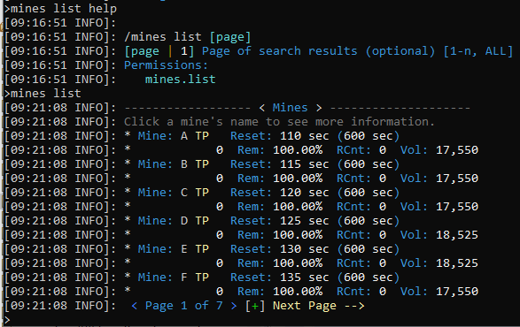  


There is some useful information in the listing too. This listing shows how soon a mine will **Reset**, and what the reset frequency is.  It will show you how many times it has been reset since the server started (**RCnt**).  It even shows the percent blocks remaining too (**Rem**).  If you've added any **mine commands**, those will indicated in a red **Cmds** entry; see the mine named **trees**.  Also if a mine is disabled, it will be listed here too.

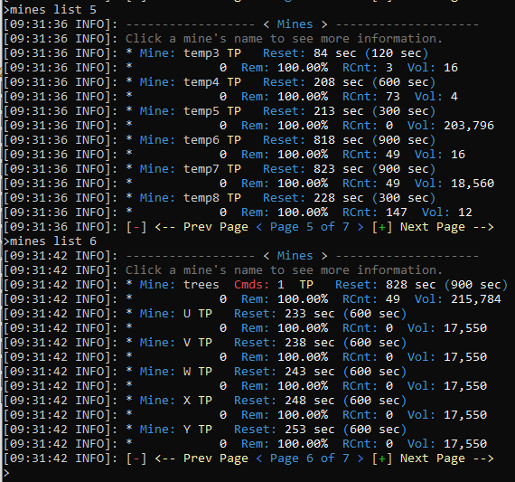  


This listing also shows more details if you have `/mines stats` enabled.  Remember that mine stats is a toggled setting.  Run it once to enable it.  Run it a second time to disable it.


With it enabled, it shows stats on mine resets in mine list, mine info, and when mines reset in general.  The following screen print within the console shows how these may look, with the addition of the stats.


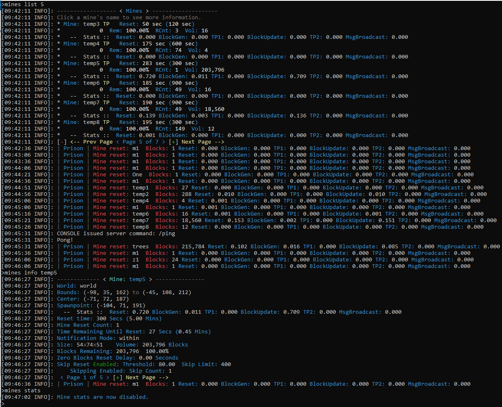  


.


<hr style="height:1px; border:none; color:#aaf; background-color:#aaf;">


# Deleting Mines

Mines can be deleted with the `/mines delete` command. 

It will prompt you for confirmation.  If you are in game you can click on the link then it will fill out the command for you with the parameter `cancel` and you need to rename it to `confirm`.  You have one minute to confirm a delete.

When you successfully delete a mine, it will remove it from memory and from loading.  The mine is only virtually deleted, since it will still exist in the server's directory. To undelete it, just rename the file back to a normal mine file name, and it will be loaded the next time the server starts.

  
<hr style="height:1px; border:none; color:#aaf; background-color:#aaf;">


# Renaming Mines

Mines can be renamed with the `/mines rename [mineName] [newName]` command.

The ability to rename a mine will properly update all references to the mine.  

  
<hr style="height:1px; border:none; color:#aaf; background-color:#aaf;">


# The Mine Data Files - A Warning

The mine data files (and also the ranks and ladders) are stored on the server's file system as a way to store each mine's configurations. These files are intended for internal use only and should never be manually modified.  When undeleting mines, you may have to rename the files so they are used the next time the server is started, but you should not change the contents.

There are many commands that have interdependancies to multiple settings, and those settings are validated only through the use of the commands.  Making changes directly to the files bypasses the validation of the commands and may lead to server corruption and failures.  

You are solely responsible for any problems you create by making changes directly to these files.  We cannot help undo any problems, issues, failures, or undefined behaviors that may be caused with such tampering.


<hr style="height:1px; border:none; color:#aaf; background-color:#aaf;">


# Advanced Topics


### Changing the Size of a Mine


<hr style="height:1px; border:none; color:#aaf; background-color:#aaf;">


# Example: A Single Block Mine Grinder


To provide a slightly different perspective as to what you can do with your Prison mines, let's build a one block mine and demonstrate the power of what we can down with a few of these settings.  We're also going to tie this in to HolographicDisplays and use of the placeholders.

So let's first setup a temporary placeholder for our new mine.  I want it to be a one block mine, one block off the ground.  So stack two blocks like this.  Added a platform, because why not?


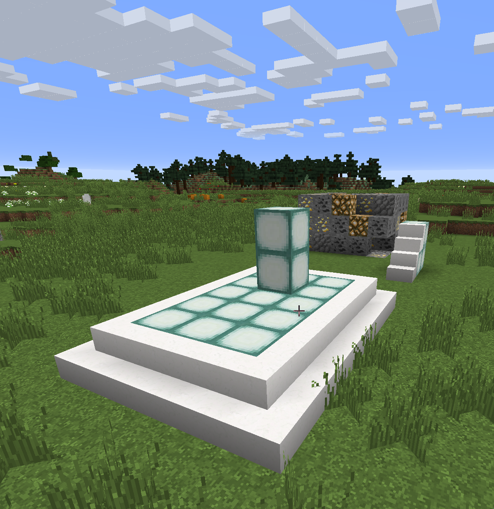  


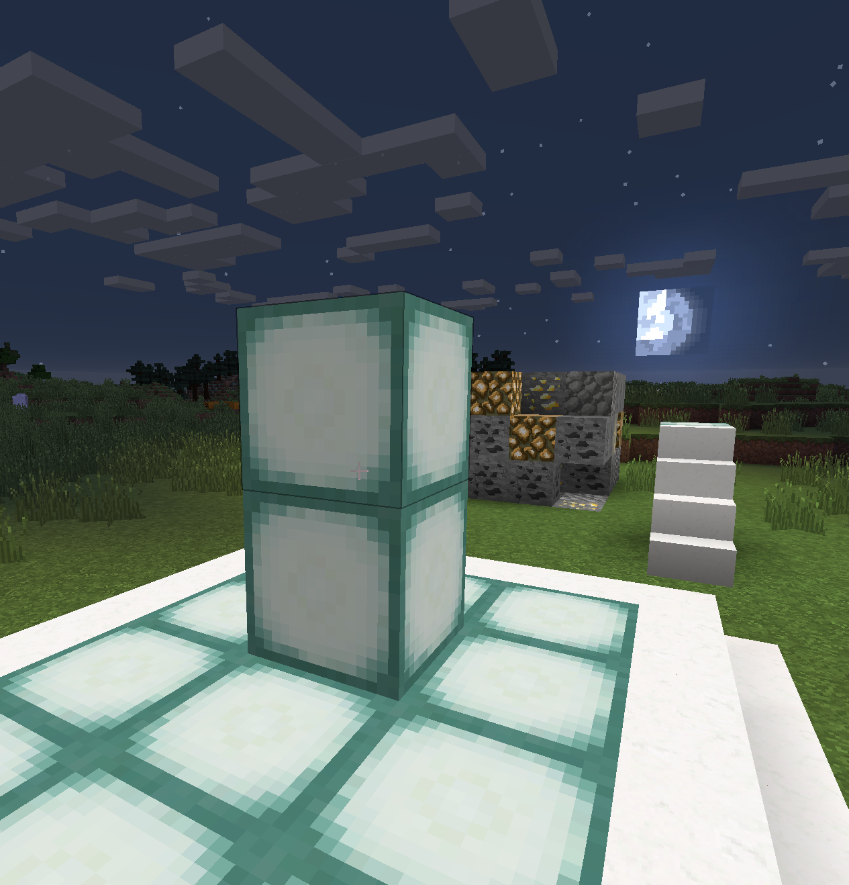  

Next, using the Prison wand, right-click and left-click on the top block.  This will create a one block selection.  Then create the mine, naming it **one**.

```
/mines create one
/mines block search ore
```

Then select the following ores and add them to the new mine, all at 10%.  Add gold_ore, iron_ore, coal_ore, Lapis ore, redstone_ore, emerald_ore, diamond ore, etc...  Then setup the reset time, turn off notifications, and set zero blocks reset delay to zero.

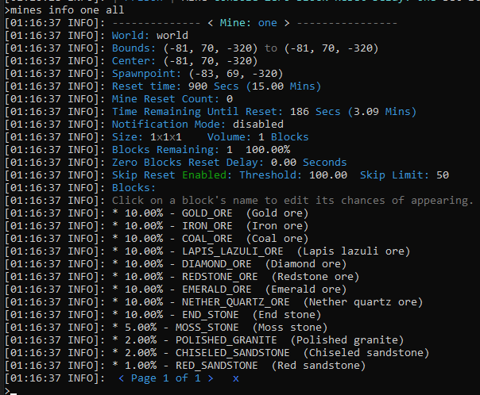  


Now let's test our new mine.  But first let's make an OP pick.  Open the config file `/plugins/Essentials/config.yml` and search for `unsafe-enchantments` and set the value to `true` and then save and exit the file.  You can either restart the server, or use `/essentials reload` to apply those changes.  Then issue the commands in game, holding the pick after you get it.

```
/essentials reload
/give <yourIGN> diamondpick 1
/enchant efficiency 20
/enchant durability 20
/enchant fortune 5
```

Remove the block under the one block mine, then reset it with `/mines reset one`.

Install HolographicDisplays as described in our documentation (see table of contents... must include HolographicExtensions and ProtocolLib).  Next we want to create two holographic displays for our one block mine, one above the block, and one below.  Do the `/mines info one` to find the *Center* of the mine, and let's use that to modify the HolographicDisplay scripts below.  In this example, our coordinates are `(-81, 70, -320)`.  Add these to the file `/plugins/HolographicDisplays/database.yml`...

```
oneTop:
  location: world, -80.5, 72.5, -319.5
  lines:
  - 'Mine: one'
  - 'Reset Interval: {slowest}%prison_mines_interval_one%'
  - 'Reset Time Left: {fast}%prison_mines_timeleft_one% - {fast}%prison_mtlf_one%'
  - 'Blocks Remaining: {slowest}%prison_mr_one% {slowest}%prison_mp_one%%'
oneBottom:
  location: world, -80.5, 69.8, -319.5
  lines:
  - 'Blocks Mined: {fast}%prison_mbm_one%'
  - 'Reset Count: {fast}%prison_mines_reset_count_one%'

```

Once you make these changes and save them, reload bolographic displays with `/hd reload`.  You can then tweak the position of the HolographicDisplays so they are just centered on the mine, and keep reloading until you get it right.  The X and Z axis should be x.5 and z.5, or "point 5", or half blocks to exactly center them.  First get them centered on the mine, you can walk around the mine to confirm it looks centered.  Then move each one up, or down, as needed.  With the results looking like the following:


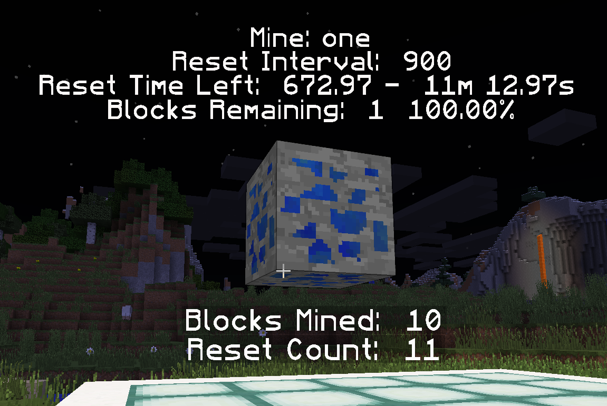  


Now to complete this mine, let's enable auto manager.  We can do that by turning on Auto Manager for all of our mines, or we can just add a few ore entries to our OP pick.  For this example, let's go with the lore.  Enter these commands (assuming you have Essentials installed).  Using `/prison autofeatures` command to review the correct names for the lore.  Please note for this example I'm using 100% since no numbers are specified with these Lore names.

It should be noted that Prison's Auto Features is currently in a state of development and may change with how these settings should be applied.  Efforts will be made to keep these instructions up to date, but they may be missed.  If you notice that this has happened, then please contact RoyalBlueRanger on the discord server and he will get this corrected. ###  Auto Features are not needed to demonstrate this one block mine, but it does illustrate a few more capabilities that exist within Prison and how a few settings can provide a different experience.

```
/prison autofeatures
/i diamondpick 1 efficiency:20 durability:20 fortune:5 lore:Pickup|Smelt|Block
```

More information on the EssentialX's lore settings can be found here: [EssentialsX Item_Meta](http://ess.khhq.net/wiki/Item_Meta).


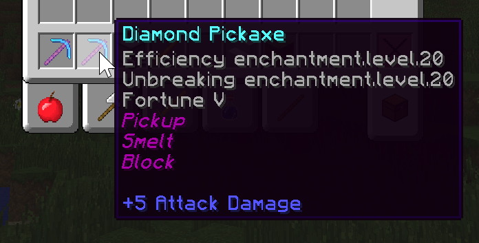  

Note, because we are using Lore on your pickaxe, we don't have to enable the auto features, such as with `AreEnabledFeatures`, but the individual elements should be all be set to `true`, or the `AllBlocks` should be set to `true`.  The Lore on a tool can bypass the global settings.  Also make sure you drop back in to survival mode to get the normal speed for your OP pick.

``` 
/gamemode survival
```


  


And that's it for now.  This is what I would consider a draft copy, and I will come back in a few days to refine this document (and remove this comment).


<hr style="height:1px; border:none; color:#aaf; background-color:#aaf;">
