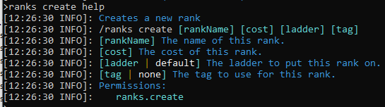
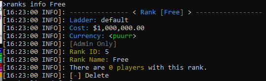
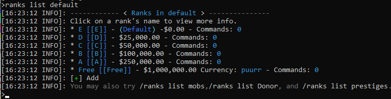
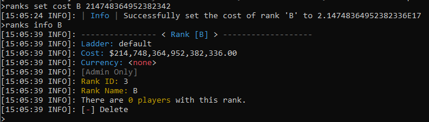
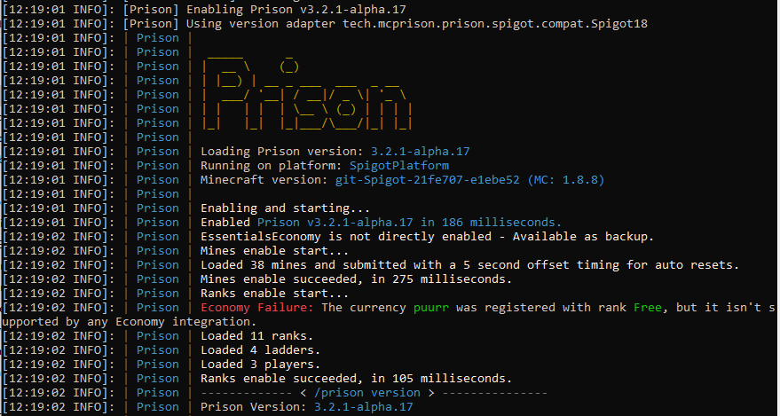

### Prison Documentation 
[Prison Documents - Table of Contents](prison_docs_000_toc.md)

## Prison - Setting Up Ranks & Ladders

This document provides information how to setup and use ranks and ladders.

Information on how to use Prestiges is provided in a separate document: [Setting up Prestiges](prison_docs_107_setting_up_prestiges.md)


The use of Ranks, Ladders, and Prestiges are all optional.  You can either use these Prison based items, or you can use some other plugin to provide these functionalities.  The choice is yours.


<hr style="height:1px; border:none; color:#aaf; background-color:#aaf;">


# Overview


Prison is more than just mines. Mines provides the physical content of your server.  It's the ranks and the ladders that ties everything together.  It's the Ranks that provides the hooks in to all of your server's other plugins through the use of Rank Commands.  And it's the ladders that provides a logical progression from one rank to the next.


Prison Ranks can be very simple in that they don't have to do much. They don't even need to have any Rank Commands, but its through the Rank Commands that provides the power to customize your server in almost any way you can dream.  


Ladders are a way to logically organize your ranks.  The concept is a just like a ladder where you start at the bottom, and to progress up the ladder, one rank (rung) at a time.  You cannot skip ranks, but you can also go back down the ladder too.  Only admins can demote players, since that's not part of the normal Prison game play.


Prison also provides a number of Admin based commands to manage ranks and ladders.  Obviously the standards on how to create and edit the Ranks and Ladders, but also Prison provides the tools to manage players within the various ranks and ladders too.

<hr style="height:1px; border:none; color:#aaf; background-color:#aaf;">


# New! Prison Fast Start

Prison now has a new set of features that can help you get up and running faster than ever!  `/ranks autoConfigure`. It can auto create your ranks and virtual mines, A through Z, it will link the mines to the ranks, setup the basic rank commands to provide basic access permissions for your players, and assign blocks of increasing values to all mines.  All you need to do is to use the command `/mines set area` on all mines to make them physical mines.  Plus there are a new features to help provide the finishing touches in almost no time.   
 -  `/ranks autoConfigure`
 - `/mines set area help`
 - `/mines set tracer help`
 - `/mines set size help`
 - `/mines set liner help`
 
Documentation pertaining to the use of the auto configuration will be coming soon.
 
Keep in mind that in order to use the command `/ranks autoConfigure` you cannot have any ranks or mines defined yet.  So before you create a test rank, go ahead and run the auto configure so at least that is complete.
 

<hr style="height:1px; border:none; color:#aaf; background-color:#aaf;">


# Ranks

There are many different ways you can setup your Prison server and ranks is just one small part of how you can customize everything.


One way to do ranks is to have a few prison ranks, with working to a "free" rank and beyond.  Example would be ranks in the following order:  D (default), C, B, A, Free, Citizen, Elite, Rules, Emperor.  Where ranks D through A are restricted to the mines within the prison, but then Free and higher have access to the free worlds to gather resources, build bases, and other things such as even factions.  A few examples provides screen prints with this design since it's generally fewer overall ranks.


Another type of prison game mode is more along the lines of an OP based Prison server where ranks run from A through Z with prestiges and even rebirths.  Where the costs of ranking up becomes significantly higher with each rank, but yet the ores and blocks you can mine have much greater worth.  The tools are generally very OP and beyond the normal safe enchantments.


This documentation uses setups that are fairly simple.  The mine names also matches the rank names, but they don't have to.  Matter of fact, the rank name and mine names can be almost anything to allow the most flexibility for your setup.


<hr style="height:1px; border:none; color:#aaf; background-color:#aaf;">


# Adding Ranks


Adding Ranks is pretty simple.


The command to add a rank is as follows, along with the help generated for it:

```
/ranks create [rankName] [cost] [ladder] [tag]

/ranks create help
```

The first rank you add will become the default rank on the ladder in which you add the rank.  As you add more ranks, they will be added to the ladder in the order in which they were added.


If you need to change the order of a rank, or even move it to another ladder, you can use the command: `/ranks ladder addrank`. Ranks do not have to be associated with a ladder and with this command, you can actually remove the ladder from the rank, or move it around.  See that command under ladders for more information.


The `cost` for the default rank, or the first rank on a ladder, should have a value of zero if you expect new players to gain this rank when they join the server.  It doesn't have to have a zero cost, but it depends upon what your needs are.  If the ladder is not the **default** ladder, then the odds are that the rank is not going to be zero.


The `ladder` field for this command is the ladder name to which the new rank will be assigned.  If it is a rank that is based upon prison mining and advancement, then the **default** ladder should be used.  The **default** ladder name is simply **default** and it does not have to be provided if there are no other parameters that follows.  If you want to provide a `tag` name then just use a value of `default` for that parameter.


The `tag` parameter is the fancy display name for this given rank. You do not have to specify it on this create command, since you can always add it, or change it later with the `/ranks set tag` command.  The tag generally contains additional formatting characters such as color codes and even brackets or other characters.  It does not have to contain the rank's name.  The tag is what is generally used in placeholders for its special formatting.

For example a default prestige rank may simply be something like this with the emphasis on the plus sign: `&d[&6+&d]`


 


<hr style="height:1px; border:none; color:#aaf; background-color:#aaf;">


# Rank Information

Information on a rank can be viewed by using the following command:

```
/ranks info [rankName]

/ranks info help
```

This example of rank information includes a rank that has a custom currency.  *See more information below on custom currencies.*  If a rank does not have a custom currency, then it will not show the currency information.


 


# Rank Listings

To list all ranks for a given ladder use the following command:

```
/ranks list [ladderName]

/ranks list help
```

The `ladderName` parameter is optional and will default to a value of **default**.  To view ranks on another ladder, then you must use that ladder's name.  But please notice, that at the bottom of the listing, it shows what other ladders are available to be used with this command. If you use this command in game, then you can click on those displayed commands to show those listings.

 


<hr style="height:1px; border:none; color:#aaf; background-color:#aaf;">


# Deleting Ranks

Ranks can be deleted, but when they are, they are simply just removed from Prison and no longer loaded.  Deleted Ranks can be undeleted.

To delete a rank, use the following command:
```
/ranks delete [rankName]
```

Ranks are stored within the server's file system in the following path starting from the server's main directory:

```
/plugins/Prison/data_storage/ranksDb/ranks/
```

Internally, all ranks are assigned a serial number which is used to identify the rank.  The number starts with a 0 and is incremented as more ranks are added.  Ranks that are deleted, may have new ranks reuse the same number.


This internal serial number is what Mojang would consider a magic number.  In a future version of prison, these magic numbers will probably be eliminated.  Their elimination will not impact preexisting prison configurations moving forward, but could impact the ability to down grade prison to an older release.

When a rank is deleted, it is removed from memory, and the file that is saved in the above directory path is renamed and ignored the next time prison is started.  For example, if a rank's file name is **rank_2.json** then when it is deleted it will be renamed **.deleted_rank_2.json_<timestamp>.del**.  Such that it may look like this: **.deleted_rank_2.json_2020-08-16_13-49-27.del**

To undelete a deleted rank, first shut down the server.  Then go in to the server's directory above and rename the deleted file back to it's original name.  If that name is taken by another rank, then you must rename it to have a magic number that is not being used by another rank, plus you must also change the internal value of the field "id" in that json file to match the new number that you assigned to it.

For example, with the file name originally being **rank_2.json** and it was deleted and assigned the new name of **.deleted_rank_2.json_2020-08-16_13-49-27.del**. Plus if numbers 0 through 36 are taken, and you must rename it with the serial number of 37: **rank_37.json** then change the internal value of "id" to match:

```
{
  "cost": 3500000.0,
  "name": "guardian_of_zool",
  "currency": "zoolian_hearts",
  "id": 37,
  "tag": "&4[&b&ka&bGuardian of &eZool&b&ka&4]",
  "commands": []
}
```

The above shows how "id" has been updated to a value of `37`.  It also shows that this rank uses a custom currency named **zoolian_hearts**.


<hr style="height:1px; border:none; color:#aaf; background-color:#aaf;">


# Changing a Rank's Cost

The Rank's cost is initially set when creating a rank, but it can be changed at any time. The command to change the cost is:

```
/ranks set cost [rankName] [cost]

/ranks set cost help
```

The cost of the rank can be any value, up to the max value allowed by a Java double.  The limitations of what can be stored in a double is also constrained by Java too.  

As an example, you can be able to use a really large value for a cost, but you may not be able to set the one's digit of that value.  For example if you assign a cost of 214748364952382342, note that the last three digits are 342.  But when you view the cost that is actually assigned to the rank, it will show the last three digits as 336.  This is not an error, but a limitation with how floating numbers, such as doubles, work within computers in general.  This is related to the fact the number is stored in more than one part, of which the mantissa and exponent are most significant for costs.  If you're going to use really huge values for a cost, you must understand you cannot control some of the digits of a double.


 


If you are going to assign the rank a custom currency, then you can set the currency at any time, before or after changing the cost.


<hr style="height:1px; border:none; color:#aaf; background-color:#aaf;">


# Changing a Rank's Currency


Prison supports custom currencies, instead of the default currency that is used with most plugins such as Vault or Essentials.


In order to use any default currency, you first must have a plugin that prison recognizes that supports multiple currencies and that must be a valid currency within that plugin prior to its use.


Currently the only plugin that Prison supports for custom currencies is GemsEconomy.  GemsEconomy can be used in addition to the default currency as accessed through Vault.  At this time, Vault does not support custom currencies, so Prison must be have an integration that supports it.


All custom currencies will be validated when they are assigned, changed, or loaded upon server startup.  If a custom currency has been added to a Rank, but then removed from the server (removal of the plugin or deletion within the plugin) then Prison will prevent usage of that Rank by the players, even if they had sufficient amounts of that currency since there is no way to perform any of the transactions against it.  Upon server startup, if Prison detects that a currency is no long supported, it will display a warning with related details.


When Prison is looking for support of a custom currency, it checks all registered economy plugins that have support for custom currencies, and then checks each of those economy plugins to see if any of them supports the custom currency.  This actually allows a server environment to use many different economy plugins, even multiple custom currency plugins.


To add a currency to a Rank, first create the rank and give it a cost.  You cannot assign a custom currency initially, but that's alright and that's expected.


Then associate a custom currency with the rank:

```
/ranks set currency [rankName] [currency]

/ranks set currency help
```

The currency must exist in one of your economies.  How to add it is beyond the scope of Prison's support and this documentation.


To currency can be changed to any other custom currency by using this command again. 


The currency can also be removed, and set back to the default, by leaving the currency name blank.  For example this removes a custom currency and returns it to a standard currency.


```
/ranks set currency [rankName]
```


The following is an example of a custom currency, named "puurr" that no long exists with in the server since the GemsEconomy plugin is not currently active.


 


Even though in the above example the custom currency "puurr" does not exist, players cannot rank up to the **Free** rank since Prison cannot confirm that it is a valid currency.  But admins can use `/ranks promote`, `/ranks demote`, and even `/ranks set rank` to force a player to have those ranks.


<hr style="height:1px; border:none; color:#aaf; background-color:#aaf;">


# Changing a Rank's Tag


A Rank's tag is a formatted String value that is intended to be used with placeholders when special formatting is needed, or desired, for a given Rank. The tag value can be set when the Rank is initially created, or at any other time.  If a tag is not defined, then any access of the tag through placeholders will only return the Rank's name.


To change a tag use the following command:

```
/ranks set tag [rankName] [tag]

/ranks set tag help
```

All valid color and formatting codes that are based upon the `&` symbol can be used.


For example: &0 - &9, &a - &f, &k (magic), &l (bold), &m (strike through), &n (underline), &o (italic), and &r (reset).  Google Image search "minecraft color codes" for graphic represtations for what those codes represent.  Note that the magic value is controlled by the character that follows it.  So if you have `&kaaaa` it will cycle through four magic values and they will all be in sync. But if you have `&kabca` then only the first and fourth digits will be sync'd and `b` and `c` will be viewed as different values.


<hr style="height:1px; border:none; color:#aaf; background-color:#aaf;">


# Showing a Player's Ranks

A player may only have zero or one active rank per ladder.  But since a player can have active ranks in more than one ladder, this command will show all ranks within all ladders that are available for the given player.

```
/ranks player [playerName]

/ranks player help

/ranks players help
```

This command will show the Player's name, the given ladder and the rank name.  If the player is not at the highest rank, then it will also show what the next rank's name is, along with the cost to achieve that rank.  If the rank has a custom currency, that too will be displayed.


The following screen print shows the status of two different players. The **default** ladder is the main ladder for doing the prison ranking.  The mobs ladder is a non-related ladder that could represent anything, such as side quests.  The Donor ladder represents a ladder used for donors, of which it could have donor specific mines for the players to use.  And this also shows that one player has prestiged once but the other player has not.


 


The command `/ranks players` shows all of the ranks that have players, along with the number of players at each rank.  Ranks with no players will not be shown.  The command `/ranks players all all` will show the same information, but it will also include ranks with no players.  See `/ranks players help` for more information.


<hr style="height:1px; border:none; color:#aaf; background-color:#aaf;">


# Promote, Demote, Set Rank, and Remove Rank Commands


Perhaps the most important thing to understand about these three commands is that it is strongly suggested that you should **never** use the `ranks set rank` command.  This will be explained later, and is related to the rank commands that are associated with your ranks.


The following commands are intended for the use of admins only.  They are to be used for setting up test accounts to see how their server is working, and to help address rank issues that players may be experiencing. 


```
/ranks promote [playerName] [ladder] [chargePlayers]
/ranks demote [playerName] [ladder] [chargePlayers]
/ranks set rank [playerName] [rankName] [ladder]

/ranks set rank [playerName] -remove- [ladder]
/ranks removeRank [playerName] [ladder] 

/ranks promote help
/ranks demote help
/ranks set rank help
```


**Warning: Risk of corruption of player ranks:**
Promote and demote changes the player's rank by just one rank.  This is important because if you need to promote a player 3 ranks, and you run this command three times, then all rankup commands are properly ran for the player and when you promote then to the final rank, they will have the correct permissions.  If you were to just use `/ranks set rank` and skip the other two ranks, then you risk the player missing important permissions and as such, may require more interventions to correct their ranks.  The `/ranks set rank` command is there in case it needs to be used, but as owner/admin, you need to understand it may corrupt the players rank.


Demote is just as important as promote.  Especially since it has been strongly suggested that when you create a rank command, that you include the commands to take away permissions that a player may have gotten in the next higher rank.  If a given rankup command set includes all the commands required for that rank, and all the commands to remove the permissions from the next higher rank, then using `promote` and `demote` will never corrupt any player's rank and will lead to less problems.


For the commands's parameter **playerName** is obviously the player's name.


The parameter **ladder** is optional, and if not specified will default to the `default` ladder.  If you need to use any other ladder you need to supply the ladder name.

The parameter **rankName** is required and identifies what rank to set the player to.  If there is more than one level of promotion or demotion, then there is a risk of corruption of the player's rank and missing permissions with promotions, or permissions the player should not have access to with demotions.


For the command `/ranks set rank` the parameter for **rankName** can be set to a value of `-remove-` to remove the player from the specified ladder.  An alias for this command is `/ranks removeRank [player] [ladder]`.


The parameter **chargePlayers** will require that the player has enough of the specific currency for promotions, and will subtract that amount from their bank balance.  If they do not have enough funds, then they will not be ranked up, just as if they ran the command.  If the player is being demoted and this parameter is used, then the player will be issued a refund for the prior rank.  


The parameter **chargePlayers** when dealing with custom currency: If this parameter is enabled and the currency for the rank is not valid (removed from the economy, or the economy plugin was removed) then the promotion, or demotion, cannot be ran.  If this parameter is **NOT** used and the custom currency does not exist on the server any longer, then the promote, or demote, commands will be ran ignoring the currency.  The lack of this command can force a player to a rank where there is a custom currency error.


<hr style="height:1px; border:none; color:#aaf; background-color:#aaf;">


# Ladder Overview


By default, Prison automatically creates two default ladders so you do not have to create them, you just use them.  These two ladders are called **default** and **prestiges**.  The **default** ladder contains all of the ranks that are associated with the normal Prison play and ranking.  The **prestiges** ladder is strictly for the prestige behavior within prison.


<hr style="height:1px; border:none; color:#aaf; background-color:#aaf;">


# Create Ladder Command

This command will create new ladders.  Ladders do not need to have any ranks associated with them.  

```
/ranks ladder create [ladderName]

/ranks ladder create help
```

The parameter **ladderName** is the name of the new ladder.

<hr style="height:1px; border:none; color:#aaf; background-color:#aaf;">


# Add Rank to a Ladder

This command will add a rank to the specified ladder.  If the rank was on a different ladder, it will be removed and added to the specified ladder.  The added rank will be added to the end of the ladder if **position** is not specified.  If **position** is specified then this command can be used to move a rank to another position within the ladder.

```
/ranks ladder addrank [ladderName] [rankName] [position]

/ranks ladder addrank help
```

The parameter **ladderName** and **rankName** are as expected and described above in the prior commands that have these same parameters.


The parameter **position** is optional.  If not specified the specified rank will be added at the end of the ladder.  If specified, it will insert the rank at the specified position, or if it does not exist, then at the end of the ladder. 


If the rank already exists within the specified ladder, then this command will move the rank to the specified **position**.  If **position** is not specified, then it will move the rank to the end of the ladder.


If the rank already exists in another ladder, it will be moved to the specified ladder to the specified position.


<hr style="height:1px; border:none; color:#aaf; background-color:#aaf;">


# Ladder Delete Command

This command will delete the specified ladder.  The ranks that are within the ladder will be unassociated with the removed ladder and all of the ranks will then be ladderless.  Any player that has that rank will be unable to be promoted or demoted until the ranks are added to another ladder, or the ranks are deleted.

```
/ranks ladder delete [ladderName]

/ranks ladder delete help
```

*Note: Ladders are treated similar to ranks as far as how they are saved on the server's file system.  The following information is identicial to the ranks.**


Ladders are stored within the server's file system in the following path starting from the server's main directory:

```
/plugins/Prison/data_storage/ranksDb/ladders/
```

Internally, all ladders are assigned a serial number which is used to identify the ladder.  The number starts with a 0 and is incremented as more ranks are added.  Ladders that are deleted, may have new ladders reuse the same number.


This internal serial number is what Mojang would consider a magic number.  In a future version of prison, these magic numbers will probably be eliminated.  Their elimination will not impact preexisting prison configurations moving forward, but could impact the ability to down grade prison to an older release.


When a ladder is deleted, it is removed from memory, and the file that is saved in the above directory path is renamed and ignored the next time prison is started.  For example, if a ladder's file name is **ladder_3.json** then when it is deleted it will be renamed **.deleted_ladder_3.json_<timestamp>.del**.  Such that it may look like this: **.deleted_ladder_3.json_2020-08-16_13-49-27.del**

To undelete a deleted ladder, first shut down the server.  Then go in to the server's directory above and rename the deleted file back to it's original name.  If that name is taken by another ladder, then you must rename it to have a magic number that is not being used by another ladder, plus you must also change the internal value of the field "id" in that json file to match the new number that you assigned to it.

For example, with the file name originally being **ladder_3.json** and it was deleted and assigned the new name of **.deleted_ladder_3.json_2020-08-16_13-49-27.del**. Plus if numbers 0 through 4 are taken, and you must rename it with the new serial number of 5: **ladder_5.json** then change the internal value of "id" to match:

```
{
  "ranks": [
    { "position": 0, "rankId": 7 },
    { "position": 1, "rankId": 8 },
    { "position": 2, "rankId": 11 },
    { "position": 3, "rankId": 13 },
    { "position": 4, "rankId": 6 },
    { "position": 5, "rankId": 15 }
  ],
  "maxPrestige": 0,
  "name": "mobs",
  "id": 5
}
```

The above shows how "id" has been updated to a value of `5`. 


As a warning, you must ensure that no other active ladders have the same name, and that none of the specified ranks that are contained in this deleted ladder, are being used within any other ladders.  If either one of these fields are used in another ladder, then you can corrupt your server's list of ranks and ladders and it is unknown how the corruption will impact your server, or what data loss will be permanent and unrecoverable. In other words, the full extent of the corruption is unknown.


If you have any doubts on possible conflicts or corruption, then its safer to just create a new ladder and manually move all ranks back in to it.a

Please note that the ladder's use of magic numbers can cause a great deal of problems when undeleting a ladder since it is not obvious which rank is which, or if it they are even used elsewhere without a lot of manual checking of each rank within the file system.  Deleted ranks may be virtually deleted, but if any amount of time has passed such that ranks can be reassigned or deleted and new ones added, then it could be dangerous to undelete a ladder.  Undeleting a ladder is best done before any other changes have happened on the server.  Undeleting a ladder servers as a fail-safe way of undoing an accidental deletion that you may have second thoughts on a few minutes later.


# The Ladders and Ranks Data Files

The ladders and ranks data files (and also the mines) are stored on the server's file system as a way to store each mine's configurations. These files are intended for internal use only and should never be manually modified.  When undeleting ladders or ranks, you may have to rename the files so they are used the next time the server is started, but you should not change the contents with the exception for their IDs. 

Even changing the IDs is a highly risky operation, since if you use an id that is already in existence, then it could corrupt your server.  Also the same goes for specifying the wrong ID, or a non existant id on a ladder.

There are many commands that have interdependancies to multiple settings, and those settings are validated only through the use of the commands.  Making changes directly to the files bypasses the validation of the commands and may lead to server corruption and failures.  

You are solely responsible for any problems you create by making changes directly to these files.  We cannot help undo any problems, issues, failures, or undefined behaviors that may be caused with such tampering.


# Ladder Remove a Rank

This command will remove a rank from a ladder.  In removing the rank, it will not delete the rank, and the given rank will not be associated with any ladder.  Any players that are active on that Rank will be removed fro that rank, such as they would be if the Rank was deleted.

```
/ranks ladder delrank [ladderName] [rankName]

/ranks ladder delrank help
```


# Ladder List

The ladder list command will list all active ladders on the server.  


```
/ranks ladder list

/ranks ladder list help
```

No other information is provided for the ladders listed.  For more information on a ladder use `/ranks list [ladderName]` or `/ranks ladder listranks [ladderName]` but this last one has less information provided.


# Ladder Ranks Listings

This command provides a simple list of ranks associated with the given ladder.  

It is suggested that you use `/ranks list [ladder]` instead of this command since it provides a lot more information than this command.

```
/ranks ladder listranks [ladderName]

/ranks ladder listranks help
```


<hr style="height:1px; border:none; color:#aaf; background-color:#aaf;">


# Rank Commands

The use of Rank Commands is what hooks everything together within Prison.  It ties Ranks to mines and even hooks it up to other plugins and custom behaviors. 

A good example of how to use it with LuckPerms can be found in the documentation for [Configuring and Using WorldGuard with LuckPerms to Protect Mines](prison_docs_626_configuring_worldguard_regions.md).  LuckPerms and WorldGuard is just one use case, but the information provided in that documentation can be applied to any other plugin or another permission plugin.


(more information to be added later, for for now, the WorldGuard and LuckPerms document covers a lot of the key features)


<hr style="height:1px; border:none; color:#aaf; background-color:#aaf;">


# Example of using Ranks

(coming soon an example on how to use ranks)


<hr style="height:1px; border:none; color:#aaf; background-color:#aaf;">


<hr style="height:1px; border:none; color:#aaf; background-color:#aaf;">

# This is a work in progress!

More coming soon!


Please visit our discord server to ask for help if you need it.

Sorry this document is not yet available.


<hr style="height:1px; border:none; color:#aaf; background-color:#aaf;">

