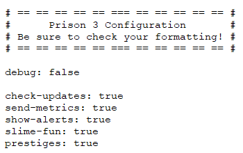
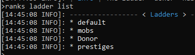
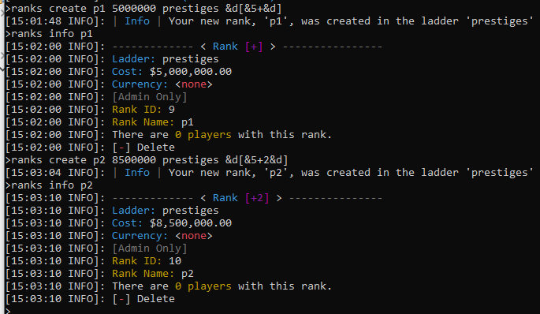
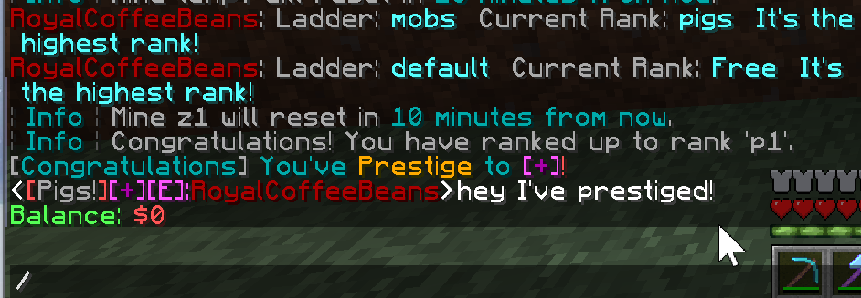
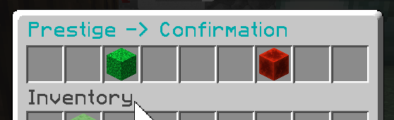
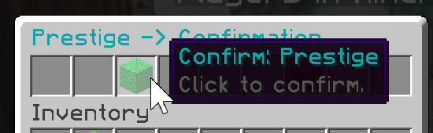
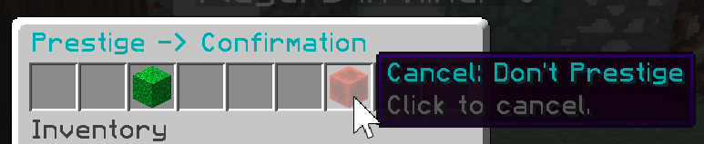

### Prison Documentation 
[Prison Documents - Table of Contents](prison_docs_000_toc.md)

## Prison - Setting Up Prestiges

This document provides information how to setup and use prestiges.


<hr style="height:1px; border:none; color:#aaf; background-color:#aaf;">

# Overview

This document should be able to provide the basic information to get the built in prestiges configured and working.


Prestiges are generally used to track how many times a player has gone through all of the default ranks.  There are many variations on how prestiges are implemented, but they area always a status symbol that sets the top players from the rest.  Some features may include resetting a player's monetary balance to zero, setting their rank back to the beginning, or some other change to make the next pass through the ranks slightly different, but usually more difficult.
  


<hr style="height:1px; border:none; color:#aaf; background-color:#aaf;">


# Enabling Prestiges

By default, prestiges are disabled and must be enabled before you can use them.  Even though the prestiges feature is disabled, prison still auto generates a prestige ladder.  


Edit the following file:

```
plugins/Prison/config.yml
```

Then set the following item to `true` and then save the file and restart the server.

```
prestiges: true
```

  


<hr style="height:1px; border:none; color:#aaf; background-color:#aaf;">


# The Prestige Ladder


The prestige ladder is created by default and is named `prestiges`, even if prestiges are not enabled.  Ranks can be added to the presetige ladder, even if it is not enabled.


In order to use prestiges, you need to create new ranks for each prestige level.  Add them as you would for the default ladder and the normal ranks, but you need to specify the prestige ladder name within the commands.


To show all the ladders that are available, use the following command.  This can help confirm that the ladder exists (it should be created as default) and it can confirm the correct spelling too.

```
/ranks ladder list
```

  


<hr style="height:1px; border:none; color:#aaf; background-color:#aaf;">


# Adding Prestige Ranks

In order to add prestige ranks, you add them just like you add ranks, but you specify the prestige ladder within the command.  


You can name them anything you want, but in our example below we are using p1, p2, etc, with the prestige tag values of `+` for the first prestige rank, then the following would be `+2`, `+3`, etc., wrapped in square brackets and colored.   


Here is an example of adding the first two prestige ranks.  These are the commands:

```
/ranks create p1 5000000 prestiges &d[&5+&d]
/ranks info p1
/ranks create p2 8500000 prestiges &d[&5+2&d]
/ranks info p2
```

This screen print shows the results of the above four commands.


  


<hr style="height:1px; border:none; color:#aaf; background-color:#aaf;">


# Setting up the Chat Placeholders or Prestige Ranks

You can add placeholders to the chat prefixes.  Please consult your chat documentation on how to do this, but here is an example for Esstentials-X Chat plugin.


Enabling the chat placeholder just requires editing one line within the `config.yml` file.  Search for the keyword **EssentialsChat** in that file, then edit the `format:` tag.  For example:

    format: '<{prison_rank_tag}:{DISPLAYNAME}>{MESSAGE}'


Once setup, restart the server. Or use **/essentials reload**.  Do not force all the plugins to be reloaded with a tool such as plugman since Prison (and other plugins) may fail to re-load properly.


The placeholder `prison_rank_tag` will include all placeholders that are active for the player, including the prestige chat prefixes.  The only issue is that you cannot control the order of how they will display.


It is possible to manually set the order by using the individual placeholders for each rank you want to show.  This allows you to omit certain placeholders too.  You can preview all of the placeholders with the placeholder search command.


```
/prison placeholder search <player> <page> rank_tag

/prison placeholder search RoyalCoffeeBeans rank_tag
/prison placeholder search RoyalCoffeeBeans 2 rank_tag
```

Please notice the first placeholder that is displayed in this screen print.  The `prison_rank_tag` shows prestige as second, and default is third.  It also shows a donor rank first.  This order is not controllable and may vary from server to server.  If you need another order, then you will have to manually set them up.


  


In our example, to customize the chat prefixes, we are interested in the following prefixes: `prison_rank_tag_pretiges` and `prison_rank_tag_default`.  


So to set them up in the EsstentialsX Chat prefix would be as follows:

```
    format: '<{prison_rank_tag_prestiges}{prison_rank_tag_default}:{DISPLAYNAME}>{MESSAGE}'
```


<hr style="height:1px; border:none; color:#aaf; background-color:#aaf;">


# Prestiging

Prestiging is simple to do.  If the player is at the highest default rank, then they can rankup the prestige ladder.  Prestiging will reset the player's balance to zero. Currently there is no warning or confirmation so proceed carefully.

```
/prestige
```

The following screen print is from performing the following commands, where the player does a prestige, then sends a chat message to show the chat prefixes.

```
/ranks player <player>
/prestige

```

Note the following ranks on this server goes from E (the lowest) to A (second highest), then Free (highest).  The first command `/ranks player` shows the player is at Free rank.

  


Prestige is only available through a gui interface.  You have to hover over the blocks to see the lore, which provides additional information.


  


Showing the Confirm Prestige button.

  


Showing the cancel button.

  


<hr style="height:1px; border:none; color:#aaf; background-color:#aaf;">


# The prestiges Command

This command shows the prestige ranks.  There are a few ways to get a listing of all of the prestige ranks.

```
/prestiges 
/prisonmanager prestiges

/ranks list prestiges
/ranks ladder listranks prestiges
```

This command is intended for players and can be enabled, or disabled, within the `plugins/Prison/GuiConfig.yml` file.  The command `/prestiges` is less configurable, but not sure why.


<hr style="height:1px; border:none; color:#aaf; background-color:#aaf;">


