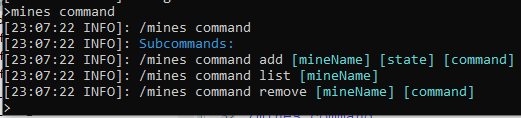
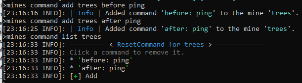
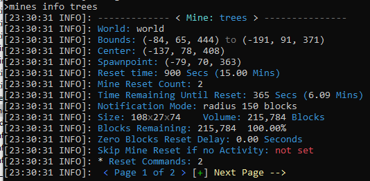
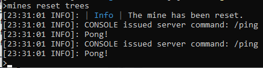
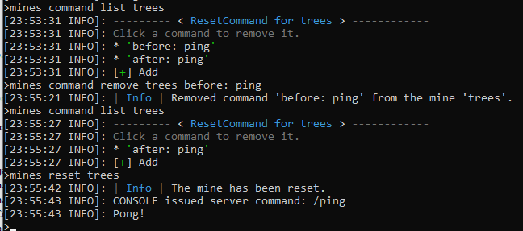

### Prison Documentation 
[Prison Documents - Table of Contents](prison_docs_000_toc.md)

## Prison - Mine Commands

This document provides information how to setup and use Mine Commands.


<hr style="height:1px; border:none; color:#aaf; background-color:#aaf;">

# Overview

Mine Commands can allow you to take your mine to the next level.  You have control to run a series of commands before, or after, then mine actually resets.  You can even disable the replacement of individual blocks that is traditionally associated with a mine reset.

The mine commands operate like rank commands, except that they run during a mine reset event.  They are ran as console, so they have full perms within the server. They can also run any command that you have access to from the console, so it may be best to test all the commands from the console prior to adding them.

This document will show a simple example, but your imagination can take it to the next level.

My personal goals to use this new feature was to dynamically build a large forest.  Then upon reset, it would erase all the trees and leaves, including any that grew outside of the mine, then randomly plant new trees.  The results would be a new random forest that would be generated each time.  Unfortunately, I have most of the details worked out on how it will work, but not 100% done yet, so I do not have this example to share at this time. :( 
  - Blue


<hr style="height:1px; border:none; color:#aaf; background-color:#aaf;">


# Adding and Listing Mine Commands

The family of mine commands are as follows:

```
/mines command
```

  


Add a mine command with the following command.  I'll add the same command twice just to illustrate that you can have a command run before, or after a mine reset.

```
/mines command add <mineName> <state> <command>

/mines command add trees before ping
/mines command add trees after ping

/mines command list trees
```

Running these three commands looks like the following.


  


The `/mines info trees` command shows how many commands are associated with the mine.  It shows that there are two commands at the bottom of the listing.

  


<hr style="height:1px; border:none; color:#aaf; background-color:#aaf;">


# Mine Command Listing Information


One point that needs to be explained has to do with the actual listing of commands.  The listings will be in the order that you add them, and that is the order in which they will be ran.  But it does not matter if you mix together the **before** and **after**.  The whole list is processed in order each time, but a filter only runs the correct command.  

It should also be understood that the **before: ** and **after: ** is actually part of the command and is stored that way.  If a command does not have either of those prefixes, then it will never be ran.  This is a warning if you are tempted to manually change the commands (could happen).


<hr style="height:1px; border:none; color:#aaf; background-color:#aaf;">


# Mine Resets


To test these commands, just perform an manual reset.

```
/mines reset trees
```


  


<hr style="height:1px; border:none; color:#aaf; background-color:#aaf;">


# Deleting Mine Commands

Deleting is simple, but it may not be quite as obvious.

First it is suggested that you list all of the commands associated with your mine, then copy the command you want to delete.  To copy the command, select everything between the single quotes.  Then paste that in to the delete command.  

As a tip, if you are in game and you list the mine commands, clicking on the command in the listing will delete it.  This could be dangerous, so because when listing commands in game.  This example will showcase the command usage from within the console.


Using the these commands to illustrate removing a command, with listing all of the commands before and after removal.  Then performing a mine reset to show that only one command is ran.


```
/mines command list trees
/mines command remove trees before: ping
/mines command list trees

/mines reset trees
```

  


<hr style="height:1px; border:none; color:#aaf; background-color:#aaf;">


<hr style="height:1px; border:none; color:#aaf; background-color:#aaf;">


# Parent Mine Control

One feature of interest that was requested by a few people, was to have the ability to use Parent mines to control the child mines.  

A parent mine is a large mine, that has smaller mines nested inside it, or the children could be elsewhere outside of the parent mine.  The options are numerous, but the idea is that all the mines reset at the same time as if they are connected.

To accomplish this, let's use the following for our example.  The mines will be based upon the name of **doggo**.  Of course, you may have a better name in mind, so let your imagination rule!

* **Parent Mine:**  doggo
* **Child Mine 1:**  doggo1
* **Child Mine 2:**  doggo2

Create the mines... of course do the selections first.  The set the mine reset times, making sure that the children reset times are larger than the parent's.  This will ensure that the children will actually never be reset automatically on their own.

```
/mines create doggo
/mines create doggo1
/mines create doggo2

/mines set resettime doggo 900
/mines set resettime doggo1 1000
/mines set resettime doggo2 1000
```

Then setup the commands on the parent to manually reset the children.

```
/mines command add doggo after mines reset doggo1
/mines command add doggo after mines reset doggo2
```

Now since we are assuming the children are nested within the parent mine, let's prevent the parent mine from destroying the child mine's blocks.  We can do that by using the block type IGNORE at 100% within the parent mine.

```
/mines block add doggo IGNORE 100.0
```

Then set the blocks in the child mines.

And that's it.  You can tweak some of the other settings on the mines, but this accomplishes what we set out to do: have a parent mine reset the children mine at the same time.  Since the children's reset times are much longer than the parents, they will never reset on their own because when they are manually reset, it resets the timer, which will never reach zero.


<hr style="height:1px; border:none; color:#aaf; background-color:#aaf;">


