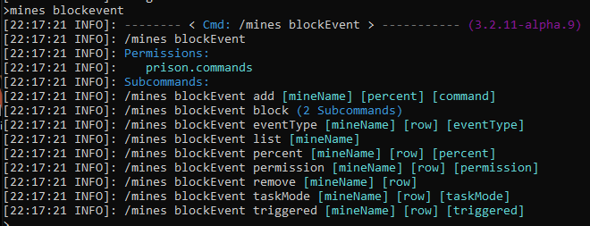

### Prison Documentation 
[Prison Documents - Table of Contents](prison_docs_000_toc.md)

# BlockEvents

Prison's BlockEvents provides a way to fire commands when a block is broken by a player.  Every BlockEvent must have a chance which can range from 0.0000 percent to 100.0 percent.  Optionally, you can tie the block event to a permission, to an event type, and for Token Enchant explosions you can filter on the enchantment type that triggered that explosion.  You can also filter on a Crazy Enchant blast too.  Soon, BlockEvents will be able to filter on block types too.


A single BlockEvent can also have more than one command that is ran together with each command separated by a semi-colon. ";" 


BlockEvents have a taskMode that defines how the specified commands are to be ran.


*Documented updated: 2021-12-03*

<hr style="height:1px; border:none; color:#aaf; background-color:#aaf;">

# BlockEvent Commands

BlockEvents can be access through the command prefixes of:

`/mines blockEvent`

There are 9 sub-commands, which includes add and list, which are probably the most important of the commands.


 


In the above screen print, the sub-commands have as a parameter named **row**.  See the next section in this document for more information.


The BlockEvent listings can also be included in the following command by including the keyword **all**:
`/mines info <mineName> all`


## Use of Row Numbers In The BlockEvent Commands:

 Due to the complexity of the blockEvent commands being deeply nested, and there could be so many of them, many of the blockEvent commands uses a **Row** identifier.  This row identifier is based upon the order of the commands as listed under the `/mines blockEvent list` command.

A number of examples of a few different blockEvets is as follows.  Emphasis is on the row numbers.

 


# BlockEvents Placeholders

Within the BlockEvents commands you can use placeholders and Prison will substitute the correct values within the commands.  


For a current list of all blockEvent commands use **placeholders** keyword with the **add** command:

`/mines blockEvent add placeholders`


`{player} {player_uid} {msg} {broadcast} {title} {actionBar} {inline} {inlinePlayer} {sync} {syncPlayer} {blockName} {mineName} {locationWorld} {locationX} {locationY} {locationZ} {coordinates} {worldCoordinates} {blockCoordinates} {blockChance} {blockIsAir} {blocksPlaced} {blockRemaining} {blocksMinedTotal} {mineBlocksRemaining} {mineBlocksRemainingPercent} {mineBlocksTotalMined} {mineBlocksSize} {blockMinedName} {blockMinedNameFormal} {blockMinedBlockType} {eventType} {eventTriggered} {utilsDecay}`


- **{player}** Provides the player's name.


- **{player_uid}** Provides the player's UUID.


Prison's BlockEvents also supports more advanced placeholders that can help simplify some basic tasks.  Over time this list will be expanded to include more useful features.


- **{msg}** Send a message to the player.  This is a shortcut for the prison command: `/prison utils msg`.  Example: `{msg} Congrats! You found a token!`. 


- **{broadcast}** Sends a broadcast message to all players on the server. Just use this placeholder followed by the message.  This is a shortcut for the prison command: `/prison utils broadcast`. Example: `{broadcast} {player} found a treasure trove of 100 voter keys!`. 


- **{actionBar}** Sends a message to the "actionBar" on the player's screen.   Just use this placeholder followed by the message. This is a shortcut for the prison command: `\prison utils titles actionBar <player>`. Example: `{actionBar}You Found Tokens!`


- **{title}** Sends a message to the "title" on the player's screen.  Just use this placeholder followed by the message. This is a shortcut for the prison command: `\prison utils titles title <player>`. Example: `{title}You Found Tokens!`


**How the command runs:**

There are four **taskModes** on how BlockEvent commands run. The taskModes can be setup through the command `/mines blockEvent taskMode help`, or they can be specified as placeholders.  There are 4 taskModes, and the placeholder versions are listed here:

- **{inline}** This is the default taskMode if not specified.  **{inline}** runs the commands in the same thread that in which Prison is handling the Block Break Events within Auto Features, and runs them as console (OP). If the command you use with BlockEvents is "slow" to run, then it could cause significant lag on the server.

- **{inlinePlayer}** This placeholder is similar to the **{inline}** placeholder, but it is ran as the player who is mining.  This too can cause significant lag if the command is not fast.

- **{sync}** This placeholder uses the taskMode of synchronous task submission.  The command specified will be submitted to run in the bukkit's synchronous thread, and is ran as console (OP). Since all block break events are ran in the same bukkit synchronous thread, the specified command will run after prison is finished processing the broken block.  Long running commands will not cause lag through the handling of the block break events, but they could still cause lag.

- **{syncPlayer}** This placeholder is similar to the **{sync}** placeholder, with the exception the commands are ran as the player, so the player must have access to those commands.

NOTE: It is impossible to run a command asynchronously, since the execution of a command must always be in a synchronous thread. Hence you can submit an async task, but then when you run the command, it does so in a sync thread. 


`/mines blockEvent add help`
`/mines blockEvent add placeholders`


Some examples showing how to use placeholders in the blockEvents. 


```

/mines blockEvent add a 100 {utilsDecay} rainbow {blockCoordinates} AIR 40 {mineName}

/mines blockevent add A 0.075 prison utils repairAll {player};{actionBar}Your items have been repaired!

/mines blockevent add A 1 prison utils smelt {player}

/mines blockEvent add A 5.0 prison utils potionEffect speed 90 2;prison utils potionEffect night_vision 300 1

```


- **{blockName}** The name of the block that was placed in the mine during the last mine reset.  The same name as used and provided within the command `/mines block search`.


- **{mineName}** The name of the mine.  If outside of a mine it will be blank.


- **{locationWorld}** Provides the world name in which the block was mined.


-**{locationX}** The **X** coordinates for the broken block.  This is an integer value.


- **{locationY}** The **Y** coordinates for the broken block.  This is an integer value.


- **{locationZ}** The **Z** coordinates for the broken block.  This is an integer value.


- **{coordinates}** This provides the X, Y, and Z coordinates for the broken block.  These are double values, surrounded by parenthesis and separated by commas.  Format: **(X,Y,Z)**  Example: `(183.2,88.3792,-3828.248)`


- **{blockCoordinates}** This is similar to the **{coordinates}** placeholder, except for the  use of integer values. Format: **(blockName,world,X,Y,Z)**  Example: `(,prisonWorld,183,88,-3828)`


- **{worldCoordinates}** This combines both the **{locationWorld}** and **{blockCoordinates}** placeholder in to one placeholder. The coordinates are integer values.  Format: **(world,X,Y,Z)**  Example: `(prisonWorld,183,88,-3828)`


- **{blockChance}** The blockEvent's percent chance as defined when setting up the command.


- **{blockIsAir}** A boolean value of either TRUE or FALSE as to if the block was originally set to AIR during the last mine reset.  Technically, if the block is set to AIR, then it is ignored in all block events that prison processes through the auto features.  Therefore this should always return FALSE.


- **{blocksPlaced}** This is the number of blocks placed in the mine during the last Mine reset.  This value should be equal to the mine's total block size, minus the number of AIR blocks that were placed during the reset.


- **{blockRemaining}** The current number of blocks remaining in the mine, until there would be zero blocks left to mine.  Note that this is a dynamic and changing value, especially if many other players are mining at the same time.  There is even a chance that this value may be non-zero with another player's block break handling triggering a mine reset event, or zero blocks remaining.


- **{blocksMinedTotal}** The total number of blocks mined of the same type that was just broke since the last mine reset.


- **{mineBlocksRemaining}** The total number of block remaining of the same type that was just broke.  See **{blockName}** for the block name. 

- **{mineBlocksRemainingPercent}** The percent number of blocks remaining in the mine.


- **{mineBlocksTotalMined}** This is the total number of all blocks mined since the stats were first enabled.


- **{mineBlocksSize}** This is the total block count of all blocks mined.


- **{blockMinedName}** This is the name of the block that was mined.  It may not be identical to the **{blockName}** placeholder, especially if another process replaced it with another block.


- **{blockMinedNameFormal}**  This is the formal name of the block that was mined.  The formal nature is the namespace prefixed to the block name, with a colon between the two.  For example a block name may be "cobblestone" and then the formal name being "minecraft:cobblestone".  This is more useful for custom blocks, such that their namespace is not "minecraft", which an example being "customitems:compressed_cobblestone".


- **{blockMinedBlockType}** This is the bukkit Material name for the block.  It may not match the block name, especially on older versions of spigot. 


- **{eventType}** This is the event type that Prison listened to that initiated the block break handling.


- **{eventTriggered}** A few enchantment plugins identify the enchantment that triggered the event.  If it is available, then that value will be provided by this placeholder.  One plugin that provides this value is TokenEnchant.


- **{utilsDecay}** This is a shortcut for `/prison utils decay`.


<hr style="height:1px; border:none; color:#aaf; background-color:#aaf;">


# BlockEvents Commands

The BlockEvent command that is used must be be runnable from the console. It is suggested that you use the console to figure out the correct structure of the command that you are interested in running.  If it works from the console, then it should work as a BlockEvent command.


The structure of the command should be the same as within the console. Do not include a a leading /.  Do not quote the command.  Use the placeholders mentioned above for referring to the players. 


Move than one command can be chained together by using a semi-colon between the commands.  The commands do not need to end with a semi-colon.  No space needs to follow a semi-colon before the next command.  There is no limit imposed upon the length of a command, or commands, but the max length may be controlled by outside factors such as ingame text message constraints.  Hence why it may be advisable to enter long commands through the console.


See the above examples on how to enter the commands when setting up a BlockEvent.


<hr style="height:1px; border:none; color:#aaf; background-color:#aaf;">


# BlockEvents Chance


The chance that is tied to a block event can range from 100 percent to as low as 0.0001 percent.  


A chance of 100 percent ensures the block event will always run if all the other filters pass.


Please be aware that there are no validations for the lowest setting for chance.  What this means is that you "could" enter a value lower than 0.0001 percent and it could be accepted and it will work, but the displaying of that value will be cut off at four decimals and no rounding will apply so it could appear as if it is the same as zero.  Also a value of 0 could be entered which would imply that the BlockEvent will never be ran.


Block Event chances are all independent from each other.  Each block even setup in a mine will have a chance to be ran on each event.  So if you have three block events, 70%, 20%, and 10%, all three can be ran on the same event since each block event rolls their own chance.  This means you cannot setup block events where you want to apply only one of a number of actions, since all actions will have a chance to be applied.
  

<hr style="height:1px; border:none; color:#aaf; background-color:#aaf;">


# BlockEvents Permission


If a permission is added to a BlockEvent then the player must have that permission before the BlockEvent is even considered.  There can only be one permission per block event.


When adding a block event, to bypass the permissions, enter the value of `none`.


<hr style="height:1px; border:none; color:#aaf; background-color:#aaf;">


# BlockEvents TaskMode


TaskMode identifies how a block event is ran.  There are two major modes, with two ways to run the command, with the TaskMode combining these two components to define 4 possible TaskModes.


The actual values are: **inline**, **inlinePlayer**, **sync**, and **syncPlayer**.


The two major modes that defines how tasks are ran are **inline** and **sync**.  


**Inline** runs the commands in the same thread as the block break event is processed.  Inline tasks should be simple and fast so they do not produce lag with holding up each block break event.  The **inline** mode is ran as console.


**Sync** submits the task to run right away, but it does so on the bukkit's synchronous thread.  It can produce lag if it takes a long time to run, but it will also allow the block break event to complete right away.  The **Sync** mode is ran as console.


**InlinePlayer** runs the task inline, but as the player.  It will not have any escalated permissions and the task can fail if it does not have access to the commands that are being ran.


**SyncPlayer** submits the task as the player.  It will not have any escalated permissions and the task can fail if it does not have access to the commands that are being ran.


Asynchronously submitted tasks are not an option since commands cannot be submitted asynchronously; only code, or functions, can be submitted to be ran in an asynchronous thread.  There isn't an option to run commands this way, and if a task is submitted to be ran asynchorously to then run a command, then it drops in to synchronous mode to run the command.


<hr style="height:1px; border:none; color:#aaf; background-color:#aaf;">


# BlockEvents EventType


The EventType defines what kind of event is being monitored.


By default, **all** is used.  This applies to all event types.


**BlockBreak** This is the standard event type.  It is used to identify when a single block is broken.


**TEXplosion** is a Token Enchant Explosion event, and generally includes more than one block.  This filters only on the TE Explosion event. With this event type the **Triggered** option can be applied.


**CEXplosion** is a Crazy Enchant explosion event and generally includes more than one block.  Unlike the BlockBreak event or the TE Explosion event, the CEExplosion event does NOT identify which block was actually hit by the player. 


<hr style="height:1px; border:none; color:#aaf; background-color:#aaf;">


# BlockEvents Triggered


Only the Token Enchant Explosion events provides information on which enchantment **triggered** the explosive event.  This allows different BlockEvents to be fired for different enchantments that use explosions.


You must enter the correct value for this triggered command as used by Token Enchant and provided by Token Enchant.  There is no way prison can validate this value when entered.  


<hr style="height:1px; border:none; color:#aaf; background-color:#aaf;">


# BlockEvents Blocks


Coming soon.  Not yet available.


Will be able to filter block events based upon block types.  Will be able to have more than one block defined for each BlockEvent.


<hr style="height:1px; border:none; color:#aaf; background-color:#aaf;">


# BlockEvents 


<hr style="height:1px; border:none; color:#aaf; background-color:#aaf;">


