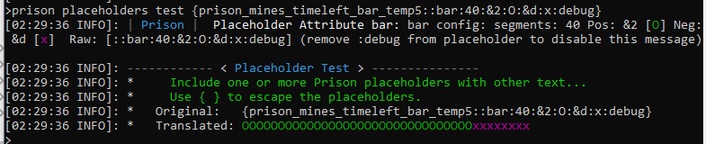
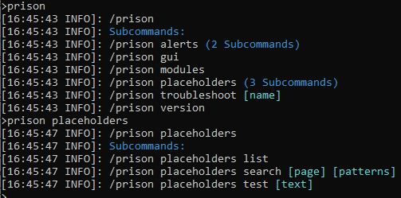
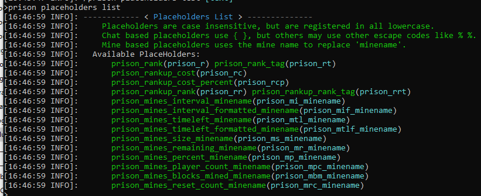
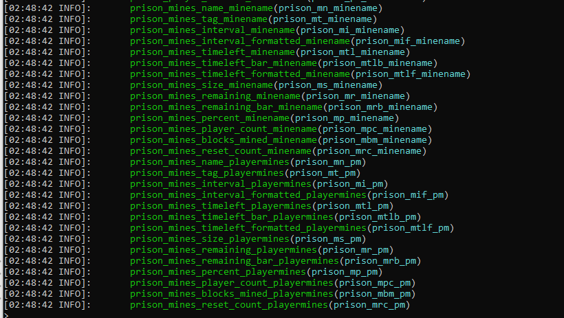
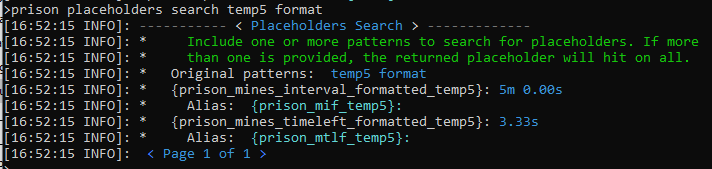
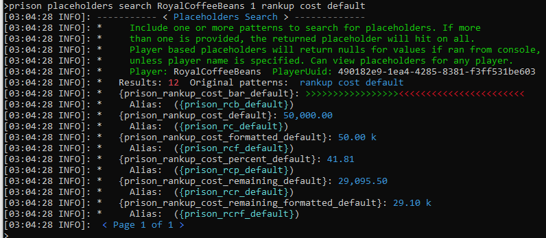
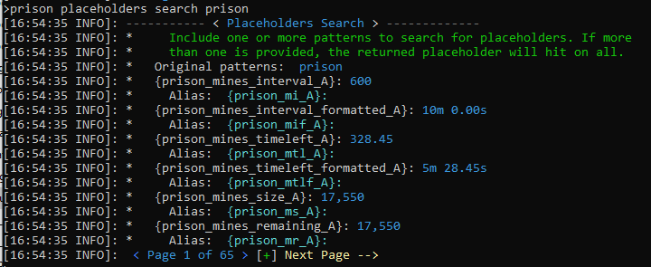
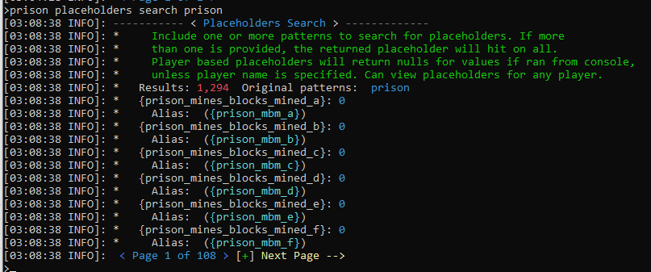
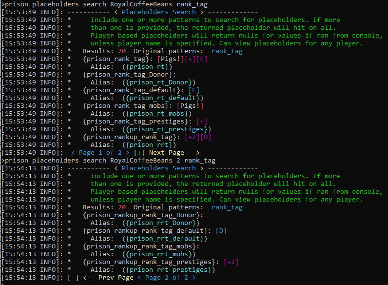
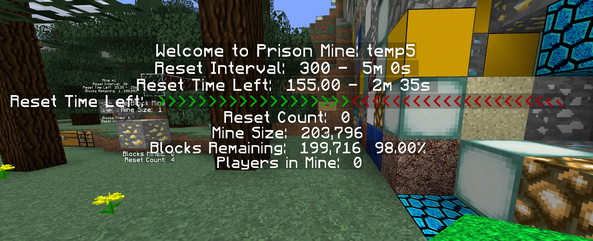

### Prison Documentation 
[Prison Documents - Table of Contents](prison_docs_000_toc.md)

## Prison - Placeholder Guide

This document covers different aspects of placeholders within Prison.  It explains how they work, how to use them, and different ways to use them.

<hr style="height:1px; border:none; color:#aaf; background-color:#aaf;">


# Overview

Placeholders allow the sharing of data from one plugin with another plugin, and without either plugin knowing anything about each other.

On the surface they appear to be simple, but there are a lot of moving parts below the surface, and with Prison Mines, there are even more things going on.

Add in to the mix, that different plugins deal with placeholders in slightly different ways, and you can wind up with a challenge to get them to work under different circumstances.

<hr style="height:1px; border:none; color:#aaf; background-color:#aaf;">

# Placeholder Types and Counts

* **Rank Related:** 4 including aliases
* **Rankup Related:** 18 including aliases


* **Rank Ladder Related:** 4 including aliases **times** each ladder
* **Rankup Ladder Related:** 18 including aliases **times** each ladder


* **Player Balance Related:** 2 including aliases
* **Player Ladder Balance Related:** 2 including aliases **times** each ladder


* **Mine Related:** 28 including aliases **times** each mine
* **Mine Player Related:** 14 including aliases


**Total base Placeholders:** 90 including aliases


**Total if 26 Mines and 3 Ladders:** 844 placeholder including aliases (22 + 26*3 ladder + 2 + 28*26 mines + 14) 
	

<hr style="height:1px; border:none; color:#aaf; background-color:#aaf;">


# Requirements

There is always more than one way to do things, and the same goes for having more than one way to use placeholders.  This documentation, and our test servers, primarily rely on the use of PlaceholderAPI as the core component to making placeholders work.  Depending upon other plugins that you may use, they may have other dependencies too.

**PlaceholderAPI** - [Setting up PlaceholderAPI](prison_docs_0xx_setting_up_PlaceholderAPI.md) - Strongly Suggested if using placeholders. 

<hr style="height:1px; border:none; color:#aaf; background-color:#aaf;">


# Placeholder Theory for Prison

There are two major types of placeholders in prison: Player based and Mine based. With the most recent releases of prison, there have been hybrids added that are a combination of the two.  For example there are now ladder based placeholder that allow targeting ranks on a specific ladder, instead of all ladders.  Also there are player mine placeholders that report on the mine stats for the mine in which the player is physically located in.  The player mine placeholders have no value when the player is not in a mine, and they will change as the player goes from mine to mine.

There are also different types of data that are returned in placeholders. Text, numbers, formatted numbers, and bar graphs.

The player based placeholders can only report on the player that is initiating the command, or request. These placeholders pertain to the player's attributes, such as rank, next rank, their balance, how more they need before reaching the next rank, and etc.  Internally, all of these requests must include the player's UUID, which is why you cannot just add them to a sign, since the sign does not know any player's UUID.

There are actually two major kinds of player based placeholders; a third type is "related" more to mines and not specifically to the player's ranks.  Rank placeholders that returns all of the player's current attributes for all active ladders they are associated with.  For example, if they are active on four ladders, then they will have four active ranks on four ladders with possible values.  So it may look something like this: `[mod][Zeus][+2][B]`, of which the ladders could be mod, donor, prestige, and default.  The thing to remember about player rank placeholders is that they may return more than one value, and you cannot control the order of the values.

The other player based placeholders, which complements the Rank Placeholders, are the ladder placeholders that narrows the ranks down to a specific ladder.  So with our example above, if you only want the ranks from the *default* ladder, that is now possible. Also you can control the order they appear by ordering the ladder placeholders in a specific sequence.  

The Mine based placeholders provide details about mines, and the mine name becomes part of the placeholder name.  Out of all of the possible mine based placeholders, each one is duplicated for each mine.  So, in rough terms, if there are different mine placeholders and you have 40 mines, then prison will generate about 400 place holders: 40 mines x 10 placeholders each = 400 placeholders for prison.

The same applies to the ladder placeholders as the mine placeholders; for every ladder, there will be a specific placeholder that represents each ladder.  

Prison has integrations for direct use of providing placeholder values to to the other plugins. Some of those other plugins request placeholder values using partial placeholder names.  Therefore to improve performance and to prevent having to always reconstructing the full placeholder names, prison precomputes the fragments for all placeholders.  Therefore, with our example of 40 mines and 10 placeholders, the actual internal number of placeholder combinations that prison will respond to is 800: 40 mines x 10 placeholders per mine  x 2 for aliases = 800 placeholders for prison.

Off hand this may sound bad, but Prison utilizes enumerations for identifying placeholders, so they may be objects, but they are lightweight and helps ensure placeholders align with the code at compile time.  This not only provides better performance, and less memory consumption, but programming errors and typos are caught at compile time and not runtime, so they also provide for a more stable and reliable Prison environment.

Internally, placeholders within Prison are case insensitive.  But Prison uses lower cased placeholder names to register with any placeholder integration.  Therefore, although prison may be case insensitive, the placeholder plugins may not recognize the placeholders unless you use them as all lower case names.

Also, internally, prison only responds to the placeholder name without the escape characters.  The escape characters are generally curly braces { }, or percents % %, but may be other characters.  All placeholder plugins strip off the escape characters before passing anything to prison.  So proper use of placeholders is dependent upon what is being required by your placeholder plugin and may require a mix of escape characters.

<hr style="height:6px; border:none; color:#aaf; background-color:#aaf;">


# Placeholder Customization with Placeholder Attributes

*Since Prison v3.2.4-alpha.2*


Placeholders within prison can now be dynamically customized without having to make any changes to any configurations.  The same placeholder can be used in multiple place, each with different configurations.  This is now possible through the use of placeholder attributes and offers a large degree of customization.


The placeholder attributes is additional text that is added at the end of a placeholder but within the escape characters.  The placeholder attribute always begins with a double colon `::` and each parameter is separated with a single colon `:`.  Some placeholders cannot use the attributes, and not all attributes can be used on a placeholder that will work with an attribute.  See additonal information below pertain to each attribute.


Here are a couple of basic placeholders, as they are listed, and as they would be used for a mine named **temp5**.

* **prison_mines_size_minename** - `{prison_mines_size_temp5}`
* **prison_mines_remaining_minename** - `{prison_mines_remaining_temp5}`
* **prison_mines_remaining_bar_minename** - `{prison_mines_remaining_bar_temp5}`
* **prison_mines_timeleft_bar_minename** - `{prison_mines_timeleft_bar_temp5}`


And these are some examples of using the attributes:

* `{prison_mines_size_temp5::nFormat:#,##0}` - **654,321**
* `{prison_mines_size_temp5::nFormat:#,##0:0:none}` - **654,321**
* `{prison_mines_size_temp5::nFormat:#,##0.00:1:kmg}` - **654.32 k**
* `{prison_mines_size_temp5::nFormat:#,##0:0:kmg}` - **654k**


* `{prison_mines_remaining_bar_temp5}` - Normally displays as (no color)
    * **>>>>>>>>>>>>>>>>>>>>>>>>>>>>>>>>>><<<<<<**
* `{prison_mines_remaining_bar_temp5::bar:10}` - Using default values, but change length to 10
    * **>>>>>>>>><**
* `{prison_mines_remaining_bar_temp5::bar:10:&2:#:&d:-}` - Change all settings
    * **#######---**
* `{prison_mines_timeleft_bar_temp5::bar:40:&2:O:&d:x:debug}` - Enable debug mode for the attribute
    * **OOOOOOOOOOOOOOOOOOOOOOOOOOOOOOOOxxxxxxxx**


The examples above don't show the color for the bar graphs, but here is a screen print that uses a prison command to test the placeholders dynamically within prison:


The placeholder: `{prison_mines_timeleft_bar_temp5::bar:40:&2:O:&d:x:debug}`

The full command:
`/prison placeholders test {prison_mines_timeleft_bar_temp5::bar:40:&2:O:&d:x:debug}`




When debug mode is enabled, it will print to the console information about the placeholder attribute, as seen in the above screen print.  This could be useful when testing the configuration of placeholder attributes


Using the command `/prison placeholders test` should be used to test and perfect the use of the placeholder attributes.

<hr style="height: 1px; border:none; color:#aaf; background-color:#aaf;">


## Placeholder Attribute - Numeric Formats


The Numeric Format attribute will only work on placeholders that return plain numbers.  If there is a "_format" version of the placeholder, then an attribute will override the default formatting.

Example of this attribute's usage is as follows, using descriptions for each parameter.

`::nFormat:format:spaces:unitType:hex:hex2:debug`


- **nFormat**: the keyword to identify this attribute.</li>
- **format**: formatting based upon Java's DecimalFormat class.
  					**Required.** Defaults to #,##0.00. 
    * #,###
    * #,###.00
    * #,###.00000

- **spaces**: number of spaces between format and unit of measure. 
  				**Optional.** Defaults to 1.
- **unitType**: unit type to display or to use to transform the results.
  				**Optional.** Defaults to the placeholder type that is used.

    * **none**: No display of units. No transformations.
    * **kmg**: Uses one character units: kMGTPEZY. Transforms results by 
       			dividing by 1000.0 until value is less than 1000.0, and 
       			each time it increments the unit character.  
       			k=1,000, M=1,000,000 and etc. These are metric SI codes.
    * **kmbt**: Uses one character units: KMBTqQsS. Transforms results by 
       			dividing by 1000.0 until value is less than 1000.0, and 
       			each time it increments the unit character.  
       			k=1,000, M=1,000,000 and etc. These are non-standard codes.   			
    * **binary**: Uses a base-two divisor of 1024 along with the units: 
       			KB, MB, GB, TB, PB, EB, ZB, and YB.  
       			
    * *Note:* Other unitTypes can be added along with different style of
       			reducers.
      
- **hex**: **Optional.** Case sensitive. Non-positional; can be placed anywhere.
  				Only valid value is "hex". When enabled it will translate
  				hex color codes, and other color codes before sending the placeholder
  				results back to the requestor. This is useful for plugins that
  				do not directly support hex color codes.
- **hex2**: **Optional.** Case sensitive. Non-positional; can be placed anywhere.
  				Only valid value is "hex2". When enabled it will translate
  				hex color codes to their intermediate state, which uses '&' color 
  				codes, sending the placeholder results back to the requestor. 
  				This is useful for plugins that do not directly support hex 
  				color codes and may work when 'hex' does not.
- **debug**: **Optional.** Case sensitive. Non-positional; can be placed anywhere.
  				Only valid value is "debug". When enabled it
   				will log to the console the status of this attribute, along with
   				any error messages that may occur when applying the attribute.
  


The parameters that are optional do not have to be included, unless another parameter after the optional ones are needed. Then the optional parameter must be supplied and cannot be empty.


`{prison_mines_size_temp5::nFormat:#,##0.00:1:kmg}`


Although it is not suggested to include color codes in the formatting of numbers, it may be possible with the addition of the quoting them with single quotes.  The following use of **hex2** format works well with testing on a scoreboard that does not support hex colors, and is a way to inject the hex color when it cannot be used directly in the scoreboard configs.

```
{prison_mines_size_temp5::nFormat:'#af33ff'#,##0.00:1:kmg:hex}
{prison_mines_size_temp5::nFormat:'#af33ff'#,##0.00:1:kmg:hex2}
```


<hr style="height: 1px; border:none; color:#aaf; background-color:#aaf;">


## Placeholder Attribute - Bar Graphs


The bar placeholder attribute only works with placeholders with the word bar in them. 


Example of this attribute's usage is as follows, using descriptions for each parameter.

`::bar:size:posColor:posSeg:negColor:negSeg:hex:hex2:debug`


- **bar**: the keyword to identify this attribute.
- **size**: The number of segments to generate.
- **Positive Color**: The color code to use for the positive segments. 
  						Color codes should start with an &.
- **Positive Segment**: The value that will be used for the positive
  						segment.
- **Negative Color**: The color code to use for the negative segments. 
  						Color codes should start with an &.
- **Negative Segment**: The value that will be used for the negative
  						segment.
  	
      
- **hex**: **Optional.** Case sensitive. Non-positional; can be placed anywhere.
  				Only valid value is "hex". When enabled it will translate
  				hex color codes, and other color codes before sending the placeholder
  				results back to the requestor. This is useful for plugins that
  				do not directly support hex color codes.
- **hex2**: **Optional.** Case sensitive. Non-positional; can be placed anywhere.
  				Only valid value is "hex2". When enabled it will translate
  				hex color codes to their intermediate state, which uses '&' color 
  				codes, sending the placeholder results back to the requestor. 
  				This is useful for plugins that do not directly support hex 
  				color codes and may work when 'hex' does not.
- **debug**: **Optional.** Case sensitive. Non-positional; can be placed anywhere.
  				Only valid value is "debug". When enabled it
   				will log to the console the status of this attribute, along with
   				any error messages that may occur when applying the attribute.					
  						


The parameters are all optional and if they are not supplied then the default values for the bar graph will be used instead. 

`{prison_mines_remaining_bar_temp5::bar:10}`

`{prison_mines_remaining_bar_temp5::bar:10:&2:#:&d:-}`

`{prison_mines_timeleft_bar_temp5::bar:40:&2:O:&d:x:debug}`


To use hex color codes within the bar graphs, the plugins that are requesting them, may not always support hex colors.  So the options of **hex** and **hex2** are options to provide pre-formatting of the hex colors so that way the hex colors could work with plugins that do not support them.  If the use of **hex** does not work, then **hex2** may.


Examples of using hex color codes in a bar graph placeholder. Try it first with **hex**, and if that does not work, then try **hex2**.  

```
{prison_mines_timeleft_bar_a::bar:15:#abcdef:O:#5a3c7f:x:hex}
{prison_mines_timeleft_bar_a::bar:15:#abcdef:O:#5a3c7f:x:hex2}
```


<hr style="height: 1px; border:none; color:#aaf; background-color:#aaf;">


## Placeholder Attribute - Text


This placeholder attribute is for text formatting the placeholder results.  The only thing it does is to process the hex, hex2, and debug options.


This placeholder attribute can be used with any placeholder, even for placeholders
that have other attributes to format their content.  Since this is strictly processing
the hex color codes, it will operate upon the final text output from the other
placeholders.


Example of this attribute's usage is as follows, using descriptions for each parameter.

`::text:hex:hex2:debug`


      
- **hex**: **Optional.** Case sensitive. Non-positional; can be placed anywhere.
  				Only valid value is "hex". When enabled it will translate
  				hex color codes, and other color codes before sending the placeholder
  				results back to the requestor. This is useful for plugins that
  				do not directly support hex color codes.
- **hex2**: **Optional.** Case sensitive. Non-positional; can be placed anywhere.
  				Only valid value is "hex2". When enabled it will translate
  				hex color codes to their intermediate state, which uses '&' color 
  				codes, sending the placeholder results back to the requestor. 
  				This is useful for plugins that do not directly support hex 
  				color codes and may work when 'hex' does not.
- **debug**: **Optional.** Case sensitive. Non-positional; can be placed anywhere.
  				Only valid value is "debug". When enabled it
   				will log to the console the status of this attribute, along with
   				any error messages that may occur when applying the attribute.


<hr style="height:6px; border:none; color:#aaf; background-color:#aaf;">


# Rank Command Placeholders


The Rank Commands recognize only two placeholders, but they are not considered part of the standard placeholders.  There are also only two placeholders that are recognized and both are case sensitive (must be lower case), and must also include curly braces too.


* {player}
* {player_uid}


This is mentioned here since these rank command placeholders are not part of all the other placeholders, so as such, it may be difficult to find information for these items.


<hr style="height:1px; border:none; color:#aaf; background-color:#aaf;">


# Placeholder Commands


*Since Prison v3.2.1-alpha.13*


There are a few commands within prison that will allow you list placeholders, search for placeholders, and to test random text that includes placeholders.


* **/prison placeholders**


* **/prison placeholders list**
* **/prison placeholders search**
* **/prison placeholders test**

* **/prison placeholders reload**

NOTE: the `/prison placeholders reload` command only reloads and registers the placeholders with the placeholder integrations.  This would be required to enable placeholders on a new mine or new ranks or a new ladder that were added since the last server restart.  Also if you reload another plugin, such as papi, you will need to reload the plugins, which just re-registers them.


* **/prison version** No longer provides a list of placeholders since it's become too large.


<h3>Prison Placeholder Command Listing</h3>



Example of placeholder command listings


<h3>Prison Placeholder Listings</h3>




Example of the list of placeholders that is available through **/prison placeholders list**.  Please note that this list may evolve as new placeholders are added.  Use these commands to get the current listing that is available on your server.


<h3>Prison Placeholder Search with Two Search Patterns</h3>




This is an example of searching for placeholders using a player's name plus two search patterns: *temp5* and *format*. The term temp5 is the name of a mine and is an example of a the dynamic construction of placeholders, and that you can still perform a search with them.  The search patterns can be any String fragment found in either the placeholder, or it's alias.  

If more than one search pattern is provided, then all patters must hit on the same placeholder to be included in the results.  They behave as a logical AND relationship. 

A player's is provided, but results do not include any player, rank, or ladder entries.  This shows that if a player's name is provide, it is recognized as a player and will not prevent valid hits.


The following example shows what the command is like when specifying the player's name, a page numer for the results, and three search parameters:

```
/prison placeholders search RoyalCoffeeBeans 1 rankup cost default
```

This example shows the current placeholder values for that player, including an example of a bar graph.




<h3>Prison Placeholder Listings - All Placeholders</h3>



In this contrived example, since all placeholders begin with "prison", this search returns a listing of all placeholders. In this example, using the current Prison v3.2.1-alpha.13 release, it has generated 65 pages of results, at 6 placeholders per page which includes the alias.  

The following shows an example of all placeholders that are active with Prison_v3.2.2-alpha.10.jar.  It includes a total of 1,294 placeholders, on 108 pages.  This is based upon 4 ladders, 13 ranks, and 41 mines.





<h3>Prison Placeholder Listings</h3>


<hr style="height:1px; border:none; color:#aaf; background-color:#aaf;">


# Chat Placeholders

There are two major ways a placeholder can be resolved within Prison: through chat or through a placeholder integration.

Chat based placeholders do not rely on other plugins for them to work.  Instead they use the org.bukkit.event.player.AsyncPlayerChatEvent, of which Prison will respond and provide translations to prison related placeholders that it find with the chat message.

Although no plugin is required for Prison to properly handle chat based placeholders, other plugins may be required to generate their use.  Such as EssentialsX's Chat plugin.  It provides a way to prefix chat messages with placeholders.


<hr style="height:1px; border:none; color:#aaf; background-color:#aaf;">


# Enabling EssentialX's Chat Placeholders

Set up the EssentialX's Chat plugin: [Setting up EssentialsX](prison_docs_0xx_setting_up_EssentialsX.md).

Enabling the chat placeholder just requires editing one line within the `config.yml` file.  Search for the keyword **EssentialsChat** in that file, then edit the `format:` tag.  For example:

    format: '<{prison_rank_tag}:{DISPLAYNAME}>{MESSAGE}'

Once setup, restart the server. Or use **/essentials reload**.  Do not force all the plugins to be reloaded with a tool such as plugman since Prison (and other plugins) may fail to re-load properly.


This will include all placeholders that are active for the player, including the prestige chat prefixes.  The only issue is that you cannot control the order of how they will display.


It is possible to manually set the order by using the individual placeholders for each rank you want to show.  This allows you to omit certain placeholders too.  Please see the next section of this document to learn how to set them up.


You can preview all of the placeholders with the placeholder search command.


```
/prison placeholder search <player> <page> rank_tag

/prison placeholder search RoyalCoffeeBeans rank_tag
/prison placeholder search RoyalCoffeeBeans 2 rank_tag
```


  


The placeholders are interested in are: `prison_rank_tag_pretiges` and `prison_rank_tag_default`.  


So to set them up in the EsstentialsX Chat prefix would be as follows:


    format: '<{prison_rank_tag_prestiges}{prison_rank_tag_default}:{DISPLAYNAME}>{MESSAGE}'


<h3>Ladder Specific Placeholders</h3>

One of the newer features available for placeholders has to do with ladder specific placeholders.  This is similar to the mines placeholders but for ladders specifically.  These player ladder placeholders are just the same a the player rank, but only for one ladder.  The player rank placeholders will return all ranks on all ladders for that placeholder.

This is an example of specifying the rank tag for both the prestige and default ladder.  This ensures the expected order of these two tags, but it will also exclude other tags from other ladders, such as donor ladders or mod ladders.

    format: '<{prison_rank_tag_prestiges}{prison_rt_default}:{DISPLAYNAME}>{MESSAGE}'


Use the placeholder tools under `/prison placeholders` for more information and to see what is available for use.


For example, to preview all of the placeholders with the placeholder search command.


```
/prison placeholder search <player> <page> rank_tag

/prison placeholder search RoyalCoffeeBeans rank_tag
/prison placeholder search RoyalCoffeeBeans 2 rank_tag
```


  


<hr style="height:1px; border:none; color:#aaf; background-color:#aaf;">


# Enabling HolographicDisplays Placeholders

Follow directions on how to install and configure the HolographicDisplays plugin.


An important detail to realize, is that HolographicDisplays can only use placeholders that related to the server.  It cannot access any of the prison placeholders on its own.  It needs the help of other plugins to extend it's functionality.

* [HolographicDisplays Download](https://dev.bukkit.org/projects/holographic-displays)
* [HolographicDisplays' Documentation](https://filoghost.me/docs/holographic-displays)

* [HolographicExtension](https://www.spigotmc.org/resources/holographicextension.18461/)
* [PlaceholderAPI Setup Details](prison_docs_0xx_setting_up_PlaceholderAPI.md)
* [ProtocolLib](https://www.spigotmc.org/resources/protocollib.1997/)

The simple directions on how to get everything to work is to download these plugins, and place them all in to your server's plugin directory.  There is no need to modify any config files to get them to work with prison.  Prison will register all of the internal placeholders with PlaceholderAPI so it knows they are valid and where to find them (where to send them to be resolved).

The simplest way to create a HolographicDisplay would be to stand where you want one.  Then enter the following command:

```
/hd create test
```

Then on the server file system, open the file:

```
plugins\HolographicDisplays\database.yml
```

Then edit the file. Keep in mind it is a yml file and must be valid yml.

This is an example of a holographic sign:

```
temp5:
  location: world, -99.832, 74.500, 191.215
  lines:
  - 'Welcome to Prison Mine: temp5'
  - 'Reset Interval: {slowest}%prison_mines_interval_temp5% - {slowest}%prison_mines_interval_formatted_temp5%'
  - 'Reset Time Left: {medium}%prison_mines_timeleft_temp5% - {fast}%prison_mtlf_temp5%'
  - 'Reset Time Left: {slowest}%prison_mines_timeleft_bar_temp5%'
  - 'Reset Count: {medium}%prison_mines_reset_count_temp5%'
  - 'Mine Size: {slowest}%prison_mines_size_temp5%'
  - 'Blocks Remaining: {slowest}%prison_mr_temp5% {slowest}%prison_mp_temp5%%'
  - 'Players in Mine: {slowest}%prison_mines_player_count_temp5%'
```

Notice that the prison placeholders are wrapped in the % % escape characters.  The prefixed placeholders such as {slowest} and {fast} are for the plugin HolographicExtensions and they control how frequently the placeholders are refreshed.

This is an example of the above settings, including the bar graph.  Notice that the bar graph's properties can be adjusted for both the characters that are used, and the total number of characters (width).  See the configuration within the file `/plugins/Prison/config.yml`.



Once you update and save the database.yml file, you can have HolographicDisaplys reload from the files:

```
/hd reload
```

The above example will produce a holograph that is too tall and the bottom part will be underground.  You can raise it up by manually increasing the **Y** value stored in *location:*.  As you raise it up, and save the file, then you use **/hd reload** to refresh.  It's also easier to make changes directly to the database.yml file. Repeat until it looks right.


One  word of warning about editing the yml file, is that it must be valid yml, if not, then it could fail to load, or it may reset to a default file.  If you're unsure about the file being proper yml, make sure you save a backup before trying to reload the HolographicDisplays settings.  You can also run it through an online yml validator to fix any issues.  To find an online yml validator, search for: "online yaml lint" or "online yaml validator".


<hr style="height:1px; border:none; color:#aaf; background-color:#aaf;">


