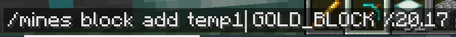

#Test-Plans for prison-mines

This is a first pass at what is needed to provide coverage test of the basic commands within 
the prison-mines module.  This will change and evolve to help ensure quality of the plugin.

Below are major topic areas.  Steps will be added later and will consist of directions and commands.

May explore adding check boxes so the tester can check off items as they try them.  Then when they move on to another server,
they can then reload the page and start over?

## Test Plans

Work on testing each item below.  Depending upon what changes were made, all sections may not need to be tested.

If testing on multiple server versions, then reload this page between tests so you can use the checkboxes to keep
track of what you tested.  If you encounter a bug, issues, or something that is suspicious, log it right away
so it is not forgotten.

##### Mine selection tool

- <input type="checkbox"/> Confirm `/mines wand` gives you a wand.
- <input type="checkbox"/> Select corners of a mine successfully.
- <input type="checkbox"/> Confirm correct size. Could test on a 2x3x4 section to keep it simple.
- <input type="checkbox"/> 

##### Creating a Mine

- <input type="checkbox"/> Confirm `/mines create <mineName>` works after selecting the area with a wand.
- <input type="checkbox"/> Confirm it was created with `/mines list`
- <input type="checkbox"/> Try something random.  Report if causes issues.

##### Mines List
- <input type="checkbox"/> Confirm `/mines list` works.
- <input type="checkbox"/> Should show your newly created mine.
- <input type="checkbox"/> Clicking on the mine name should show the Mines Info 
- <input type="checkbox"/> 

##### Mines Info
- <input type="checkbox"/> Confirm `/mines info <mineName>` works.
- <input type="checkbox"/> Confirm that the mines list generates this command properly
- <input type="checkbox"/> Confirm the command works.  Test clicking on a block name to confirm that works.
- <input type="checkbox"/> Not sure what will happen if there are many kinds of blocks in a mine.
- <input type="checkbox"/> 
- <input type="checkbox"/> 

##### Mines Set Area
- <input type="checkbox"/> Confirm `/mines set area <mineName>` works, first select a new area bigger or smaller than an existing mine with the wand.
- <input type="checkbox"/> Do a `/mines reset <mineName>` to confirm the new size
- <input type="checkbox"/> 

##### Deleting a Mine

- <input type="checkbox"/> Confirm `/mines delete <mineName>` works.
- <input type="checkbox"/> **New Feature??** Wow... no confirmation.  Add confirmation?
- <input type="checkbox"/> **New Feature??** Does not clear the old blocks... maybe should set to 100% air and reset before deleting.  Have a parameter of "clear" to perform this task?
- <input type="checkbox"/> **New Feature??** Settings are deleted from the file system. Probably should move in to a sub folder named "deleted" so there could be an option to undelete a mine?  If accidentally done, could be difficult to tweak it again.
- <input type="checkbox"/> Try something random.  Report if causes issues.

##### Adding blocks to a Mine

- <input type="checkbox"/> Try adding with `/mines block add <blockType> <percent>`
- <input type="checkbox"/> Try adding with `/mines block search <searchTerm>`
- <input type="checkbox"/> 
- <input type="checkbox"/> 
- <input type="checkbox"/> Try something random.  Report if causes issues.

##### Remove blocks from a Mine

- <input type="checkbox"/> Try using `/mines block remove <mineName> <block>`.
- <input type="checkbox"/> Type using info on the mine, then click a block to edit it, and set the percent to ZERO.
- <input type="checkbox"/> Confirm that it's been removed; it should show the updated block listing.
- <input type="checkbox"/> 
- <input type="checkbox"/> Try something random.  Report if causes issues.

##### Changing a block's chance within a Mine

- <input type="checkbox"/> Issue command
- <input type="checkbox"/> Do the `/mines info` command to show all blocks.  Then click on block to edit.
- <input type="checkbox"/> 
- <input type="checkbox"/> Try something random.  Report if causes issues.

##### Searching for a block and adding it to a mine

- <input type="checkbox"/> Search for something that exists: "gold"
- <input type="checkbox"/> Search for something that does not exist: "starbucks"
- <input type="checkbox"/> Search for something with more than one page of results: "minecraft" will always be EVERYTHING.
- <input type="checkbox"/> Page Next.
- <input type="checkbox"/> Test paging Next past the end. Should not have a Next button on last page or if there is only one page.
- <input type="checkbox"/> Total results is listed in the header and should match last item on last page (add one since it is zero based)
- <input type="checkbox"/> Test Previous button.  Should not be shown on the first page or if there is only one page.
- <input type="checkbox"/> Click on an item to "suggest". Will not automatically add to the mine.
- <input type="checkbox"/> Confirm that the suggest format for `/mines block add` is correct.
- <input type="checkbox"/> Try something random with block search.  Report if causes issues.
- <input type="checkbox"/> 
- <input type="checkbox"/> **New Feature??** Try to fix the buttons so they are on the same line.  
- <input type="checkbox"/> **New Feature??** Add page counts, like page 3 out of 5.
- <input type="checkbox"/> **New Feature??** Try to figure out how to validate if it a block and not an object.  Object are selectable, but never spawnable within the mines.  So if we can eliminate them from the listing, then the search will be tighter.
- <input type="checkbox"/> 

**Example of including images:**
")

##### TP players out upon mine reset

**TP conditions** 
- <input type="checkbox"/> Mines auto reset
- <input type="checkbox"/> Mines manually reset (possible problems still?)
- <input type="checkbox"/> No spawn set
- <input type="checkbox"/> spawn set
- <input type="checkbox"/> Log off when in a mine - **Fails** - Suffocation when reconnects
- <input type="checkbox"/> Set a home and TP back, or use /back - **Fails ??** - Should be prevented due to unsafe teleport?
- <input type="checkbox"/> Try something random.  Report if causes issues.

###### Tests with HTML in Mark Down

<ul>
  <li><input type="checkbox"/> Test 1</li>
  <li><input type="checkbox"/> Test 2 
  	<ul>
  		<li><input type="checkbox"/> Test 2a</li>
  		<li><input type="checkbox"/> Test 2b</li>
  	</ul>
  </li>
</ul>

